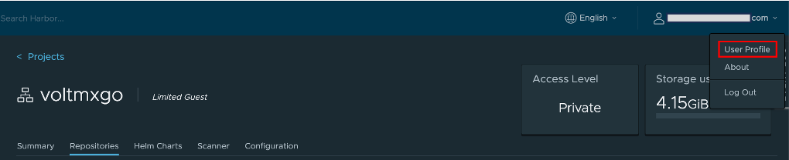

The binary images and Helm charts for Volt MX GO server components will be pulled from the HCL Container Repository. This will require you to get your authentication token from the HCL Container Repository. 

1. Go to the [HCL Container Repository](https://hclcr.io).
2. On the login page, click **LOGIN VIA OIDC Provider**, and then login using your corporate email address.
3. On the **Projects** page, enter `voltmxgo` in the search field, and then click `voltmxgo-ea` on the search result. 

    

4. On the **voltmxgo-ea** project page, click your username and select **User Profile**.

    

5. On the **User Profile** dialog, copy the value of the **CLI secret** by clicking the copy icon.

    

6. Save the CLI secret value as it's required in the next steps. 
7. Take note of exactly how your email address is written in the **User Profile** dialog as authentication is case sensitive on the user email.
8. Run the following commands to export the username and authentication token. 

    !!!note
        Replace `<your hclcr username>` with your email address as shown in the **User Profile** dialog. Replace `<your hclcr authentication token>` with the **CLI secret** value you copied from the **User Profile** dialog.

    ```
    export HCLCR_USERNAME=<your hclcr username>
    ```
    ```
    export HCLCR_TOKEN=<your hclcr authentication token>
    ```