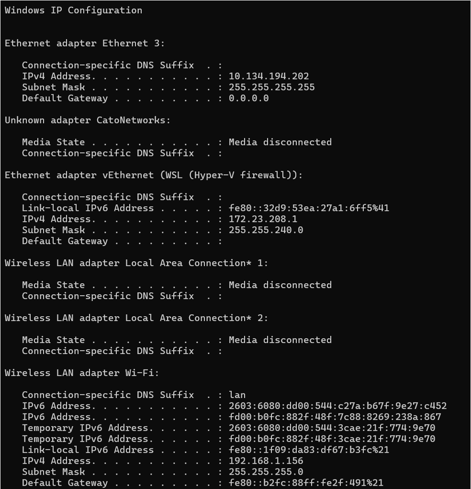

### Before you begin

The following procedure must be performed post installation of K3s or Rancher Desktop, and before the download of the Domino REST API Helm chart and Volt MX Go Foundry installation.

!!!warning "Important"
    If you deployed Kubernetes using Rancher Desktop, use an Ubuntu terminal session to run all the commands in this section and the other subsequent sections. To access the Ubuntu terminal, enter "Ubuntu" in the Windows search box and select the Ubuntu for Windows App. An Ubuntu terminal session opens with your home directory set as your current directory.


<!--## 1. Export username and authentication token

The binary images and Helm charts for Volt MX Go server components are pulled from the HCL Container Repository. You must [obtain your authentication token from the HCL Container Repository](obtainauthenticationtoken.md) before running the commands.

Run the following commands to export the username and authentication token.

!!!note
    - Replace `<your hclcr username>` with your email address as shown in the **User Profile** dialog. *Take note of exactly how your email address is written in the **User Profile** dialog as authentication is case sensitive on the user email*.
    - Replace `<your hclcr authentication token>` with the **CLI secret** value you copied from the **User Profile** dialog.

```
export HCLCR_USERNAME=<your hclcr username>
```
```
export HCLCR_TOKEN=<your hclcr authentication token>
```
-->

### Configure Helm to pull from HCL Container Repository

The procedure sets up Helm with the details necessary to authenticate with the HCL Container Repository. You will need your [email and authentication token](../tutorials/obtainauthenticationtoken.md) used with the HCL Container Repository.

- Run the following command to set up Helm:

    ```
    helm repo add hclcr https://hclcr.io/chartrepo/voltmxgo --username <your hclcr username> --password <your hclcr password>
    ```

    !!!example
         `helm repo add hclcr https://hclcr.io/chartrepo/voltmxgo --username user.name@example.com --password xx3ds2w`

    !!!note
        Use the **CLI secret** value you saved from [obtaining authentication token from HCL Container Repository](../tutorials/obtainauthenticationtoken.md) as your authentication token or password.

If you get an error message similar to the following:

``` { .yaml .no-copy }
Error: looks like https://hclcr.io/chartrepo/voltmxgo is not a valid chart repository or cannot be reached: failed to fetch https://hclcr.io/chartrepo/voltmxgo/index.yaml : 401 Unauthorized
```

Most likely, you haven't specified your username or authentication token correctly. Make sure the case and content matches exactly what's listed on the HCL Container Repository site and retry.

### Create a namespace for MXGO

Run the following commands to create a namespace and set the current context to **mxgo**:

```
kubectl create namespace mxgo
kubectl config set-context --current --namespace=mxgo
```

--8<-- "restartwindows.md"

### Ensure Foundry hostnames are resolvable

You must ensure the url used to access Volt MX Go Foundry and Domino REST API are resolvable by all systems that will be accessing it including Kubernetes and any browsers that you use. This can be done by adding DNS host names and IP addresses to your corporate DNS configuration, or by modifying the hosts file for all systems.

In the examples that follow we're going to use these hostnames as examples:

```
drapi.mymxgo.com - used to access Domino REST API.
drapi-management.mymxgo.com - used to access the Domino REST API Management interface.
foundry.mymxgo.com - used to access HCL Volt MX Go Foundry
```

You can either provide your own hostnames, or use these example names. Either the name to IP address mapping must be made in your DNS configuration, or you must modify your system hosts file. Further documentation here assumes you aren't using a DNS system and configuration and are therefore modifying local hosts file entries.


#### For K3s only

!!!tip
    Obtain your machine's IP ADDRESS as you will need it in the following step.

1. Add the hostnames that you have chosen to use in your `/etc/hosts` file together with your **IP ADDRESS** and **dns domain name**. As an example:

    ```
    10.190.252.181 drapi.mymxgo.com drapi-management.mymxgo.com foundry.mymxgo.com
    ```

    !!!note
        If you will be accessing this deployment from other remote machines, you need to apply this same `/etc/hosts` file change on those machines as well.

1. Run the following command to make these name/IP address matches available within the Kubernetes:

    ```
    kubectl edit configmap -n kube-system coredns
    ```

2. Locate the segment that looks like the following:

    ``` { .yaml .no-copy }
        import /etc/coredns/custom/*.server
      NodeHosts: |
        10.190.252.181 vm1.example.com
    kind: ConfigMap
    ```

3. Before the line that starts with `kind: ConfigMap`, add a new line that uses the same IP address, but adds the hostnames you have chosen to use. When done, the segment of the file looks like the following code, but with your IP address and your own hostname. The previously hard-coded values are shown in this example:

    ```{ .yaml .no-copy }
        import /etc/coredns/custom/*.server
      NodeHosts: |
        10.190.252.181 vm1.example.com
        10.190.252.181 drapi.mymxgo.com drapi-management.mymxgo.com foundry.mymxgo.com
    kind: ConfigMap
    ```

4. Save the file and exit the editor.
5. Run the following command to force the restart of the coredns pod:

    ```
    kubectl delete pod -n kube-system -l k8s-app=kube-dns
    ```

#### For Rancher Desktop only

1. From a Command Prompt on either Windows 10 or Windows 11, obtain the IPv4 Address for the Ethernet adapter vEthernet (WSL) via the ipconfig command.

    

    !!! warning "Important"
        - Select the correct **IPv4 Address** under **Ethernet adapter vEthernet (WSL (Hyper-V firewall))**, which by default starts with **172**. Placing the correct IPv4 address in the Windows host file ensures deployment is reachable from within WSL2 and Windows.
        - If you want to access this deployment from a remote machine, you most likely need to update the `/etc/hosts` file on the remote machine as well. Specify the **IPv4 address** for the Windows system where Foundry is installed. If using a wired connection, use the **IPv4 Address** under **Ethernet adapter Ethernet 3**. If using a wireless connection, use the **IPv4 Address** under **Wireless LAN adapter Wi-Fi**. 

2. Add the hostnames that you have chosen to use in your `C:\Windows\System32\drivers\etc\hosts` file together with your IPv4 ADDRESS and dns domain name.

    For example:

    ```
    172.23.208.1 drapi.mymxgo.com drapi-management.mymxgo.com foundry.mymxgo.com
    ```

3. Restart Rancher Desktop.

    1. Select **File** &rarr; **Exit** to close the current session.
    2. Open a new session by opening Rancher Desktop via the desktop icon.

    --8<-- "restartwindows.md"

### Create a temp directory for the charts

Run the following commands to create a temp directory for the charts and make it the current directory:

```
mkdir ~/mxgo
cd ~/mxgo
```

### Install wget and curl into your Linux environment

Use a search engine, such as Google, to search for instructions on installing **wget** and **curl** to the Linux environment that you are using if they're not already installed.

### Next step

Proceed to [Install Domino REST API](../tutorials/downloadhelmchart.md).