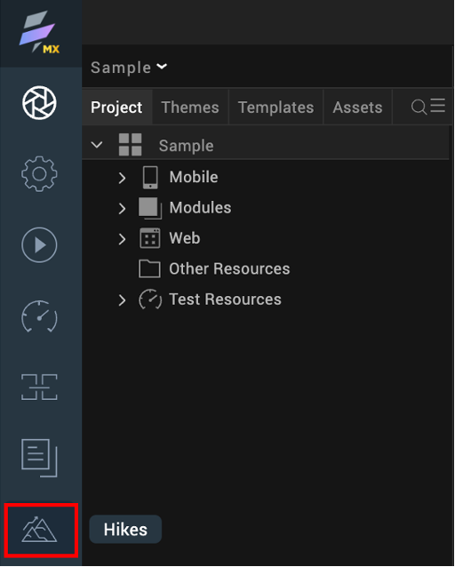

# Access VoltFormula Hikes 

!!!note
    The information in this topic applies starting with Volt MX Go version 2.1 release. 

## About this task

Guides you on how to access VoltFormula Hikes that provide step-by-step interactive walkthroughs helping you understand the basics of VoltFormula.  

!!!info
    Hikes are organized into guided tours in a catalog, and in a sequence to take you through a learning path. You should go through the Hikes in the specified order.

## Before you begin

You have launched Volt MX Go Iris. 

## Procedure

1. Click the **Hikes** icon from the left navigation panel in Volt MX Go Iris. A page opens containing the available Hikes.

    {: style="height:50%;width:50%"}

2. Select a VoltFormula Hike on the page, and then click **Start** on the succeeding page to start the step-by-step interactive walkthrough.
3. Follow the instructions in the displayed dialog, which is part of the Hike procedure to help you to navigate and perform the required steps. 
4. After completing the instructions, click **Next** in the dialog to move to the next step.

    !!!tip
        Arrows point to the area where you must focus to perform the action in a Hike step. For some Hike steps, after you successfully perform an action, you are automatically directed to the next step.

5. Once you have completed a Hike, you can either move on to the next Hike or close the current Hike by clicking **Done**. 