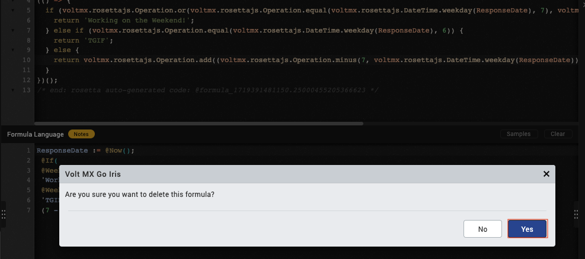
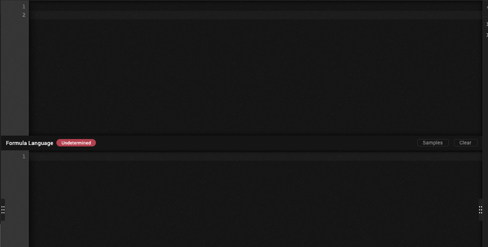

# Clear formulas in Controller and Action Editor

--8<-- "mxgoversion.md"

## About this task

Shows you how to clear JavaScript code and formulas in **Controller** and **Action Editor**.

## Before you begin

- You must read and familiarize yourself with the VoltFormula tutorial.
- You need to use a **Controller** and **Action Editor** in your project to access this feature.

## Procedure in Controller

**For removing formula using **Clear** button. 

1. Go to your **Project** &rarr; **Responsive Web/ Desktop/ Mobile** &rarr; **Controller**.

2. Click the **Controller** you want change.

3. Click **Clear** button to delete the formula and the JavaScript code in the editor. 

    

4. A confirmation dialog shows to confirm delete the formula. Click **Delete**.

    

    The **clear** button deleted the formula and the JavaScript code.

    

***For removing formula using **Delete Formula** button

1. Go to your **Project** &rarr; **Responsive Web/ Desktop/ Mobile** &rarr; **Controller**.

2. Click the **Controller** you want change.

3. Right-click on the JavaScript code and click the **Delete button** 

    !

4. A confirmation dialog shows to confirm removing the formula. Click **Delete**.

    

    The **clear** button removed the formula and the JavaScript code.

    