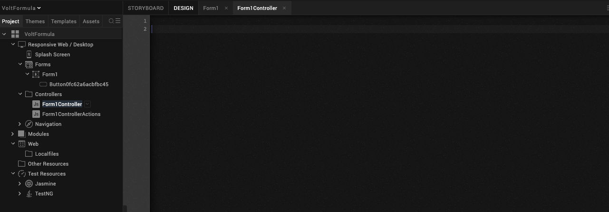
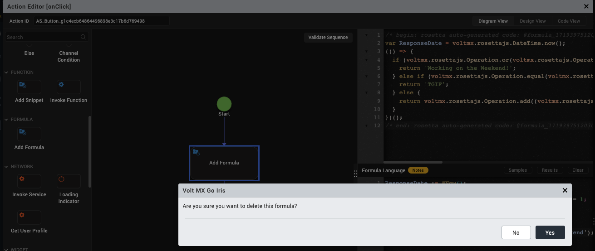
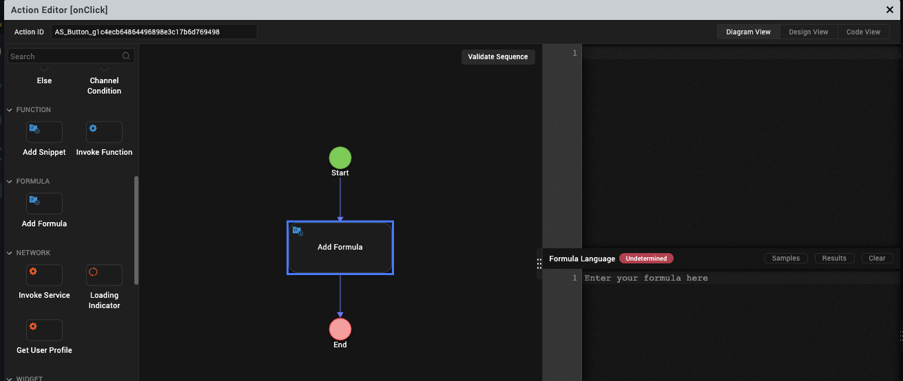
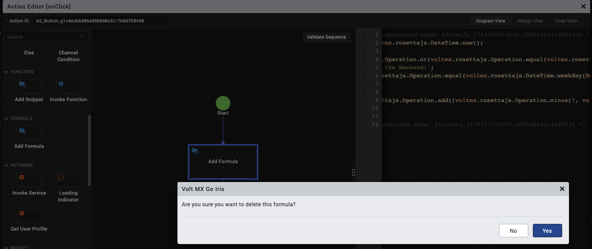
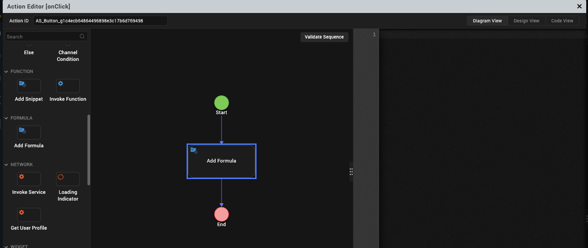

# Clear formulas in Controller and Action Editor

--8<-- "mxgoversion.md"

## About this task

Shows you how to clear JavaScript code and formulas in **Controller** and **Action Editor**.

## Before you begin

- You must read and familiarize yourself with the VoltFormula tutorial.
- You need to use a **Controller** and **Action Editor** in your project to access this feature.

## Procedure in Controller

### For removing formula using Clear button

1. Go to your **Project** &rarr; **Responsive Web/ Desktop/ Mobile** &rarr; **Controller**.

2. Click the **Controller** you want to change.

3. Click **Clear** to delete the formula and the JavaScript code in the editor. 

    

4. A confirmation dialog shows to confirm deletion. Click **Yes** to delete the formula and JavaScript code.

    

    The Formula Editor after deleting the formula and the JavaScript code.

    

### For removing formula using Delete Formula button

1. Go to your **Project** &rarr; **Responsive Web/ Desktop/ Mobile** &rarr; **Controller**.

2. Click the **Controller** you want to change.

3. Right-click on the JavaScript code and select **Delete Formula**. 

    

4. A confirmation dialog shows to confirm deletion. Click **Yes** to delete the formula and JavaScript code.

    

    The Formula Editor after deleting the formula and the JavaScript code.

    

## Procedure in Action Editor

### For deleting formula and JavaScript code using Clear button

1. Go to your **Project** &rarr; **Responsive Web/ Desktop/ Mobile** &rarr; **Forms**. For example, you have created a **Button** on your form.

2. Click **Edit** on **Action** tab. For example, **onClick**.

       

3. The **Action Editor** window opens. Click **Clear** to delete the formula and the JavaScript code in the editor. 

    

4. A confirmation dialog shows to confirm delete. Click **Yes** to delete the formula and JavaScript code.

    

    The **Action Editor** after deleting the formula and the JavaScript code.

    

### For removing formula using Delete Formula button

1. Go to your **Project** &rarr; **Responsive Web/ Desktop/ Mobile** &rarr; **Forms**.

2. Click **Edit** on **Action** tab. For example, **onClick**.

       

3. The **Action Editor** window opens. Right-click on the JavaScript code and click **Delete Formula**. 

    

4. A confirmation dialog shows to confirm delete. Click **Yes** to delete the formula and JavaScript code.

    

    The **Action Editor** after deleting the formula and the JavaScript code.

    