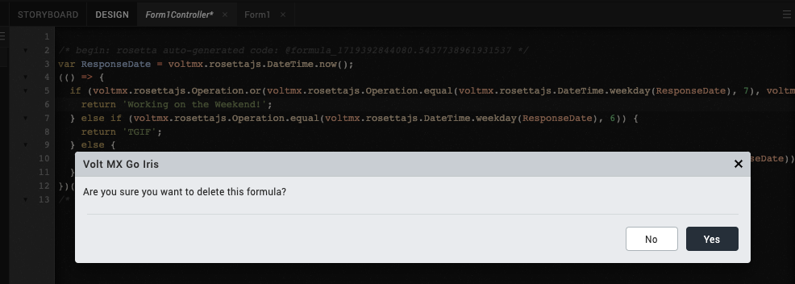

# Clear formulas in controller and Action Editor

!!!note
    The information in this topic applies starting with the Volt MX Go version 2.0.4 release. 

## About this task

Guides you on how to clear JavaScript code and formulas in **controllers** and **Action Editor**.

## Before you begin

- You have launched Volt MX Go Iris and have opened the project containing the formulas and JavaScript codes you want to delete.
- You need to use **controller** and the **Action Editor** in your project to access this feature.

## Procedure

### For controllers

1. Under the **Controllers** directory, select the controller that contains the formula you want to delete. The **Formula Editor** opens.
2. In the **Formula Editor**, right-click in the JavaScript code and select **Delete Formula** from the context menu.

    

3.	In the confirmation dialog, click **Yes**. 

     

The JavaScript code and its source formula have now been deleted.

You can also click **Clear**, if the **Formula Language** section of the **Formula Editor** is open, to delete the formula and the corresponding JavaScript code. 

### For Action Editor

1. Under the **Forms** directory, expand the form that contains the widget with the formula you want to delete, and then select the widget, for example a button in your form. 
2. Go to the **Properties** tab and select **Action** tab.
4. Click **Edit** next to an event, for example **onClick**. The **Action Editor** opens.

    

5. In the **Action Editor**, click the **Add Formula** diagram component to open the **Formula Editor**. 
6. To delete the formula:

    - Right-click in the JavaScript code and select **Delete Formula** from the context menu.

        

    OR

    - Click **Clear** in the **Formula Language** section of the **Formula Editor**.

        

6.	On the confirmation dialog, click **Yes**. 

The JavaScript code and the source formula have now been deleted.