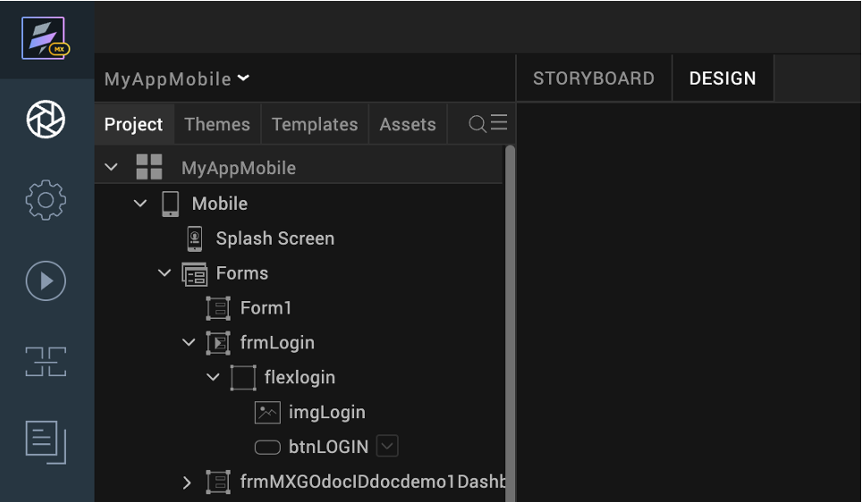
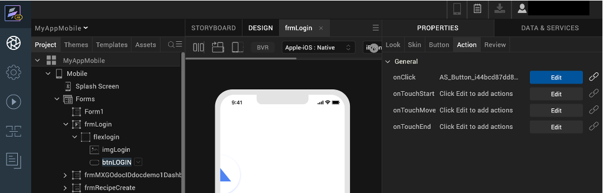
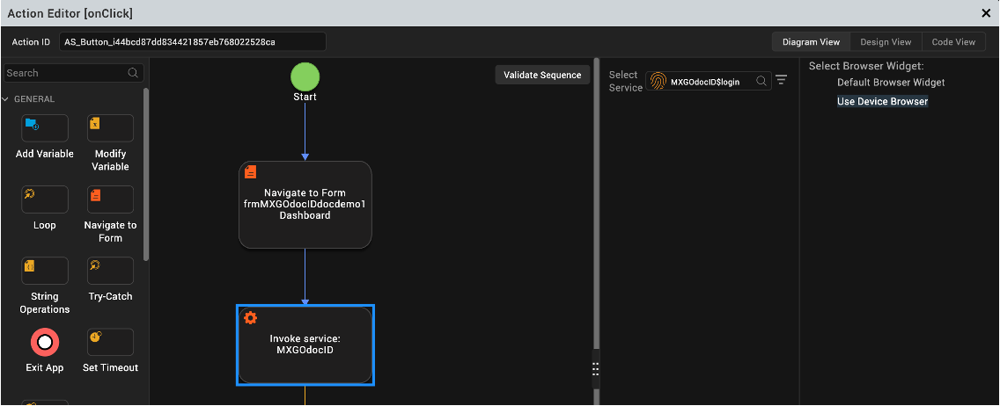

# Configure mobile app browser

## About this procedure

This procedure describes how to configure the mobile app browser before  building and publishing the Native App.

## To configure mobile app browser

1. Go to the **Design** tab.
2. In your **Project**, go to **Form**, click the **Start-Up form** (e.g, frmLogin).

    

3. Click the login button and click the properties tab.
4. Under properties, click **Action** tab.
5. Click the **Edit** button next to the **onClick** item. 

    

6. The Action Editor will open. Click the **Invoke Service**.

    !!!note
        The default view is in Diagram View.   Make sure to click on the Diagram view tab if it's not already selected.
    

7. Click the **Use Device Browser** under the **Select browser widget**

    

8. Click **Save**.