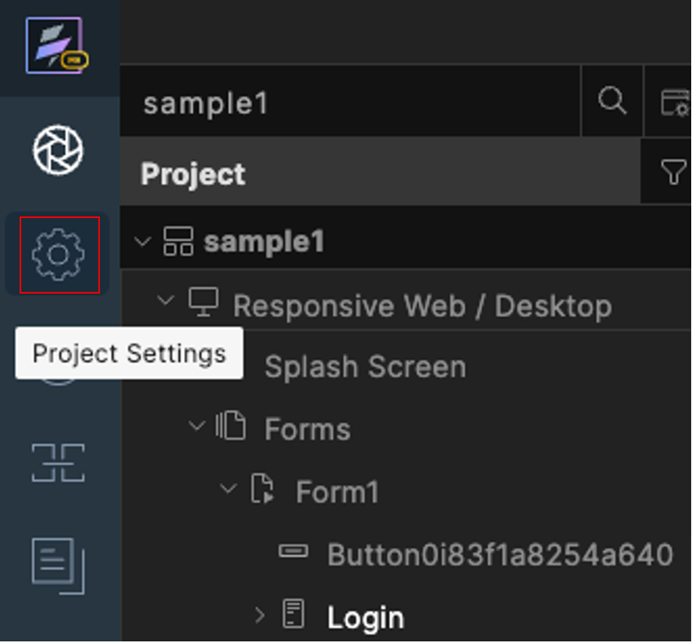

# Configure VoltFormula's Rosetta API Options

## About this procedure

This procedure describes how to configure the Rosetta API based on what you need when using the Rosetta formula.

- Register Custom API
- Preferred API implementation
- Typeahead Intellisense
- Converter Configuration
- Use Native vs API Conversion

### To configure settings in Rosetta API

1. Click the **Project Settings** icon.
    
    {: style="height:80%;width:80%"}

2. In the **Project Setting** window, click the **Rosetta** tab.
    
    

    |Rosetta area | Rosetta area sections | Description|
    |-------------|------------|------------|
    |**API Configuration**| |Allows you to configure options specific to the APIs' implementation and execution.|
    | |**Register Custom API**|Allows you to upload a file with custom APIs. Refer to the [API reference documentation](https://help.hcltechsw.com/docs/voltmxgo/javadoc/index.html) under the rosetta-api module for method `registerAPI` for more details on expected file format and parameters.|
    | |**Preferred API implementation**| Allows you to specify whether to execute the Notes Formula or the OpenFormula implementation when calling an API method, which has an existing implementation in either formula language. Example, `@Abs()` and `=ABS()` are encapsulated by Rosettas `abs()` method. Selecting `Notes` option makes Rosetta call the Notes implementation. Usually, either implementation behaves the same. But in other cases, there may be differences in parameters, execution, or returned results. For example, most Notes formula functions allow lists to be passed in as arguments while OpenFormula allows lists as ranges for only a number of methods. Refer to the [API reference documentation](https://help.hcltechsw.com/docs/voltmxgo/javadoc/index.html) for details on each API.|
    | |**Typeahead Intellisense**| Allows you to configure options whether to inlcude "no plans to implement items" and "not yet implemented items" to be inlcuded in the rosetta formula list intellisense. When **no plans to implement items** is selected, the list of formula names is "strikethrough". If **"not yet implemented items"** is checked, the font color of the formula name is greyed out. |
    |**Converter Configuration**| |Allows you to configure options related to how formulas are converted into their corresponding Rosetta enabled JavaScript.|
    | |**Passthrough unrecognized formula language into JavasSript conversion results**|Allows you to specify whether the converter allows unrecognized formula code to be part of the javascript conversion results without any massaging, or if it should throw an error when encountering unrecognizable formula code. This allows greater flexibility but also exposes the API to injection of code. **Use with care**.|
    | |**Use Native vs API Conversion**|Allows you to specify whether the converter uses native JavaScript or API calls for methods where a native JavaScript function exists. Example, convert `@If( )` into JavaScript native `if( )` or call the API `rosettajs.Logical.if( )`.  Sometimes, it makes sense and produces cleaner code to select "convert into native JavaScript" than using the API. Other times, you may want to go through the API call itself to allow for additional checks and/or handle the parameters differently.|
    |**Version**| |Indicates the `SDK` plugin,`API`,`Converter`, and `Prettifier` versions.|

3. Click **Done**.

