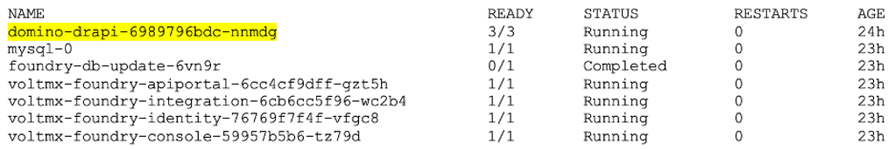

# Connect to Domino server from your Notes client

The procedure guides you in connecting to the Domino server from your Notes client.

## Before you start

Make sure that your `/etc/hosts` file has the early access preview host names. You will need these same entries on any machine you want to connect from, such as your dev laptop. For more information, check the details on [adding early access preview host names](../tutorials/prereq.md#4-add-early-access-preview-host-names). 

## Procedure

!!!note
    The procedure is based on using HCL Notes v12.

1. Run the following command to copy the `admin.id` from the domino/keep pod:

    ```
    kubectl cp -n mxgo -c restapi-log $POD_NAME:/local/notesdata/admin.id ./k8s-notes-admin.id
    ```

    !!!tip
        The `$POD_NAME` in the command represents the name of the Domino pod. To get the name of the Domino pod, run the command `kubectl get pods`. In the following example result, the highlighted text corresponds to the Domino pod name.

        

        So using the example result, the command above should look like:

        `kubectl cp -n mxgo -c restapi-log domino-keep-6989796bdc-nnmdg:/local/notesdata/admin.id ./k8s-notes-admin.id`

    **If necessary, copy the `k8s-notes-admin.id` file to your laptop**.

2. Switch your ID within the Notes client.

    1. On your Notes client, select **File** &rarr; **Security** &rarr; **Switch ID**.
    2. On the **Choose User ID to Switch To** dialog, search and select the `k8s-notes-admin.id` file, and then click **Open**.

        !!!note
            The default password is `password`.


3. Specify your `names.nsf` file within the Notes client.

    1. On the Notes client, select **File** &rarr; **Open** &rarr; **HCL Notes Application**.
    2. On the **Open Application dialog**, search and select the `names.nsf` file, and then click **Open**.

4. Create a new server connection.

    1. On the Notes client, select **Advanced** &rarr; **New** &rarr; **Server Connection**. The **Server Connection** page opens.
    2. On the **Basics** tab, enter `keep` in the **Server name** text box and then select the **TCPIP** checkbox for **Use LAN port**. 
    3. Click the **Advanced** tab, and then enter `drapi.mymxgo.com` for your server in the **Destination server address** text box.
    4. Click **Save & Close**.

## Expected result

In your Notes client, you should now be able to select **File** &rarr; **Open** &rarr; **HCL Notes Application**, specify `keep` as the server name, and connect to your new Domino server.

