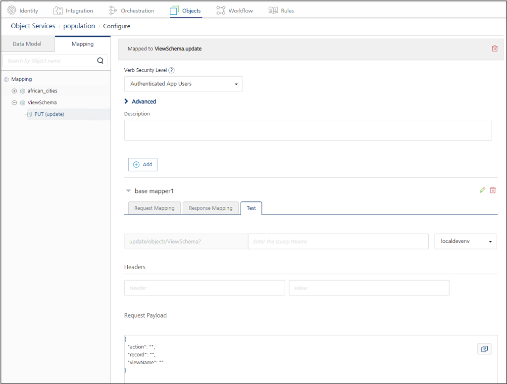

# Import ViewSchema endpoint into Apache CouchDB data model

## About this task

Guides you through importing the **ViewSchema** endpoint under the **SchemaManagement** object of a CouchDB database to enable schema management within the imported data model of the configured Apache CouchDB[^1] object service. The **ViewSchema** endpoint allows developers to query and update the first document in a CouchDB view to keep the inferred schema current.

For more information, see [Schema Management](../../topicguides/couchtopicguide.md#schema-management).

[^1]:Apache CouchDB and CouchDB are trademarks of The Apache Software Foundation.

## Before you begin

- You have an active CouchDB instance, and your Volt Foundry server is able to connect to the CouchDB host via HTTP/HTTPS.
- You have [configured an object service for Apache CouchDB](../../tutorials/couch.md#configure-an-object-service-for-apache-couchdb) in Volt Foundry, and have [generated the data model](../../tutorials/couch.md#generate-a-data-model).

## Procedure

1. Log in to Volt Foundry.
2. In the left pane of the **Volt MX Foundry Console**, click **API Management**.
3. On the **APIs** page, navigate to **Objects**, then select the object service configured for Apache CouchDB into which you want to import the **ViewSchema** endpoint.
4. On the **Data Model** tab, click **Generate**.

    The **Import Objects from Backend** dialog appears, displaying the CouchDB databases.

5. Expand the target database, then expand **SchemaManagement**, and select the checkbox next to **ViewSchema**.

    In the example image, the *population* database is the target database.

    {: style="height:80%;width:80%"}

6. Click **Next**, then click **Generate**. The **ViewSchema** endpoint is now added to the **Data Model**.

    {: style="height:80%;width:80%"}

## Additional information

The **ViewSchema** endpoint includes the fields **action**, **record**, and **viewName** fields, and supports only the **PUT** method. The **Request Payload** for the **PUT** method follows the structure shown in the example image.

{: style="height:80%;width:80%"}