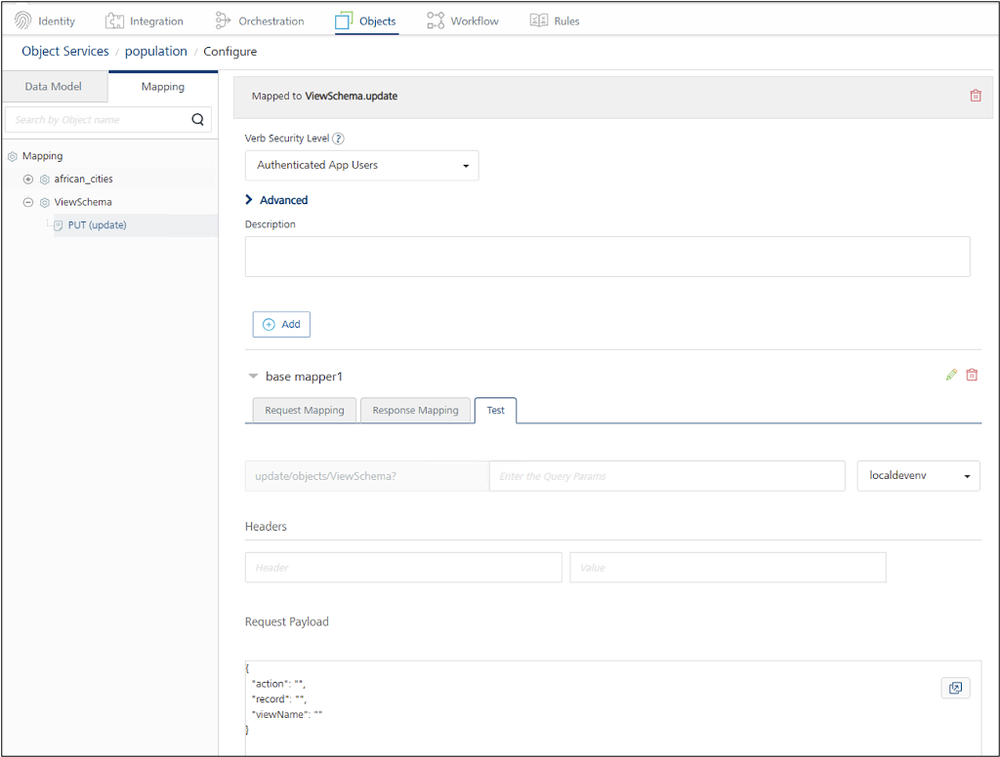

# Query and update the first document in a CouchDB view for schema management

## About this task

The Apache CouchDB[^1] adapter infers a provisional schema by analyzing the first document returned from a CouchDB view. This task guides you through querying that first document to retrieve and review the schema, and then updating the document as needed to ensure the inferred schema accurately represents the expected data structure.

[^1]:Apache CouchDB and CouchDB are trademarks of The Apache Software Foundation.

## Before you begin

- You have an active CouchDB instance, and your Volt Foundry server is able to connect to the CouchDB host via HTTP/HTTPS.
- You have [configured an object service for Apache CouchDB](../../tutorials/couch.md#configure-an-object-service-for-apache-couchdb) in Volt Foundry, and have [generated the data model](../../tutorials/couch.md#generate-a-data-model).
- You have [imported the ViewSchema endpoint](imprtschema.md) into the data model of a configured object service for Apache CouchDB in Volt Foundry.

## Procedures

### Query the first document in the CouchDB view

Perform this procedure to query the first document returned from the CouchDb view, allowing you to retrieve and review the inferred schema.

1. Log in to Volt Foundry.
2. In the left pane of the **Volt MX Foundry Console**, click **API Management**.
3. On the **APIs** page, navigate to **Objects**, then select the object service configured for Apache CouchDB where you want to retrieve and review the inferred schema.
4. Click the **Mapping** tab, expand **ViewSchema**, and select the **PUT** method.
5. Expand the **base mapper1**, then click the **Test** tab.

    The **Request Payload** should follow the structure shown in the example image.

    {: style="height:80%;width:80%"}

6. Enter the values for the fields.

    **Example payload**:

    ```json
    {
        "action": "getSchema",
        "record": "",
        "viewName": "afrian_cities"
    }
    ```

    !!! tip

        - The `action` field accepts only two values: `getSchema` or `updateSchema`.
        - The `viewName` field must match the name of the CouchDB view you want to query.

7. Click **Send**.

You will receive a response containing the record of the first document from the specified CouchDB view.

**Example response**:

```json
{
    "continent": "AF",
    "country": "Egypt",
    "infants": 80000,
    "phds": 5000,
    "grads": 150000,
    "_rev": "1-1676ce76eece9cfe72384b059628cf79",
    "name": "Cairo",
    "_id": "0b649f10-f5ec-4b81-bd97-dabb36d11a96",
    "censusdate": "2023-12-31T00:00:00Z",
    "population": 9900000
}
```

### Update the first document in the CouchDB view

Follow this procedure to update the first document returned from the CouchDb view to ensure that the inferred schema accurately represents the expected data structure.

!!! note

    The procedure assumes you have selected the **PUT** method of the **ViewSchema** endpoint and clicked the **Test** tab after expanding **base mapper 1**.

1. Enter the values for the fields in the **Request Payload**.

    For example, using the example response and assuming you want to add a new field called `postgrads` to capture the number of postgraduates in the city, the request payload should look like this:

    ```json
    {
    "action": "updateSchema",
    "record": "{\"continent\": \"AF\", \"country\": \"Egypt\", \"infants\": 80000, \"phds\": 5000, \"grads\": 150000, \"_rev\": \"1-1676ce76eece9cfe72384b059628cf79\", \"name\": \"Cairo\", \"_id\": \"0b649f10-f5ec-4b81-bd97-dabb36d11a96\", \"censusdate\": \"2023-12-31T00:00:00Z\", \"population\": 9900000, \"postgrads\": 500}",
    "viewName": "african_cities"
    }
    ```

    !!! note 

        The value of the `record` field must be a stringified JSON where all double quotes (**"**) are escaped with a backslash (**\**) when the `action` is `updateSchema`.

2. Click **Send**.

!!! warning "Important"

    After executing the `updateSchema`, you must remove the existing data model with the old schema and reimport the CouchDB view with the same name. This ensures the new schema is applied and used going forward.

## Additional information

You can use the following client-side Javascript code to generate the properly escaped string required for the payload when executing `updateSchema`.  

```javascript
const jsonText = `{
  "continent": "AF",
  "country": "Egypt",
  "infants": 80000,
  "phds": 5000,
  "grads": 150000,
  "_rev": "1-1676ce76eece9cfe72384b059628cf79",
  "name": "Cairo",
  "_id": "0b649f10-f5ec-4b81-bd97-dabb36d11a96",
  "censusdate": "2023-12-31T00:00:00Z",
  "population": 9900000
}`;

// Step 1: Parse the JSON text into a JS object
const obj = JSON.parse(jsonText);

// Step 2: Stringify the object (produces compact JSON with quotes escaped)
const escapedJsonString = JSON.stringify(obj).replace(/"/g, '\\"');

console.log(`"${escapedJsonString}"`);
```

!!! note

    The `jsonText` variable should contain the JSON response obtained from executing the `getSchema` action.

You can use the following Javascript function to generate the properly escaped string required for the payload when executing `updateSchema`.  

```javascript
function toEscapedJsonString(obj) {
  // Step 1: Stringify the object into normal JSON
  const jsonString = JSON.stringify(obj);

  // Step 2: Escape the double quotes
  const escapedJsonString = jsonString.replace(/"/g, '\\"');

  // Step 3: Wrap in quotes to match your example
  return `"${escapedJsonString}"`;
}

// Example usage:
const record = {
  continent: "AF",
  country: "Egypt",
  infants: 80000,
  phds: 5000,
  grads: 150000,
  _rev: "1-1676ce76eece9cfe72384b059628cf79",
  name: "Cairo",
  _id: "0b649f10-f5ec-4b81-bd97-dabb36d11a96",
  censusdate: "2023-12-31T00:00:00Z",
  population: 9900000
};

const anotherString = toEscapedJsonString(record);
console.log(anotherString);
```

After running the preceding Javascript function, the variable `anotherString` contains:  

```text
"{\"continent\": \"AF\", \"country\": \"Egypt\", \"infants\": 80000, \"phds\": 5000, \"grads\": 150000, \"_rev\": \"1-1676ce76eece9cfe72384b059628cf79\", \"name\": \"Cairo\", \"_id\": \"0b649f10-f5ec-4b81-bd97-dabb36d11a96\", \"censusdate\": \"2023-12-31T00:00:00Z\", \"population\": 9900000}"
```

!!! note

    The `record` variable in the above Javascript function should contain the JSON response obtained from executing the `getSchema` action.
