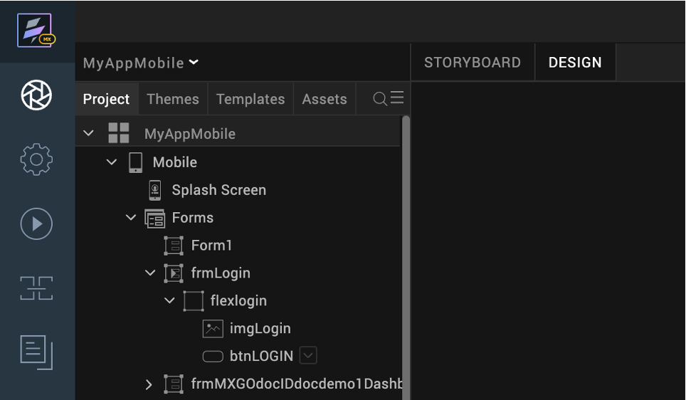
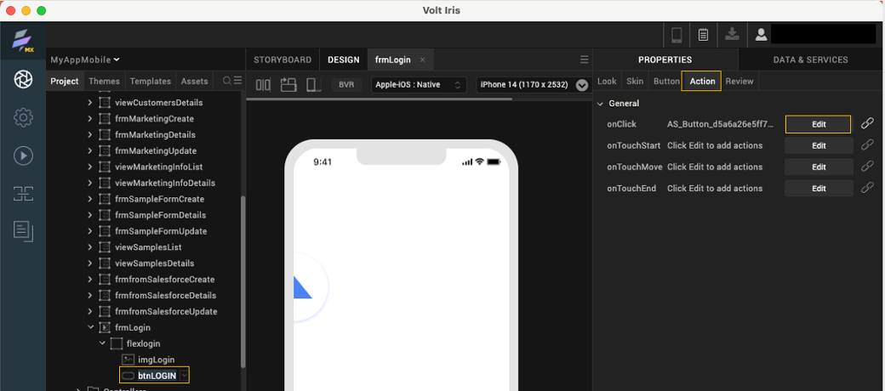
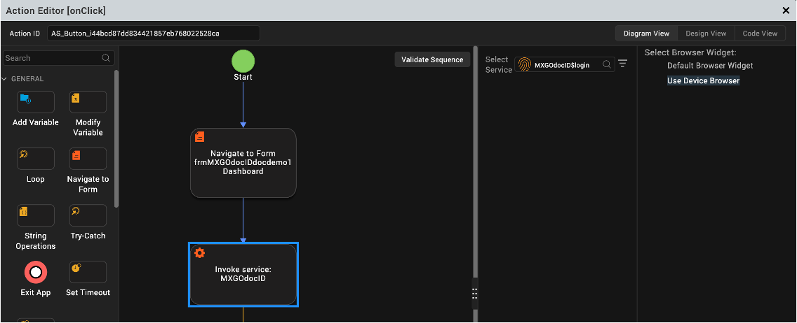

# Configure mobile app browser

## About this task

Shows you how to configure the mobile app browser before building and publishing the Native App.

## Before you begin

- You have imported a Domino application into a native app project using Design Import.
- You have launched Volt Iris and opened your native app project.

## Procedure

1. Click the **Design** tab.
2. Under **Project**, expand the **Forms** folder and then your start-up form, for example **frmLogin**, until you reach your login button, for example **btnLOGIN**.

    

3. Select your login button and then go to the right side of the work area to click **Properties** and select the **Action** tab.
4. Click **Edit** corresponding to the **onClick** action. The **Action Editor** opens.

    

5. On the **Action Editor**, click **Invoke service** in the diagram and then select **Use Device Browser** under **Select Browser Widget**.

    

    !!!note
        The default view in the **Action Editor** is the **Diagram View**. In case you can't see the diagram to select the **Invoke service**, make sure to select the **Diagram View** tab.

6. Click **Save**.
