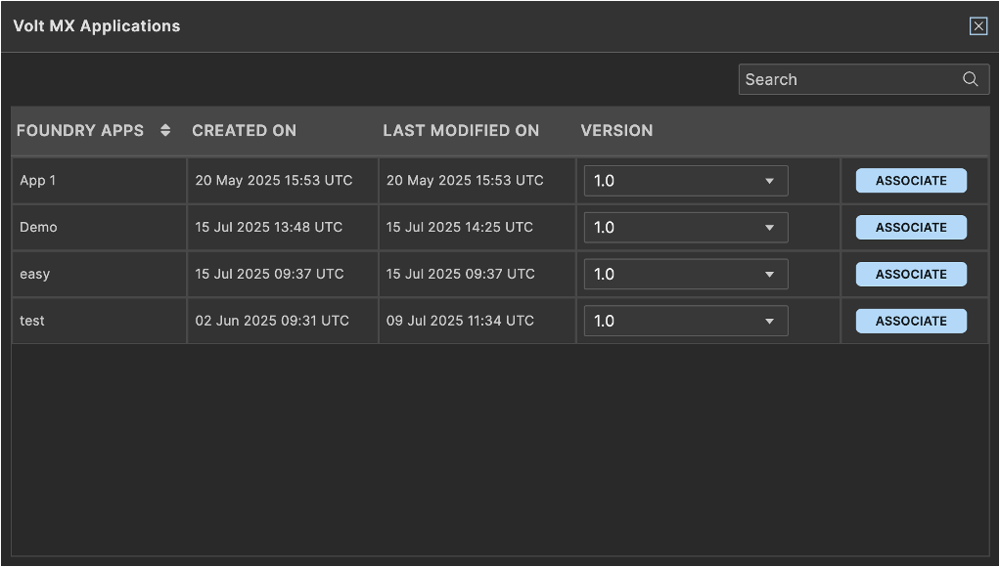
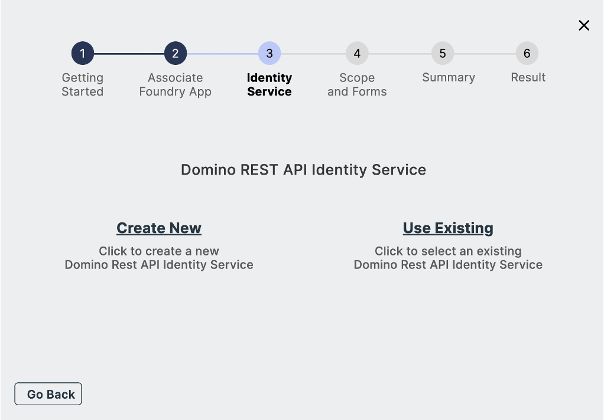

# Import a Domino application 

--8<-- "mxgoversion.md"

## About this task

Guides you through importing a Domino application to Volt Iris via Design Import using an existing Volt Foundry app and its identity service.

## Before you begin

- You have met all the [Design Import process prerequisites](../../tutorials/designimport.md#before-you-begin).  
- You have launched Volt Iris and have created a new project.

## Procedure

1. In the top menu, select **Project** &rarr; **Import** &rarr; **Domino Application**. The **VoltMX Design Import Wizard** opens.

2. On **Getting Started** step, click **Next**.

    {: style="height:80%;width:80%"}

3. On **Associate Foundry App** step, click **Use Existing**. The **Volt MX Go Applications** dialog opens.

    {: style="height:80%;width:80%"}

4. Click **Associate** corresponding to the Volt Foundry app you want to use.

    In the example image, only one application is available. The number of applications you will see in the **Volt MX Go Applications** dialog will depend on the number of applications in the Volt Foundry.

    {: style="height:80%;width:80%"}

5. After the name of the selected Volt Foundry app is displayed, click **Next**.

    {: style="height:80%;width:80%"}

6. On **Identity Service**:

    1. Select **Use Existing**.

        {: style="height:80%;width:80%"}

    2. Under **Select Existing Identity Service**, select an identity service from the drop-down list and then click **Next**.

        {: style="height:80%;width:80%"}

    3. In the **HCL Domino Login** dialog, log in with your *Domino credentials*.

        {: style="height:80%;width:80%"}

        In case a **Permission Requested** dialog appears, click **Allow**.

        <!--For v2.1.2 
        note
        In case of an error due to incorrect **Scope**, **Client ID**, or **Client Secret**, a dialog shows an error message and information on how to address the error. You must then update the existing identity service you selected in Volt Foundry.
        -->

    4. Choose the identity service related to your app on Volt Foundry in **Foundry App Identity Service** and click **Next**.

        !!! tip

            You should always select the Identity Service name that contains *used for DRAPI*.

        {: style="height:80%;width:80%"}

7. On **Scope and Forms**:

    !!! note

        - Selectable forms, views, and agents are only those set to the active status when configuring the schema in the Domino REST API. Those in inactive status can still be seen but won't be selectable. Unsupported agents are also shown but won't be selectable. 
        - Actions are often active within the Domino database and can only be modified using Domino Designer. Imported actions might not function as expected. If this happens, you modify or update the actions to function as expected. For more information, see [Modify or update imported actions using VoltFormula](../voltformula/importvoltformula.md).
        - If a dialog opens indicating that your Domino REST API schema has misconfigured settings, kindly see [Troubleshooting](../../references/troubleshoot.md#design-import) for more information on addressing the issue.
        - If you see a **warning** icon appear beside any form, form field, view, or agent, click the **Reports** folder icon and click a report to open a detailed report explaining the cause of the warning.
        - You can click the **Refresh** icon to update the scope in case there are changes in the Domino REST API schema without exiting the wizard.
        - You can use the **All**, **Active**, **Inactive**, and **Unsupported** buttons in each tab to filter what's displayed.
        - You can use the **Search** box to find forms, fields, actions, views, and agents. The search results will automatically update as you type the letters of your keyword in the **Search** box. If you want to clear the search, simply click the clear icon.

    1. Select the **scope** you want to use from the drop-down list.

        The available scopes are based on the scopes defined when creating the identity service.  

        {: style="height:80%;width:80%"}

    1. Click the **Forms** tab and select the forms, fields, and actions you want to include in the import.

        {: style="height:80%;width:80%"}

    1. Click the **Views** tab and select the views and actions you want to include in the import.

        {: style="height:80%;width:80%"}

    1. Click the **Agents** tab and select the agents you want to include in the import.

        {: style="height:80%;width:80%"}

    1. Click **Next**.

8. On **Summary**, review the selected `forms`, `fields`, `views`, and `agents` you want to import. Once you confirm your selection, click **Build Iris Application**.

    {: style="height:80%;width:80%"}

    !!! note

        - It may take a while to complete the publishing of the imported Domino app.
        - If a dialog indicating that existing Volt Iris forms are detected appears, click **Yes** to overwrite the detected forms and build the application. The existing Volt Iris forms were automatically generated when you created the new project in Volt Iris. 

            

9. On **Result**, see the final `forms`, `views`, `actions`,`agents`, and then click **Done**.

    !!! tip

        - A **checkmark** icon indicates a successful import.  
        - A **warning** icon indicates a successful import, but the imported component might not work as expected due to, for example, its data type not being currently supported. 
        - An **error** icon indicates a failed import. 
        - Click the **Show only with errors** toggle in a specific tab to the on position to see all elements with the **error** icon in that specific tab. The **Show failed imports** toggle won't be visible in a specific tab when there are no failed imports in that particular tab.
        - You can click **view report** to see a results report of imported forms, views, and agents in a new window.

    {: style="height:80%;width:80%"}

Once you click **Done**, you can see the imported forms and views in a storyboard view in Volt Iris.

{: style="height:80%;width:80%"}

To see the imported forms in a directory, click the **DESIGN** tab to show the **Project** tab. You then expand the **Responsive Web / Desktop** and the **Form** directory to show the imported forms, views, and actions.

{: style="height:80%;width:80%"}