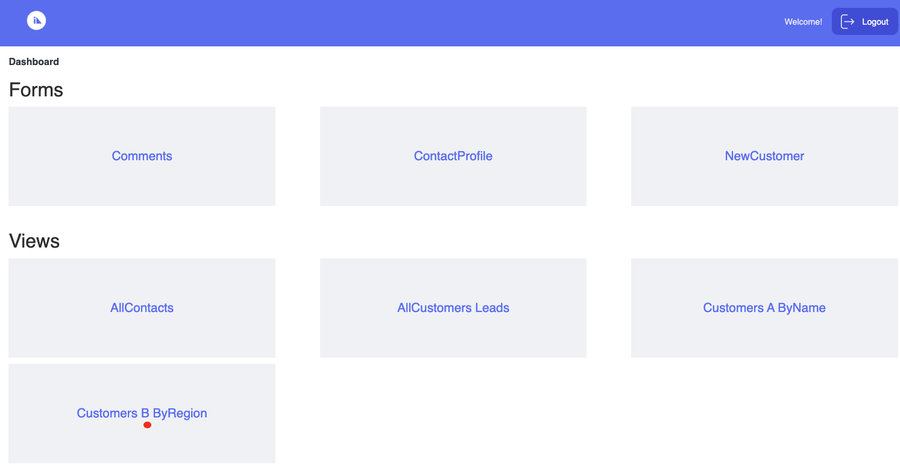
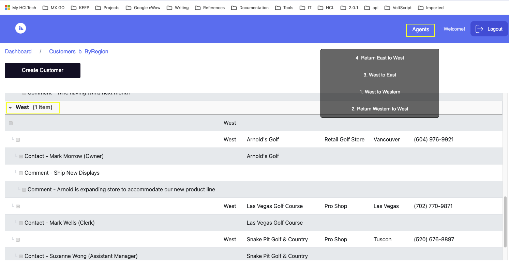
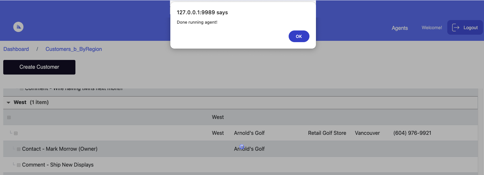
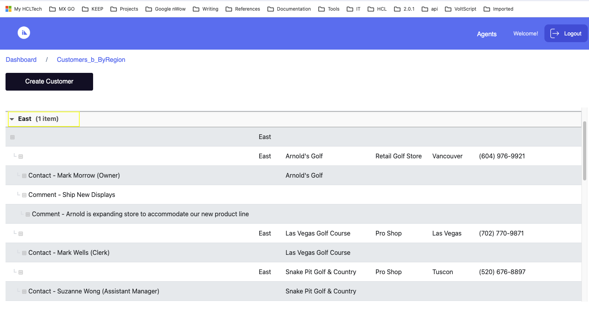

# Access imported agents in a published Domino app

!!!note
    The information in this topic applies starting with the Volt MX Go version 2.0.3 release. 

Agents are stand-alone programs that perform a specific task in one or more Domino databases. Agents are the most flexible type of automation you can add to most design elements in a Domino application. To learn more, see [Agents](https://help.hcltechsw.com/dom_designer/14.0.0/basic/H_ABOUT_DESIGNING_AGENTS.html "Link opens a new tab"){: target="_blank" rel="noopener noreferrer"}&nbsp;{: style="height:13px;width:13px"} in the *HCL Domino Designer* documentation.

!!!note
    As of Volt MX Go release v2.0.4, only agents meeting the following conditions can be imported using **Design Import**:
    
    - The agent's trigger type configuration is **action menu selection**.
    - The agent's document setting is configured to **All**.

You can include agents in the import when importing a Domino application using **Design Import**. These **agents are imported as actions** and are available in all the views on the imported Domino application.

## About this task

Guides you on accessing and using imported agents in a published Domino app.

## Before you begin

- You have imported a Domino application, including agents, using Design Import to a **Web App project** in Volt MX Go Iris.

    !!!note
        Agents are currently **not supported** for **Native App projects**.

- You have published the imported Domino application using Volt MX Go Iris and opened the published application.

## Procedure

For this procedure, the steps will be based on an example Domino application with agents capable of modifying the region assignment of customers. Although the example Domino application and its agents will differ from your imported Domino application and its agents, the process of accessing and executing the agents will be the same. 

1. Upon opening the published application in a browser, you will see the **Dashboard**. From the **Dashboard**, click a view. In the example image, we will click the **Customer B ByRegion** view.

    

2. On the **Customer B ByRegion** page, click **Agents** from the top header to open a context menu showing available agents. In the example image, you can see the available agents.

    

3. Select an agent. In the example image, the **West to East** agent is selected to move all customers from the West region to the East region.

    

4. On the dialog indicating that the task of the selected agent has been completed, click **OK**.

    

In the example image, you can see that the task of the selected agent, which is to move all customers from the West region to the East region, has been completed.

