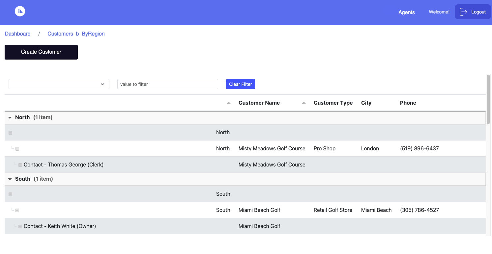

# Import Domino Agents

  **Domino Agents** which are part the HCL Domino are part of the `nsf` that only Domino Designer can be able to modify. These `nsf` will be able to use by the Domino REST API to be able to use it for other services. Only those configured Agents in a `nsf` will be available to amend by the Domino REST API. These **Agents** will be imported to Volt MX Go Iris as part of the Design Import. 

  To learn more about Agents, follow this link [Domino Agents.](https://help.hcltechsw.com/dom_designer/11.0.1/basic/H_ABOUT_DESIGNING_AGENTS.html)

## About this procedure

This procedure shows you how the **Agents** is imported to the Volt MX Iris Go Design Import.

## Before you start

- You must read and familiarize yourself with the Design Import tutorial.

## Procedure

1. You must finished the procedure [importing Domino Application](../tutorials/designimport.md#import-a-domino-application-using-the-new-foundry-app).

!!!important
    - For the Volt MX Go release v2.0.3, only limited Agents are supported.
    - The Design Import App shows the following conditions for using Domino Agents:
        - If the Domino Agents' trigger type configuration is **action menu**.
        - If the Domino Agents' document setting is configured to  **All**.

**Importing Agents in Volt  MX Go Iris using the Design Import capability**

- The **Domino Agent** will be imported as **actions**. These will available on **Views** for all the configured `views` on the imported Domino app.

## Expected result

**Sample output on Agents from the imported Domino App using Web App**

  In this example, the Domino Agent has the capability to modify the Region. 

  1. On the **Views**, click the **Customers B ByRegion**. 

      

      
       The **Customers B ByRegion** will open. 
       
      
  
  
  2. **Agents** action will be available on the navigation bar. Click the **Agents**.

      

      The four configured Agent will appear as **actions**. These **actions** are imported from the Domino Agent, which is already set up inside the `nsf` file.

  3. Click the **actions** "*West to East*". 

     

  4. It will give a prompt that the Agent has been done processing. Click **OK**.

     

  5. All customers in the *West* Region will move to the *East* Region.

     

   

