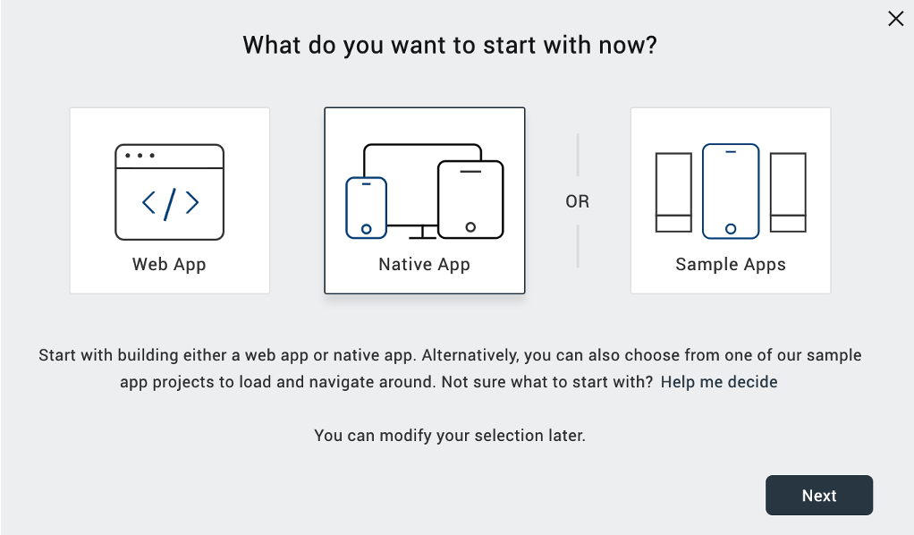
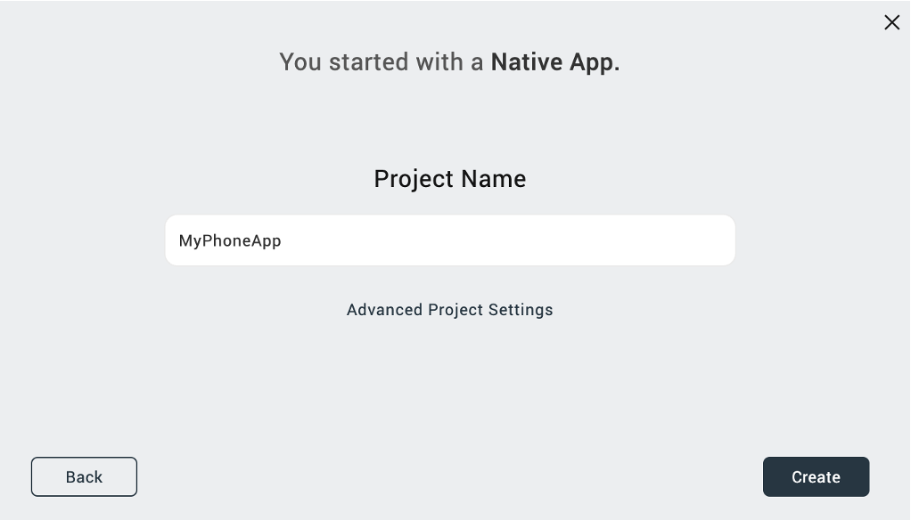
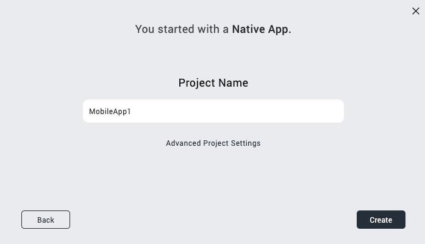

# Create a native app project 

## About this task

Guides you through the process of creating a new project for a mobile or tablet platform.

## Before you begin

You have launched Volt MX Go Iris. 

## Procedure
    
1. In the top menu of Volt MX Go Iris, select **Project** &rarr; **New Project**.
2. In the **What do you want to start with now?** dialog, select **Native App** and click **Next**.

    

3. In the **Which device size do you want to start building for first?** dialog, select **Mobile** or **Tablet** and click **Next**.

    <!--{: style="height:80%;width:80%"}-->

4. Enter your **Project Name** and click **Create**.  
  
    
 
You have now created a new native app project. You can see your project name in the upper-left corner of the **Volt MX Go Iris** canvass.

!!!tip
    For more information on importing Domino applications, see the [Design Import tutorial](../tutorials/designimport.md).