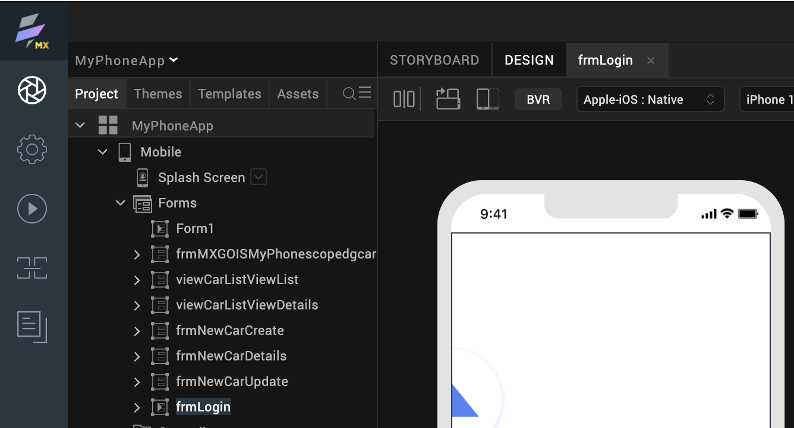

# Create a new native app project 

--8<-- "mxgoversion.md"

## About this procedure

This procedure walks you through the process of creating a new project for a mobile or tablet platform.

## Before you start

- You have launched Volt MX Go Iris. 
<!-- You must read and familiarize yourself with the Design Import tutorial.-->

## Procedure
    
1. In the top menu of Volt MX Go Iris, select **Project** &rarr; **New Project**.
2. In the **What do you want to start with now?** dialog, select **Native App** and click **Next**.

    {: style="height:80%;width:80%"}

3. In the **Which device size do you want to start building for first?** dialog, select **Mobile** or **Tablet** and click **Next**.

    {: style="height:80%;width:80%"}

4. Enter your **Project Name** and click **Create**.  
  
    {: style="height:80%;width:80%"}
 
You have now created a new native app project. You can see your project name in the upper-left corner of the **Volt MX Go Iris** canvass.

{: style="height:80%;width:80%"}

!!!tip
    For tutorials on how to import Domino applications, see:

    - [Import a Domino Application using the new Foundry app](../tutorials/designimport.md#import-a-domino-application-using-the-new-foundry-app)
    - [Import a Domino Application from the existing Foundry app](../tutorials/designimport.md#import-a-domino-application-from-the-existing-foundry-app)