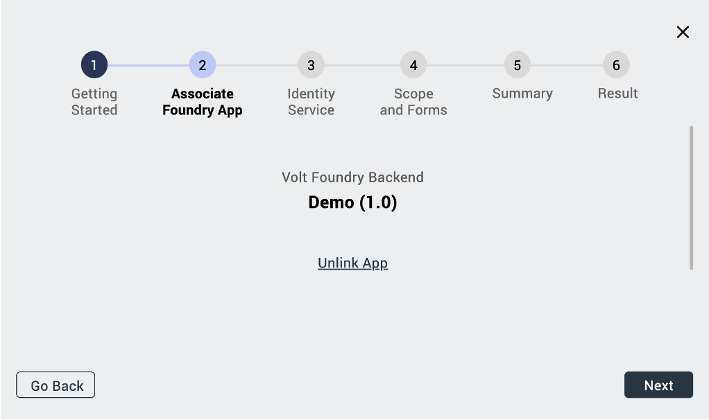
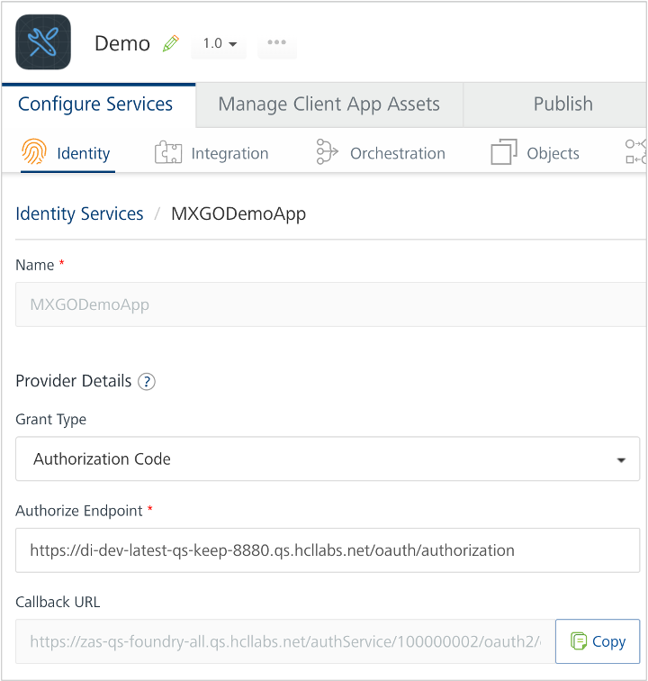
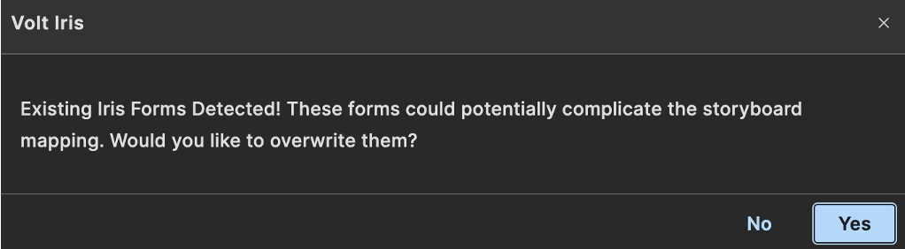

# Import a Domino Application using existing identity service from existing Volt MX Go Foundry app

## About this task

## Before you begin

## Procedure

1. In the top menu, select **Project** &rarr; **Import** &rarr; **Domino Application**. The **VoltMX Design Import Wizard** opens.

2. On **Getting Started** step, click **Next**.

    
    
3. On **Associate Foundry App** step, click **Use Existing**.

    

1. Click **Associate** corresponding to the Volt MX Go Foundry app that you want to use.

1. After the name of the selected Volt MX Go Foundry app is displayed, click **Next**.

     
         
4. On **Identity Service**, you can either select **Use Existing** or **Create New**.

    === "To use an existing identity service"

        1. Select an existing identity service and then click **Next**

            
                
        1. In the **HCL Domino Login** dialog, log in with your *Domino credentials*.

            

        1. In the Permission Requested dialog, click **Allow**.

        1. Choose the identity service related to your app on Volt MX Go Foundry in **Foundry App Identity Service** and click **Next**.

            
    
    === "To create a new identity service"
    
        1. Enter the required details in **Create New Identity Service** and click **Next**. 

            |Fields|Description|
            |:----|:----|
            |DRAPI URL|This refers to the Domino REST API URL you are working with.|
            |Scope|This refers to the name of the scope that's set up in the OAuth app you are using in the Domino REST API.  If multiple scopes are configured in the OAuth app, and you wish to use specific scopes, ensure that you separate these scopes with commas when you enter them. For example: `scope1,scope2`  If you intend to use or access all the scopes available in Domino REST API, enter `$DATA`. Just make sure that you only configured `$DATA` and `$SETUP` in the OAuth app in Domino REST API.|
            |Client ID | This is the App ID of the OAuth app you are using in Domino REST API.|
            |Client Secret| This is the App Secret of the OAuth app you are using in Domino REST API.|
            |Service Name:| Any name that identifies the Volt MX Go Foundry Identity Services. |

            

        2. Select the **Identity Service**. 
        
            The name of the Identity Service is the service name you provided prefixed with *MXGO*. As shown in the image, the name of the Identity Service is *MXGODemoApp1*. Make sure to select the correct one as the Volt MX Go Foundry app already has some identity services. 

            
            
            !!!warning "Important"
                You need to **pause** here and **do not** click **Next** until you **update the callback URL in the OAuth app** in Domino REST API with the callback URL from the Identity Service in your Volt MX Go Foundry app. If you click **Next** without updating the callback URL in the OAuth app, a validation error appears. 
            
            ???note "To update the callback URL of the OAuth app in Domino REST API"
                1. Get the callback URL of your Identity Service.

                    1. Log in to Volt MX Go Foundry.
                    1. On the **Apps** page, click your Volt MX Go Foundry app.
                    1. On the **Identity** tab under **Configure Services**, click your Identity Service.
                    1. Under **Provider Details**, click **Copy** corresponding to the **Callback URL** field to copy the callback URL.

                        

                    1. Close Volt MX Go Foundry.

                1. Update the callback URL of the OAuth app in Domino REST API.

                    === "All access"

                        1. Log in to Domino REST API.
                        1. Select **Application Management – OAUTH** from the home page or **Applications** from the side navigation pane to access the **Application Management** page.
                        1. Click the **Edit Application** icon corresponding to your OAuth app.
                        1. Update the **Callback URLs** field with the callback URL you copied from your Identity Service.
                        1. Click **Update**.
                        1. Close Domino REST API.

                    === "Limited access"

                        1. Send the copied callback URL to the Domino REST API administrator and request to update the callback URL of the OAuth app.
                        2. Get confirmation that the callback URL of the OAuth app is already updated before proceeding.

                        **Note**: If you don't receive immediate confirmation that the callback URL in the OAuth app has been updated, you can close the Design Import Wizard and Volt MX Go Iris. Once you receive confirmation, follow these steps:

                        1. Open Volt MX Go Iris and sign in using your MX Go Volt Foundry account.
                        2. Make sure that the opened project is what you used in this tutorial.
                        3. In the top menu, select **Project** &rarr; **Import** &rarr; **Domino Application** to open the **VoltMX Design Import Wizard**.
                        4. On **Getting Started**, click **Next**.
                        5. On **Associate Foundry App**, you will see that the Volt Foundry app is still linked. Click **Next**.
                        6. On **Identity Service** page, click **Use Existing** and then select the identity service under **Select Existing Identity Service**.

                    From here, you can continue with the next step in this tutorial.

        3. Click **Next**. The **HCL Domino Login** dialog opens. 
                
        4. Login with your *Domino credentials* in the **HCL Domino Login** dialog.
        
        5. In the Permission Requested dialog, click **Allow**.

            

        5. Choose the identity service related to your app on Volt MX Go Foundry in **Foundry App Identity Service** and click **Next**.

            

     

5. On **Scope and Forms**:

    !!!note
        - Selectable forms, views, and agents are only those set to the active status when configuring the schema in the Domino REST API. Those in inactive status can still be seen but won't be selectable. Unsupported agents are also shown but won't be selectable. 
        - Actions are often active within the Domino database and can only be modified using Domino Designer. Imported actions might not function as expected. If this happens, you modify or update the actions to function as expected. For more information, see [Modify or update imported actions using VoltFormula](../howto/importvoltformula.md).
        - If a dialog opens indicating that your Domino REST API schema has misconfigured settings, kindly see [Troubleshooting](../references/troubleshoot.md#design-import) for more information on addressing the issue.
        - If you see a **warning** icon appear beside any form, form field, view, or agent, click the **Reports** folder icon and click a report to open a detailed report explaining the cause of the warning.

    1. Select the **scope** you want to use from the drop-down list. When you only add one scope when creating the identity service, that scope is shown by default. 

        

    1. Click the **Forms** tab and select the forms, fields and actions you want to include in the import. 
        
        

    1. Click the **Views** tab and select the views and actions you want to include in the import.

        

    1. Click the **Agents** tab and select the agents you want to include in the import. 

        

    1. Click **Next**.
    

6. On **Summary**, review the selected `forms`, `fields`, `views`, and `agents`. Once you confirm that you have selected everything that you want to import, click **Build Iris Application**.

    

    !!!note
        - It may take a while to complete the publishing of the imported Domino app.
        - If a dialog indicating that existing Iris forms are detected, click **Yes** to overwrite the detected forms and proceed with the building of the application. The existing Iris forms were automatically generated when you created the project in Volt MX Go Iris.

            

7. On **Result**, see the final `forms`, `views`, `actions`,`agents`, and then click **Done**.
 
    !!!tip
        - A **checkmark** icon indicates a successful import.  
        - A **warning** icon indicates a successful import, but the imported component might not work as expected due to, for example, its data type not being currently supported. 
        - An **error** icon indicates a failed import. 
        - Click the **Show only with errors** toggle in a specific tab to the on position to see all elements with the **error** icon in that specific tab.  
        - When the scope you selected has active agents, the **Agents** tab is shown. Otherwise, the **AppForms** tab is shown.
        - You can click **view report** to see a results report of imported forms, views, and agents in a new window. 

     

Once you click **Done**, you can now see the imported forms and views in a storyboard view in Volt MX Go Iris. 

To see the imported forms in a directory, you can click the **DESIGN** tab to show the **Project** tab. You then expand **Responsive Web / Desktop** and then the **Form** directory to show the imported forms, views, and actions.

