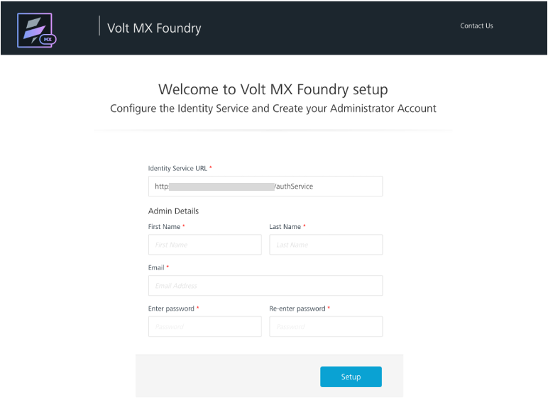

# Create a Foundry administrator account

## About this procedure

The procedure guides you in creating an administrator account to log in to Foundry.

## Before you start

You must complete the [Volt MX Go installation](../tutorials/installation.md). 

## Procedure

### For Volt MX Go Foundry installed via containerized deployment

1. Open `http://foundry.mymxgo.com/mfconsole/` or your provided Foundry hostname concatenated with `/mfconsole/` in your browser. The **Welcome to Volt MX Foundry setup** page opens.

    !!!note
        The **Identity Service URL** text box is already populated with the Identity Service URL. In case it's empty, enter `http://foundry.mymxgo.com/authService` or your provided Foundry hostname concatenated with `/authService`.

2. Under **Admin Details**: 

    1. Enter your first name in the **First Name** text box. 
    2. Enter your last name in the **Last Name** text box.
    3. Enter your email address in the **Email** text box. 
    4. Enter your password in the **Enter password** and **Re-enter password** text boxes. 

3. Click **Setup**.

### For Volt MX Go Foundry installed via installers

- Check the procedure on [how to get started with Volt MX Foundry Console](https://opensource.hcltechsw.com/volt-mx-docs/95/docs/documentation/Foundry/voltmx_foundry_user_guide/Content/How_to_access_VoltMX_Foundry_Portal_on-Prem.html){: target="_blank"}.

## Expected result

Once the details are validated for one-time configuration, the system associates your credentials with Volt MX Foundry identity services and authorization services, and then opens the **Sign in to your account** page. 
