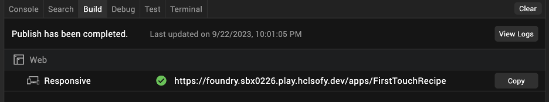

# Import First Touch Recipes app into Iris

## About this task

Imports the First Touch Recipes app into Iris so that you can try out the different development features of Iris. 

## Before you begin 

- You have installed the First Touch app in Foundry. For more information, see [First Touch tutorial](../tutorials/firsttouch.md).  
- You have downloaded the First Touch Recipes project (*FirstTouchRecipe.zip*) from the HCL License & Download Portal. For more information, see [Download HCL Volt MX Go Release package](../tutorials/portaldownload.md).

## Procedure

### To import the First Touch Recipes app project

1. Open Volt MX Go Iris. When the **Sign-in to your account** page appears, close it by clicking the Volt Iris home icon.

    

2.	Import the First Touch Recipes app project.
    1. On the top menu, select **Projects** &rarr; **Import** &rarr; **Local Project** &rarr; **Open as New Project** &rarr; **From an Archive**. A file selector dialog opens.
    2. Search and select the *FirstTouchRecipe.zip* file, and click **Open**. 

The First Touch Recipes app is now imported into your workspace in Iris and you can now try and experience the different development features of Iris to edit and update the First Touch Recipes app. 

### To build and publish the First Touch Recipes app

If you want to build and publish the First Touch Recipes app to see how it looks or if you want to see the outcome of the edits and updates you have done:

1. Check Foundry settings.
    1. Go to **Preferences**.
        - For Windows, select **Edit** &rarr; **Preferences**. 
        - For Mac, depending on your macOS, select **Volt Iris** &rarr; **Preferences** or **Settings**.
    2. On the **Volt MX Go Iris Preferences** dialog, click **Volt MX Go Foundry**.
    3. On the **Volt MX Go Foundry** tab, enter your Foundry URL in the **Foundry URL** text box, and then click **Validate**. You should see the “Validation Successful” message at the top of the dialog.
    4. Click **Done**.

2.	Log in to Iris.

    1. Click **Login** on the upper right corner of the page.
    2. Enter your email and password for Foundry on the **Sign in to your account** page.
    3. Click **Sign In**. Your username appears next to the profile icon. 

3.	Connect to Foundry.

    1. Click the **Data & Services** tab menu and select **Link to Existing App**.

        {: style="height:60%;width:60%"}

    2. Click **Associate** corresponding to a First Touch Recipes app.

        

    3. Click **Project Services** and see the connections to the Foundry data.

4.	Build and publish.

    1. On top menu, select **Build** → **Build and Publish Web**.
    2. Select **Responsive Web** checkbox and **Clean Build** checkbox, and then click **Build**.
    3. Once the publish completion dialog appears, click **OK**.
    4. Copy and open the link in your browser to open the First Touch Recipes app.   

        
    

