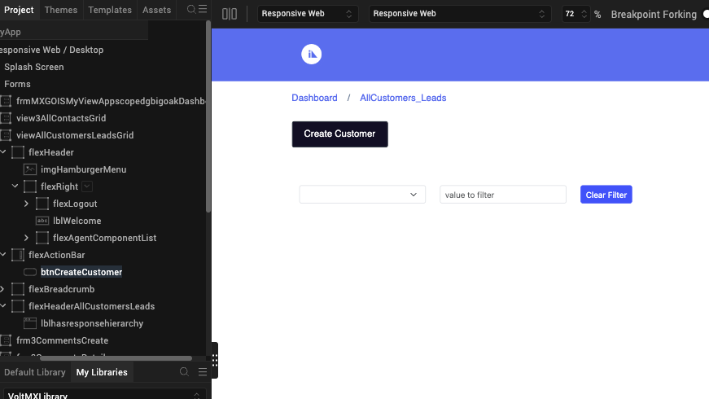
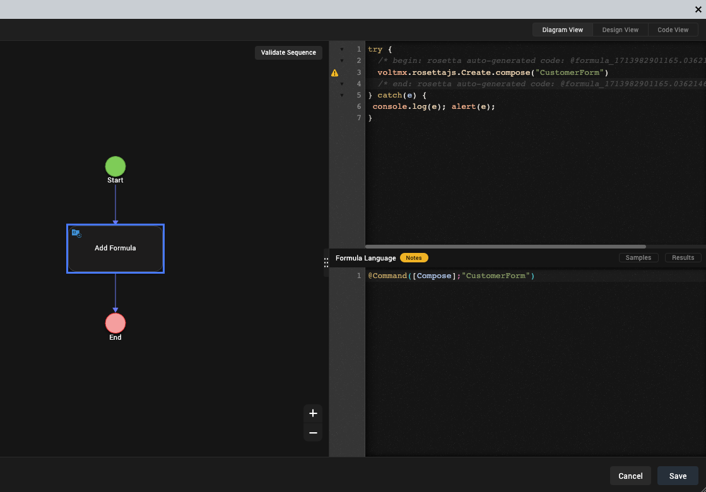

# Import actions from Domino view
## About this procedure

This procedure will guide you through the process of importing the **Domino app** and integrating the VoltFormula function. The imported actions from the Domino view will automatically convert with `voltmx.rosettajs` syntax, incorporating formula languages like **Notes** and **OpenFormula**.

## Before you start

- You must complete the [Design Import tutorial](../tutorials/designimport.md)
- You need to have **actions** on your Domino view configuration 
- You need to configure your Domino view as **Active**

## Procedure

1. On the top menu, select **Project** &rarr; **Import** &rarr; **Domino Application**. The **VoltMX Design Import Wizard** opens.
2. Finished all the steps in the **VoltMX Design Import Wizard**.
3. On the Volt MXGo Iris project, open the form that has the **actions** (i.e., Create Customer) button imported from Domino view.

    

4. On **Action** properties tab, select **onClick**.
5. Click **Edit**. The **Action Editor** page will appear.
6. Double-click **Add Formula** in the flowchart.
7. The formula language window will appear containing the *Formula Language* and `voltmmx.rosettajs` syntax.

     

8. Click **Save**.

