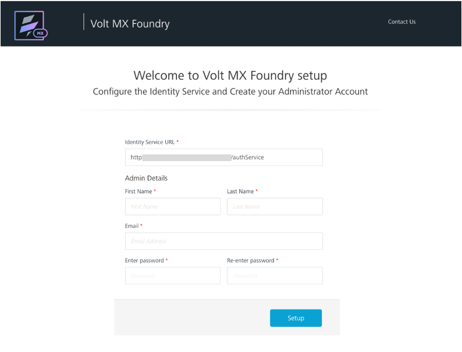

# Create a Volt Foundry administrator account

## About this task

Guides you in creating an administrator account to log in to Volt Foundry.

## Before you begin

You must complete the [Volt MX Go installation](../../tutorials/installupgrade/index.md).

## Procedure

Check the procedure on [how to get started with Volt MX Foundry Console](https://opensource.hcltechsw.com/volt-mx-docs/95/docs/documentation/Foundry/voltmx_foundry_user_guide/Content/How_to_access_VoltMX_Foundry_Portal_on-Prem.html "Link opens a new tab"){: target="_blank" rel="noopener noreferrer"}&nbsp;{: style="height:13px;width:13px"}. You can also contact the Volt Foundry administrator to request for an administrator account.

<!--
???note "For Volt Foundry installed as part of the installation on a *development or test-only environment*, which was only available until Volt MX Go v2.0.4."

    1. Open `http://foundry.mymxgo.com/mfconsole/` or your provided Volt Foundry hostname concatenated with `/mfconsole/` in your browser. The **Welcome to Volt MX Foundry setup** page opens.

        !!!note
            The **Identity Service URL** text box is already populated with the Identity Service URL. In case it's empty, enter `http://foundry.mymxgo.com/authService` or your provided Volt Foundry hostname concatenated with `/authService`.

    2. Under **Admin Details**: 

        1. Enter your first name in the **First Name** text box. 
        2. Enter your last name in the **Last Name** text box.
        3. Enter your email address in the **Email** text box. 
        4. Enter your password in the **Enter password** and **Re-enter password** text boxes.

            !!!note
                Your password must be a combination of alphanumeric and special characters, and at least 8-characters long. 

    3. Click **Setup**.

    
-->

## Expected result

Once the details are validated for one-time configuration, the system associates your credentials with Volt Foundry identity services and authorization services, and then opens the **Sign in to your account** page.