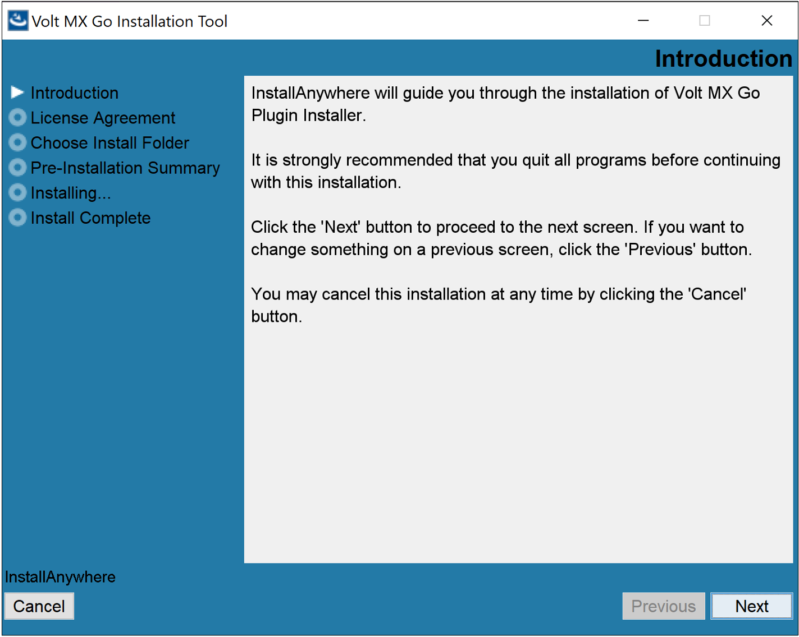
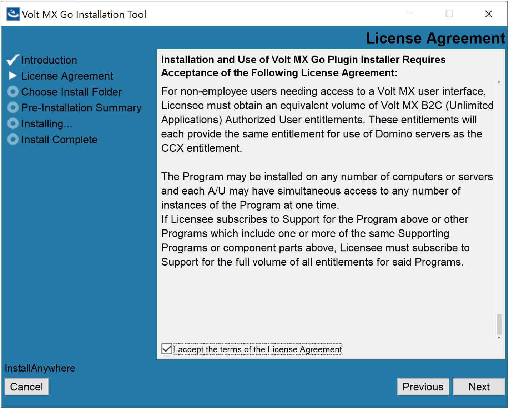
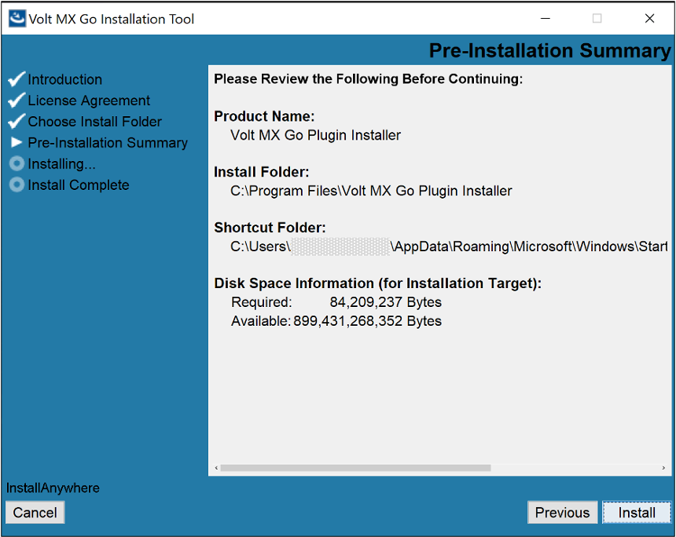
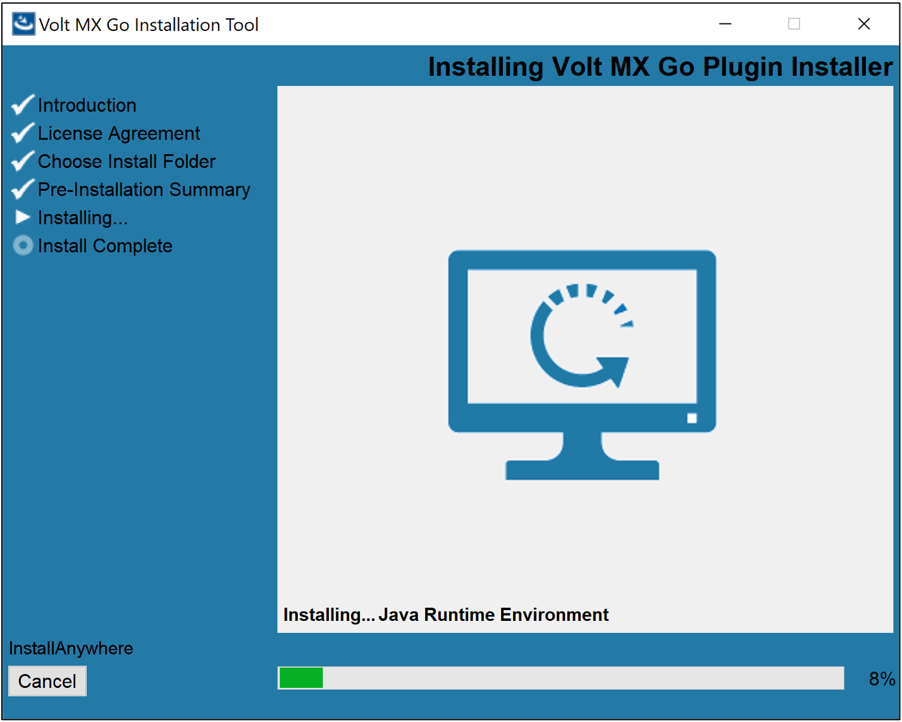
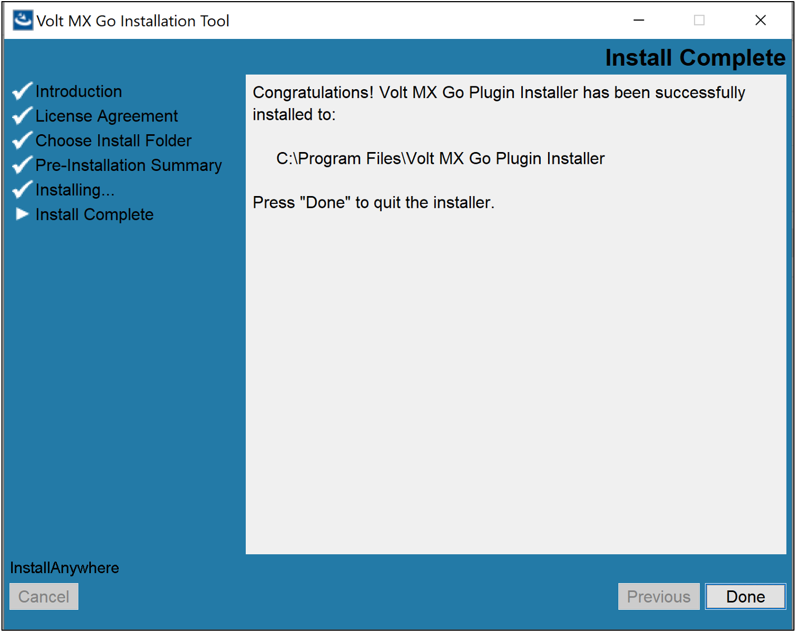
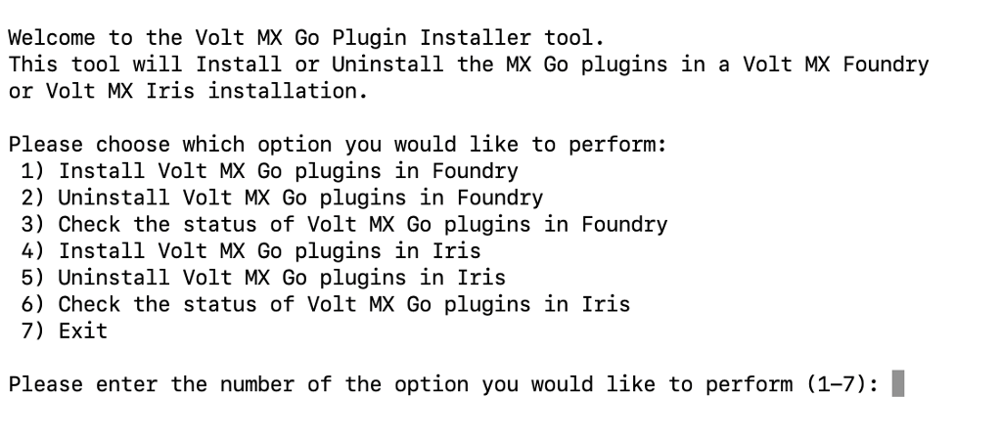

# Enable VoltScript in Volt Foundry

VoltScript is a [BASIC](https://en.wikipedia.org/wiki/BASIC "Link opens a new tab"){: target="_blank" rel="noopener noreferrer"}&nbsp;{: style="height:13px;width:13px"} scripting language that has been extended for use with Volt MX Go as a server-side scripting language running within the Volt Foundry middleware layer. It's now available as a custom code technology adapter for Volt Foundry Integration Service.

!!! note

    The information in this topic applies starting with the Volt MX Go v10 release.

## About this task

Guides you in enabling VoltScript in Volt Foundry so as to be available as a custom code technology adapter for the Volt Foundry Integration Service. 

## Before your begin

- You have downloaded and installed the supported version of Volt Foundry that's licensed with a Volt MX Go entitlement.
- You have downloaded the VoltScript Installation Tool.

For more information, see [Download HCL Volt MX Go installers](../../tutorials/installupgrade/portaldownload.md#for-volt-mx-go-v10).

## Procedure

### Install VoltScript Installation Tool

The procedure enables the installation of the VoltScript Installation Tool, which is used for enabling VoltScript in Volt Foundry.

=== "on Linux"

    1. Open terminal and extract the installer from the tar file. 
    1. Navigate to the directory containing the `VoltMXGoInstallationTool.bin` to ensure that you are in the right location to execute the installation commands for the bin file. 
    1. Enter the following command to grant executable permissions to the `VoltMXGoInstallationTool.bin` file and press **Enter**. 

        `sudo chmod +x VoltMXGoInstallationTool.bin`

        Using the `chmod` command with `sudo` ensures administrative privileges.

    1. Run the `VoltMXGoInstallationTool.bin` file to start the installation using the following command and press **Enter**.

        `./VoltMXGoInstallationTool.bin`

    1. Follow the installation instructions. The binary file will initiate the installation process and may prompt you with on-screen instructions. Follow these instructions carefully to complete the installation.

        !!!note

            If you have a graphical terminal associated with your Linux deployment, the **Volt MX Go Installation Tool** window opens. Otherwise, installation is via the command line.  

=== "on Windows"

    1. Navigate to the folder containing the downloaded installer file. 
    1. Double-click the installer file. The **Volt MX Go Installation Tool** window opens. 
    1. On the **Introduction**, read the details and instructions, and then click **Next**.

        {: style="height:80%;width:80%"}

    1. On the **License Agreement**, read the agreement details, select the **I accept the terms of the License agreement** checkbox, and then click **Next**.

        {: style="height:80%;width:80%"}

    1. On the **Choose Install Folder**, click **Next** if you agree with the indicated default location.

        {: style="height:80%;width:80%"} 

        !!! tip

            - If you want a different installation location, click **Choose** to select your preferred installation location or directly enter your preferred installation location in the text box, and then click **Next**.
            - If you selected a different installation location and decided to revert to the default location, click **Restore Default Folder** and then click **Next**.

    1. On the **Pre-Installation Summary**, review the details and then click **Install**.

        {: style="height:80%;width:80%"}

    1. On the **Installing**, see the installation status.

        {: style="height:80%;width:80%"}

    1. On the **Install Complete**, click **Done**.

        {: style="height:80%;width:80%"}

### Enable VoltScript

The procedure guides you in enabling VoltScript in Volt Foundry.

=== "on Linux"

    1. Open Terminal.
    1. Go to the directory where you installed the Volt MX Go Plugin Installer. By default, the installer executable is located in the `~/VoltMXGoPluginInstaller` directory.
    2. Run the Volt MX Go Plugin Installer by entering the following command and press **Enter**.

        `./VoltMXGoPluginInstaller`

        The installation tool opens on the Terminal showing the available options.

        {: style="height:80%;width:80%"}

    3. Enter **1** to install Volt MX Go plugins in Volt Foundry and press **Enter**.
    4. Specify the Tomcat WebApps directory by entering the number corresponding to your installation or enter the full path to your Tomcat WebApps directory, and then press **Enter**.

        You get a confirmation statement that the plugins have been installed.

        !!! note

            Starting with Volt MX Go version 2.1.1, the installed Volt Foundry version is checked for compatibility. If incompatible, the plugin installation stops, and users are informed of their current and required minimum Volt Foundry versions. 

    6. Enter **7** and press **Enter** to exit the installation tool. 

=== "on Windows"

    1. Select **Start**, scroll through the alphabetical list, and select **Volt MX Go Plugin Installer**. Depending on your OS, you might need to select **All apps**, scroll through the alphabetical list, and click **Volt MX Go Plugin Installer**.

        OR

        Double-click the **Volt MX Go Plugin Installer** shortcut on your desktop if available. 

        A Command Prompt window opens showing the available options.

        {: style="height:80%;width:80%"}

    2. Enter **1** to install Volt MX Go plugins and press **Enter**.
    3. Specify the Tomcat WebApps directory by entering the number corresponding to your installation, or enter the full path to your Tomcat WebApps directory, then press **Enter**. 

        You get a confirmation statement that the plugins have been installed.

        !!! note

            Starting with Volt MX Go version 2.1.1, the installed Volt Foundry version is checked for compatibility. If incompatible, the plugin installation stops, and users are informed of their current and required minimum Volt Foundry versions. 

    5. Press **Enter** to close the Command Prompt window.

