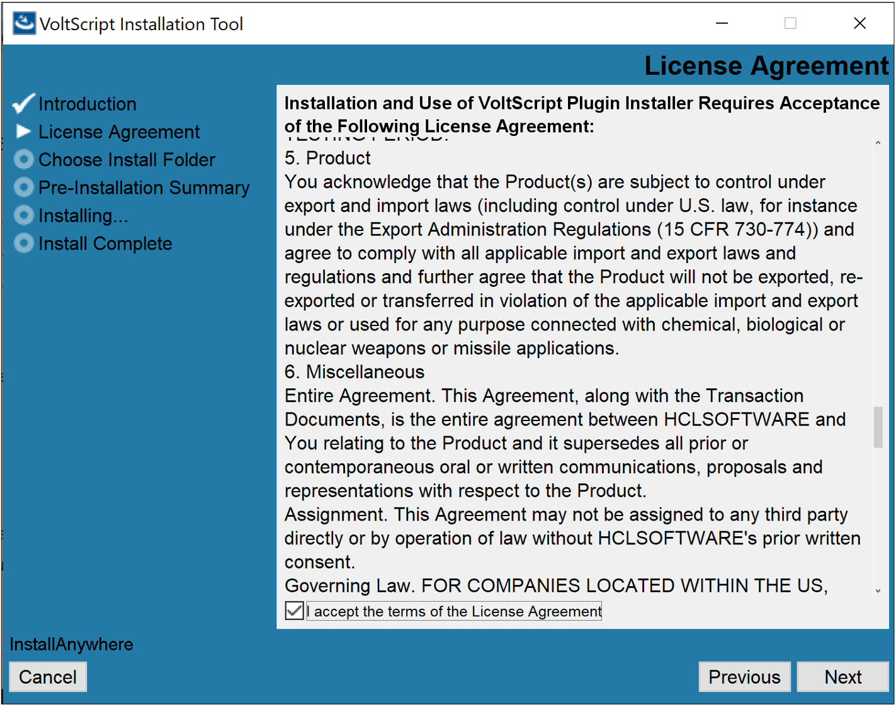

# Enable VoltScript in Volt Foundry

VoltScript is a [BASIC](https://en.wikipedia.org/wiki/BASIC "Link opens a new tab"){: target="_blank" rel="noopener noreferrer"}&nbsp;{: style="height:13px;width:13px"} scripting language that has been extended for use with Volt MX Go as a server-side scripting language running within the Volt Foundry middleware layer. It's now available as a custom code technology adapter for Volt Foundry Integration Service.

!!! note

    The information in this topic applies starting with the Volt MX Go v10 release.

## About this task

This guide walks you through installing the VoltScript Plugin Installer using the VoltScript Installation Tool, and then using the VoltScript Plugin Installer to add VoltScript plugins in Volt Foundry.

## Before your begin

- You have downloaded and installed the supported version of Volt Foundry that's licensed with a Volt MX Go entitlement.
- You have downloaded the VoltScript Installation Tool.

For more information, see [Download HCL Volt MX Go installers](../../tutorials/installupgrade/portaldownload.md#for-volt-mx-go-v10).

## Procedure

### Install VoltScript Plugin Installer 

The procedure guides your through the installation of the VoltScript Plugin Installer, installs the VoltScript plugins in Volt Foundry.

=== "**on Linux**"

    1. Open terminal, navigate to the directory containing the installer file, and extract the installer from the tar file. 
    1. Navigate to the directory containing the `.bin` file to ensure that you are in the right location to execute the installation commands for the `.bin` file. 
    1. Enter the following command to grant executable permissions to the `.bin` file and press **Enter**. 
        
        For example:

        `sudo chmod +x <installerfilename>.bin`

        Using the `chmod` command with `sudo` ensures administrative privileges.

    1. Run the `.bin` file to start the installation using the following command and press **Enter**.
        
        For example:

        `./<installerfilename>.bin`

    1. Follow the installation instructions. The binary file will initiate the installation process and may prompt you with on-screen instructions. Follow these instructions carefully to complete the installation.

        !!!note

            If you have a graphical terminal associated with your Linux deployment, the **VoltScript Installation Tool** window opens. Otherwise, installation is via the command line.  

=== "**on Windows**"

    1. Navigate to the folder containing the downloaded installer file. 
    1. Double-click the installer file. The **VoltScript Installation Tool** window opens. 
    1. On the **Introduction**, read the details and instructions, and then click **Next**.

        {: style="height:80%;width:80%"}

    1. On the **License Agreement**, read the agreement details, select the **I accept the terms of the License agreement** checkbox, and then click **Next**.

        {: style="height:80%;width:80%"}

    1. On the **Choose Install Folder**, click **Next** if you agree with the indicated default location.

        {: style="height:80%;width:80%"} 

        !!! tip

            - If you want a different installation location, click **Choose** to select your preferred installation location or directly enter your preferred installation location in the text box, and then click **Next**.
            - If you selected a different installation location and decided to revert to the default location, click **Restore Default Folder** and then click **Next**.

    1. On the **Pre-Installation Summary**, review the details and then click **Install**.

        {: style="height:80%;width:80%"}

    1. On the **Installing**, see the installation status.

        {: style="height:80%;width:80%"}

    1. On the **Install Complete**, click **Done**.

        {: style="height:80%;width:80%"}

### Install VoltScript plugins

The procedure guides you in installing the VoltScript plugins in Volt Foundry.

=== "on Linux"

    1. Open Terminal.
    1. Go to the directory where you installed the VoltScript Plugin Installer. <!--By default, the installer executable is located in the `~/VoltMXGoPluginInstaller` directory.-->
    2. Run the VoltScript Plugin Installer by entering the following command and press **Enter**.

        `./<installerfilename>`

        The installation tool opens on the Terminal showing the available options as can be seen from the following example:

        {: style="height:80%;width:80%"}

    3. Enter **1** to install VoltScript plugins in Volt Foundry and press **Enter**.
    4. Specify the Tomcat WebApps directory by entering the number corresponding to your installation or enter the full path to your Tomcat WebApps directory, and then press **Enter**.

        You get a confirmation statement that the plugins have been installed.

    6. Enter **7** and press **Enter** to exit the installation tool. 

=== "on Windows"

    1. Select **Start**, scroll through the alphabetical list, and select **VoltScript Plugin Installer**. Depending on your OS, you might need to select **All apps**, scroll through the alphabetical list, and click **VoltScript Plugin Installer**.

        OR

        Double-click the **VoltScript Plugin Installer** shortcut on your desktop if available. 

        A Command Prompt window opens showing the available options as can be seen from the following example:

        {: style="height:80%;width:80%"}

    2. Enter **1** to install VoltScript plugins and press **Enter**.
    3. Specify the Tomcat WebApps directory by entering the number corresponding to your installation, or enter the full path to your Tomcat WebApps directory, then press **Enter**. 

        You get a confirmation statement that the plugins have been installed. 

    4. Press **Enter** to close the Command Prompt window.

!!! tip

    Make sure to restart Volt Foundry after completing the installation of the VoltScript plugins.  

## Expected result

You have now installed the VoltScript plugins in Volt Foundry. You can now configure a VoltScript Integration Service in Volt Foundry. For more information, see the [VoltScript documentation](https://help.hcl-software.com/docs/voltscript/early-access/index.html "Link opens a new tab"){: target="_blank" rel="noopener noreferrer"}&nbsp;{: style="height:13px;width:13px"}.

## Additional information

You can install VoltScript Runtime using the **Install VoltScript Runtime Zip** option in the VoltScript Plugin Installer. The VoltScript Runtime files will be saved in the following locations:

- For Linux: `/usr/local/voltscript`
- For Windows: `C:\Program Files\HCL\voltscript`

For more information on VoltScript Runtime, see the [VoltScript documentation](https://help.hcl-software.com/docs/voltscript/early-access/index.html "Link opens a new tab"){: target="_blank" rel="noopener noreferrer"}&nbsp;{: style="height:13px;width:13px"}.
