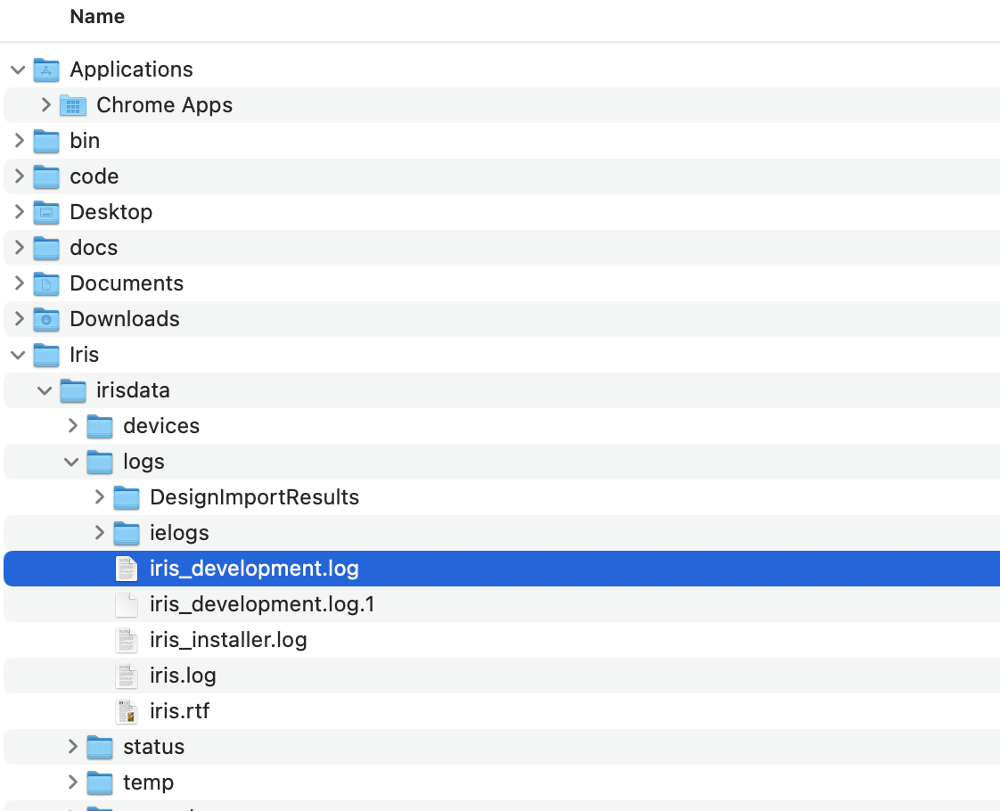

# Monitor logging level

## About this procedure
This procedure guides you on how to monitor your log file using the specific logging level.

## Check the logging level

!!!Note
    This Logging Level is specified for import domino application only.

1. Go to Help&rarr;Logging level, and  click the current level you want. For your reference, see [Logging Reference Levels](../references/reflogginglevels.md).

    !!!Note
    The default level is **Trace**. For each level of logging, you must restart the Iris to take effect the level that you have chosen. After restarting the Iris the current level will be the level that you have chosen and this will be the default level of the logging.

## View the logging details
### For mac and windows
1. Go to the **Iris** directory. This is found inside your local user directory. 
2. Open the **irisdata**&rarr;**Logs**&rarr;**ielogs** directory.
3. Select and open the `iris_development.log` file name using **Text Editor** app.
### Expected result

#### For mac
{: style="height:80%;width:80%"}

#### For windows
{: style="height:80%;width:80%"}