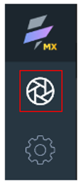
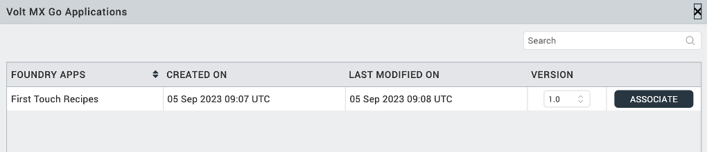

# Generate CRUD forms for Object Service

## About this task

The procedure guides you in generating CRUD forms and associated form-navigation links for an Object Service after linking your Volt Iris project to your Volt Foundry app with a defined Object Service data model.

## Before you begin

- You have [created an app in Volt Foundry](../../tutorials/adaptertutorial.md#create-an-app-in-volt-foundry).

- You have [configured an Identity Service for your app in Volt Foundry](../../tutorials/adaptertutorial.md#configure-an-identity-service).

- You have [added an environment for your app](../../tutorials/adaptertutorial.md#add-an-environment).

- You have [configured an Object Service for your app in Volt Foundry](../../tutorials/adaptertutorial.md#configure-an-object-service-for-domino).

- You have [generated the data model for the Object Service](../../tutorials/adaptertutorial.md#generate-a-data-model).

- You have [created a project in Volt Iris](../../tutorials/designimport.md#create-a-new-project).

## Procedure

1. Open Volt Iris. When the **Sign-in to your account** page appears, close it by clicking the Volt Iris home icon.

    

2. Check Volt Foundry settings.
    1. Go to **Preferences**.

        For Windows, select **Edit** &rarr; **Preferences**.

        For Mac, depending on your macOS, select **Volt Iris** &rarr; **Preferences** or **Settings**.

    2. On the **Volt Iris Preferences** dialog, click **Volt Foundry**.
    3. On the **Volt Foundry** tab, enter your Foundry URL in the **Foundry URL** text box, and then click **Validate**.

        You should see the “Validation Successful” message at the top of the dialog.

    4. Click **Done**.

3. Log in to Volt Iris.
    1. Click **Login** on the upper right corner of the Volt Iris screen.
    2. Enter your email and password for Volt Foundry on the **Sign in to your account** page.
    3. Click **Sign In**. Your username appears next to the profile icon.

4. Connect to Volt Foundry.
    1. Click the **Data & Services** tab menu and select **Link to Existing App**. 

        {: style="height:60%;width:60%"}

        The **Volt MX Go Applications** dialog opens.

    2. Click **Associate** corresponding to a Volt Foundry app that you want to link.

        

        In this example, the associated Volt Foundry app is the *First Touch Recipes* app.

    3. Click **Project Services** on the **Data & Services** tab and see the connections to the Volt Foundry data.

5. Generate forms.

    1. Go to the **Data & Services** tab, and expand **Project Services**.  
    2. Right-click the Object Service, and then select **Generate Forms** &rarr; **Responsive Web**.

    Using the *First Touch Recipes* app as an example, right-click the **FirstTouchRecipesObj** and then select **Generate Forms** &rarr; **Responsive Web**.

    {: style="height:80%;width:80%"}

!!!note
    **Summernote Editor** is automatically applied on Rich Text fields when generating entry forms (CREATE/UPDATE) from the data panel. **Summernote Editor** is a simple WYSIWYG editor that allows a developer to enter or edit rich text content in a Rich Text field in a form in Volt Iris. For more information, see [Summernote Editor](../../topicguides/summernotewidget.md).

## Expected result

Five types of forms (*Dashboard*, *Grid*, *Details*, *Create*, and *Update*) are generated for each object in the Object service with the respective navigation links among each other.

The Dashboard form displays all the objects of the selected Object service. Users can navigate to the respective Grid, Details, Create, and Update forms from the Dashboard screen. If you haven't defined the startup form of the app, the Dashboard form is made the startup form by default.

If your Object Service has views, they're also generated. In the example, the Object Service *DemoGAObjectService* of the Volt Foundry app *DemoGA* has the view *Main*.

{: style="height:60%;width:60%"}

After the process, there are two types of forms (*Grid* and *Details*) for the view *Main*, and five types of forms for the object *Recipe*.   

