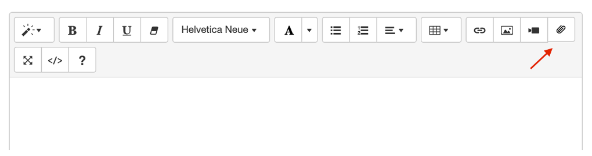
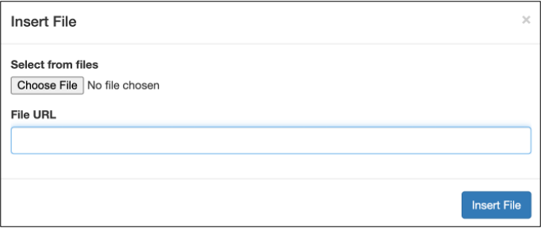
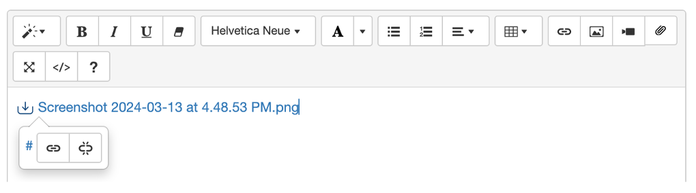
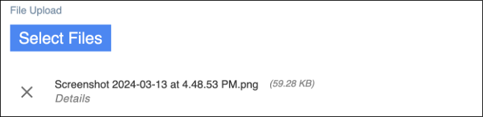
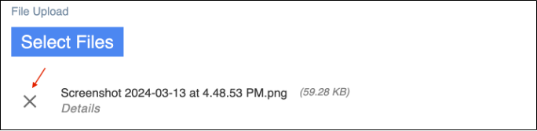

# Insert attachments via Summernote Editor

## About this task

Guides you on how to insert attachments via the [Summernote Editor](../../topicguides/summernotewidget.md).

## Before you begin

- You have [generated CRUD forms for Object Service](codegen.md).

- You have [built and published your app in Volt Iris](https://opensource.hcltechsw.com/volt-mx-docs/95/docs/documentation/Iris/iris_user_guide/Content/Cloud_Build_in_VoltMX_Iris.html#post-successful-build "Link opens a new tab"){: target="_blank" rel="noopener noreferrer"}&nbsp;{: style="height:13px;width:13px"}.

!!! note "Important"

    Make sure that you included the virtual field `$FILES` in the form configured in Domino REST API. 

## Procedure

1. On the Summernote Editor toolbar, click the paper clip icon to open the **Insert File** dialog.

    {: style="height:80%;width:80%"}

2. Click **Choose File** to browse and select the file you want to attach or enter the file URL in the **File URL** box

    {: style="height:80%;width:80%"}

3. Click **Insert File**.

The selected file is inserted as a link in the content field of Summernote Editor. The source link is shown as # and not the Base64 data since the Base64 data takes too much space. The link will have a class name of domino-attachment used as the flagging of attachments inserted on Summernote Editor.

{: style="height:80%;width:80%"}

The selected file also appears in the File List section of the form where you manage the document attachments.

!!!tip
    The File List section of the form appears only when you include `$FILES` on the form configured on Domino REST API.

{: style="height:80%;width:80%"}

!!!note
    When inserting a new attachment with the same filename and file type as an existing attachment, you will be prompted that the attachment already exists and asked if you would like to overwrite the existing attachment with the new one.

## Additional information

### To remove an attachment

1. Go to the File List section of the form.
2. Select the attachment that you want to remove and click the corresponding delete icon.

    {: style="height:80%;width:80%"}

3. In the confirmation dialog, click **OK** to confirm attachment removal.

!!!note
    Removing the attachment link in the content field of the Summernote Editor doesn't remove the attachment. You have to remove it from the File List section.

## To download an attachment

You can download attachments from the Grid or Details form of a document.

- To download all attachments, click **Download All Attachments**.
- To download an individual attachment, click the attachment file link on the rich text field.

To learn more about attachments, see [Attachments](../../topicguides/adapter/method.md#attachments).
