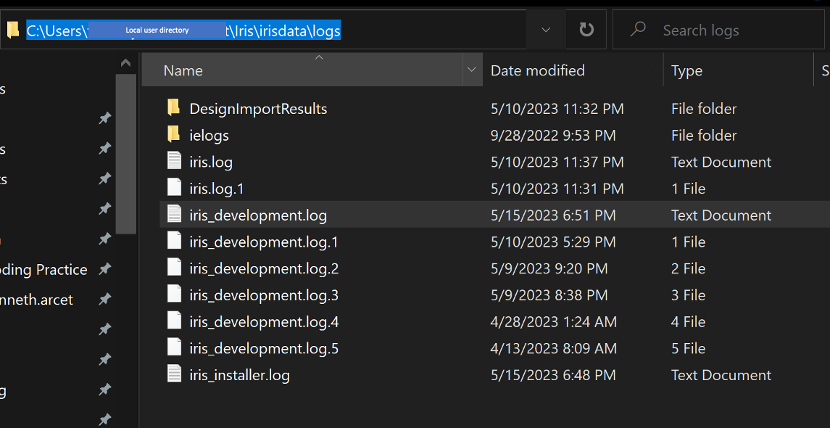

# Set logging level

## About this task

Guides you on how to check and set the logging level, and access the log files. For more information, see [Logging levels](../../references/reflogginglevels.md).

!!! note

    The logging level in Volt Iris only affects the logs for importing a Domino application at the moment.

## Before you begin

You have launched Volt Iris.

## Procedure

### To check the logging level

- In the top menu of Volt Iris, go to **Help** &rarr; **Logging Level**. The current logging level is indicated.

    !!! note

        The default level is **Trace**.

### To set the logging level

1. In the top menu of Volt Iris, go to **Help** &rarr; **Logging Level**, and then choose a logging level based on the level of details you want to find in the logs. To learn the description of each logging level, see [Logging levels](../../references/reflogginglevels.md).

2. Restart Volt Iris after setting a new logging level.

### To view the logs

1. From your user directory, go to **Iris** &rarr; **irisdata** &rarr; **logs**.

    - For Windows:

    {: style="height:80%;width:80%"}

    - For Mac:

    {: style="height:80%;width:80%"}

2. Open the `iris_development.log` file to view the logs.
