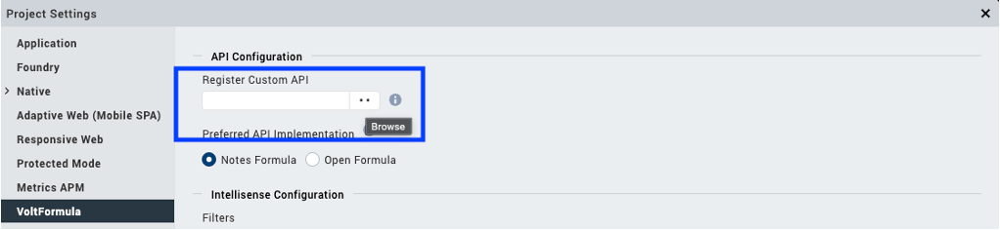
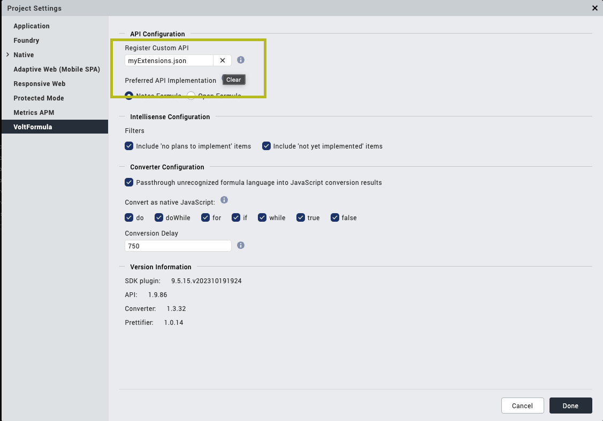

# Register and unregister custom Rosetta API

## About this procedure

This procedure describes how to register and unregister custom Rosetta API in the **API Configuration**.

## Procedure

### Register custom API

1. Go to **Project Settings**, and select **VoltFormula**.
3. On the **Register Custom API** text box, click the **Browse** icon.
4. Select your custom API `.json` file.
5. Click **Done**.

    

### Unregister custom API

1. Go to the **Project Settings**, and select **VoltFormula**.
3. On the  **Register Custom API** text box, click **X** to remove the custom API.
4. Click **Done**.

    

Once you have unregistered your custom API, VoltFormula will no longer provide results for your custom API.

