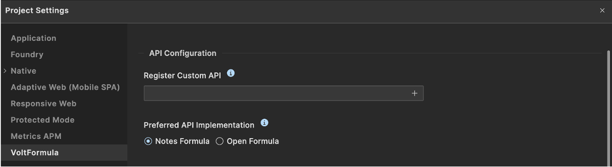

# Register and unregistered custom Rosetta API

## About this procedure

This procedure describes how to register and unregistered custom Rosetta API in the API configuration.

## Procedure

#### Register custom API

1. Go to the **Project Settings**. The project setting window will open.
2. Select **VoltFormula**
3. On the  Register Custom API text box, click **Browse**.
4. Select your custom API `.json` file.
5. Click **Done**.

    

#### Unregister custom API

1. Go to the **Project Settings**. The project setting window will open.
2. Select **VoltFormula**
3. On the  **Register Custom API** text box, click **X**. This will remove the custom API.
4. Click **Done**.

    

Once you have unregistered your custom API, the VoltFormula will no longer be able to provide results for the custom API that was removed. You must registered it again.

