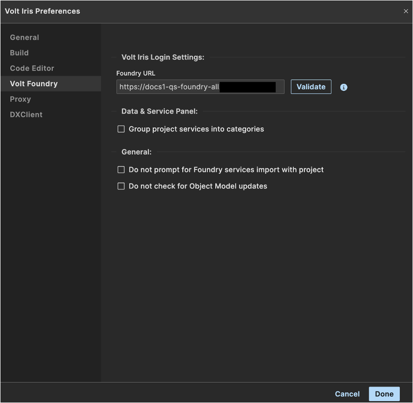
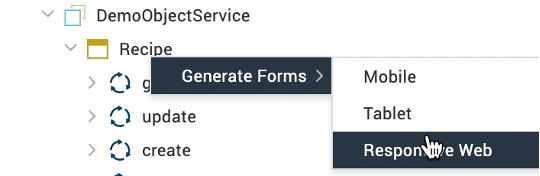

# Import Summernote Editor

## About this procedure 

The procedure guides you in importing the Summernote Editor component in Iris. The Summernote Editor component is a simple WYSIWYG editor that allows a developer to enter or edit rich text content in a rich text field in a form in Iris.  

## Before you start
- You have created a Domino data model in a Foundry Object Service for which you want to generate forms.
<!-- You have completed the [Volt MX Go installation](../tutorials/installation.md) and opened Volt MX Iris.
- You have created your [Foundry admin account](foundryadminaccount.md).
- You have checked your Foundry settings. To check your Foundry settings:

    1. (For Windows) On the top menu, select **Edit** &rarr; **Preferences**.

        or

        (For Mac) On the main menu, select **Volt MX Iris** &rarr; **Preferences**.

    2. On the **Volt MX Iris Preferences** dialog, click **Volt MX Foundry**.
    3. On the **Volt MX Foundry** tab, enter `http://foundry.mymxgo.com` in the **Foundry URL** text box, and then click **Validate**.

        

        You should see the “Validation Successful” message at the top of the screen if the Foundry is available.

    4. Click **Done**.

- You have connected Iris to Foundry. To connect to Foundry:

    1. Click the **Profile** icon on the upper right corner of the Iris screen.
    2. Enter your username and password for Foundry. Your username appears next to the **Profile** icon.
    3. Click the **Data & Services** tab under your username.
    4. Click the menu icon, and then select **Link to an Existing App**. The Volt MX Applications dialog opens.
    5. Click **Associate** to link your app to the data stored on Foundry.
    6. Click **Project Services** and see the connections to the Foundry data.

        
-->
## Procedure

### To import Summernote Editor:

1. On the top menu of Volt MX Iris, select **Project** &rarr; **Import** &rarr; **Summernote Editor**. 

    

    An **Import Component** dialog opens and shows the import progress. 

    

2. Wait for the import completion. Once completed, the **Import Component** dialog shows the “Component imported successfully” message.

    

3. Click **Close**.

The Summernote Editor component is now successfully imported.

### To test Summernote Editor implementation: 

1.	Open a project, and then go **Data & Services** &rarr; **Project Services**.
2.	Expand the **ObjectService** and click a data model.

    

3.	Select **Generate Forms** &rarr; **Responsive Web**. A dialog indicates the generation of forms.

    

4.	Once the forms are generated, go to Project &rarr;  select the “Create” or “Update” form.

    
    
    On the selected form, the rich text field now has a WYSIWYG editor instead of just being a text field. 

    

## Additional information

To learn more, see [SummernoteEditor widget](../references/summernotewidget.md). 