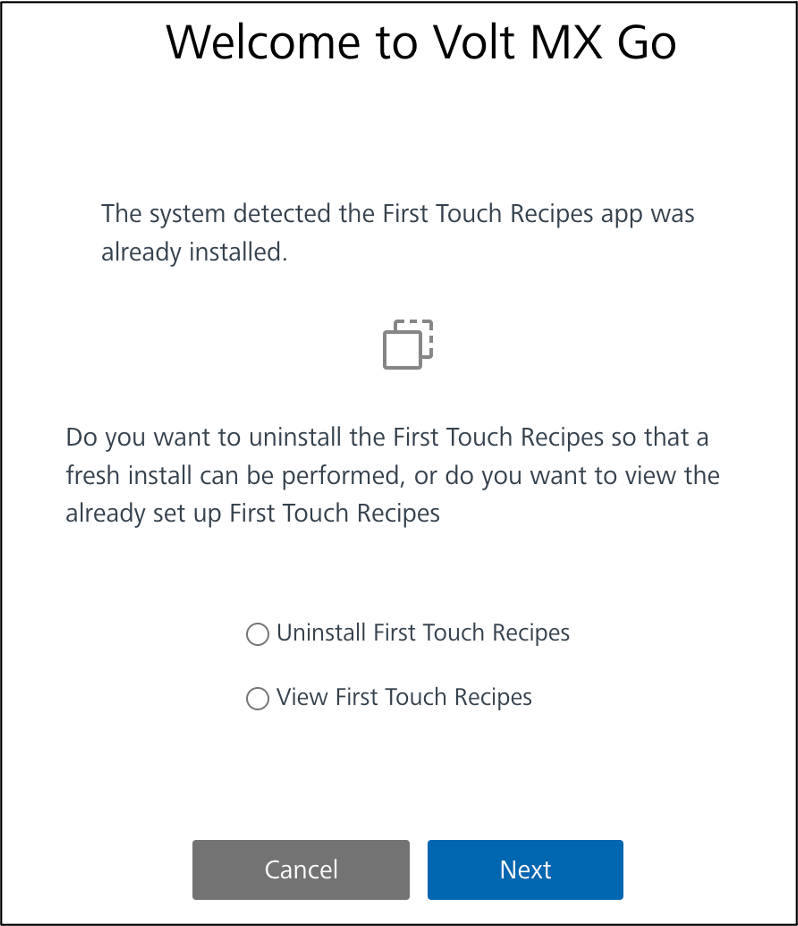
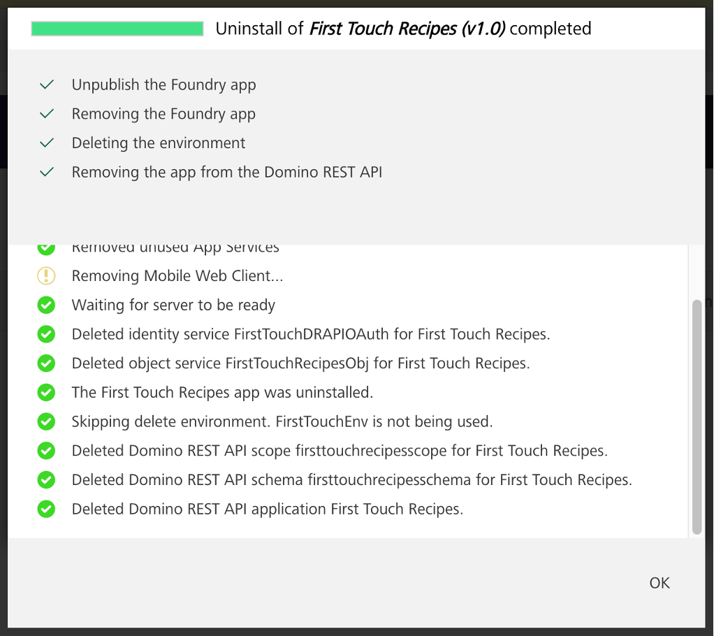

# Uninstall First Touch

## About this task

Guides you in uninstalling First Touch in case you want to start over with the First Touch installation or you want to completely remove First Touch.

## Procedure

1. On the **Apps** page of the **Volt MX Foundry Console**, click **GET STARTED**.  

    OR

    Select **VOLT MX GO First Touch** from the side panel. 

2. On the **Welcome to Volt MX Go** dialog, select **Uninstall First Touch Recipes**.

    {: style="height:60%;width:60%"}

3. Click **Next**. An uninstall progress dialog shows the status of the uninstallation subprocesses. 

    !!!note 
        -  If the Domino REST API configuration can't be pulled from the object service or the object service has been unlinked or deleted, enter your Domino REST API details in the **Uninstall First Touch** dialog and click **Next**. 
        -  If another app is published to the environment created when First Touch was installed, the Progress dialog indicates that the environment isn't deleted as it's used by another app. However, the First Touch app is removed from the environment. 

4.	After the completion of each uninstallation subprocess as indicated by a check icon, click **OK** to close the dialog. 

    {: style="height:60%;width:60%"}

## Expected result

- The First Touch app and the environment created when installing First Touch are deleted in Volt MX Foundry.

    !!!note
        The environment isn't deleted during the uninstallation **if another app is published to the environment**.

- The schema, scope, and app related to the First Touch app are deleted from the Domino REST API.

!!!warning "Important"
    If you uninstall First Touch and reinstall it again, ensure you clear your browser cache before launching the app.
