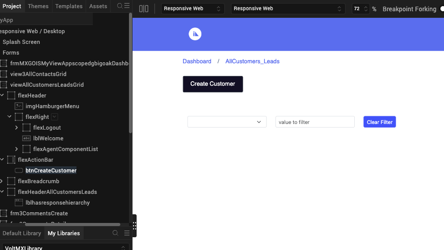
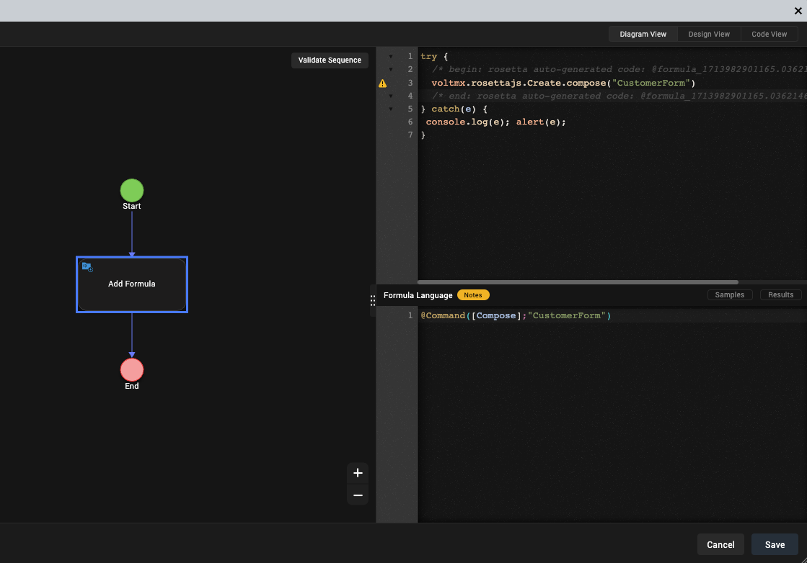

# Modify or update imported actions using VoltFormula

!!!note
    The information in this topic applies starting with the Volt MX Go version 2.0.3 release. 

When importing a Domino application using Design Import, you have the option of selecting and including the actions from the Domino view in the import process. The imported actions from the Domino view are automatically converted with `voltmx.rosettajs` syntax, incorporating formula languages like Notes and OpenFormula.  

## About this task

Guides you on how to modify or update the formula language of actions included in an imported Domino application using VoltFormula.

## Before you begin

- You have imported a Domino application, including actions from the Domino view, using Design Import.
- You have launched Volt MX Go Iris and opened the project with the imported Domino application that included actions. 

## Procedure

1. Click the **Design** tab.
2. Under **Project**, expand the **Forms** folder and then the view that contains the action that you want to modify.
3. Click the action, and then go to the right side of the work area to click **Properties** and select the **Action** tab.

    !!!note
        An imported action is always under `flexActionBar`.

    

4. Click **Edit** next to the **onClick** event. The **Action Editor** opens.
5. In the **Action Editor**, click the **Add Formula** in the diagram to open the **Formula Editor**.

    

6. Modify or update the formula in the **Formula Language** section of the **Formula Editor** based on your requirements.
7. Click **Save**.
