# Define widget properties using formula language

## About this task

Guides you on using formula language to define properties of Volt Iris widgets. The following widget properties are supported:

- Visible
- Text
- ToolTip
- Enable Blur
- Mask Text
- Max Characters
- Sensitive Text

!!! info

    To learn more about widgets, see the [Iris Widget Programmer Guide](https://help.hcl-software.com/voltmx/v9.5/Iris/iris_widget_prog_guide/Content/Overview.html "Link opens a new tab"){: target="_blank" rel="noopener noreferrer"}&nbsp;{: style="height:13px;width:13px"} in the HCL Volt MX documentation.

## Before you begin

You have added a widget with properties that support formulas to a form in your project in Volt Iris.

!!! note

    Volt Iris widget properties that support formulas are identifiable by the **formula button**&nbsp;. 

## Procedure

1. Select the widget and then go to **Properties**.
2. Select the supported property that you want to define from the tabs under **Properties**.
3. Define the widget property.

=== "For **Visible**"

    1. Click the formula button. The **Enter Formula** dialog opens.

        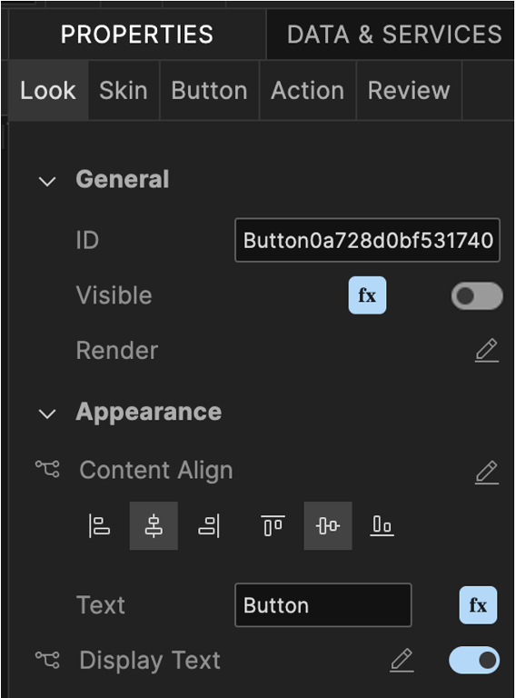{: style="height:40%;width:40%"}

    2. Enter the formula in the **Formula Language** section and then click **Apply**.

        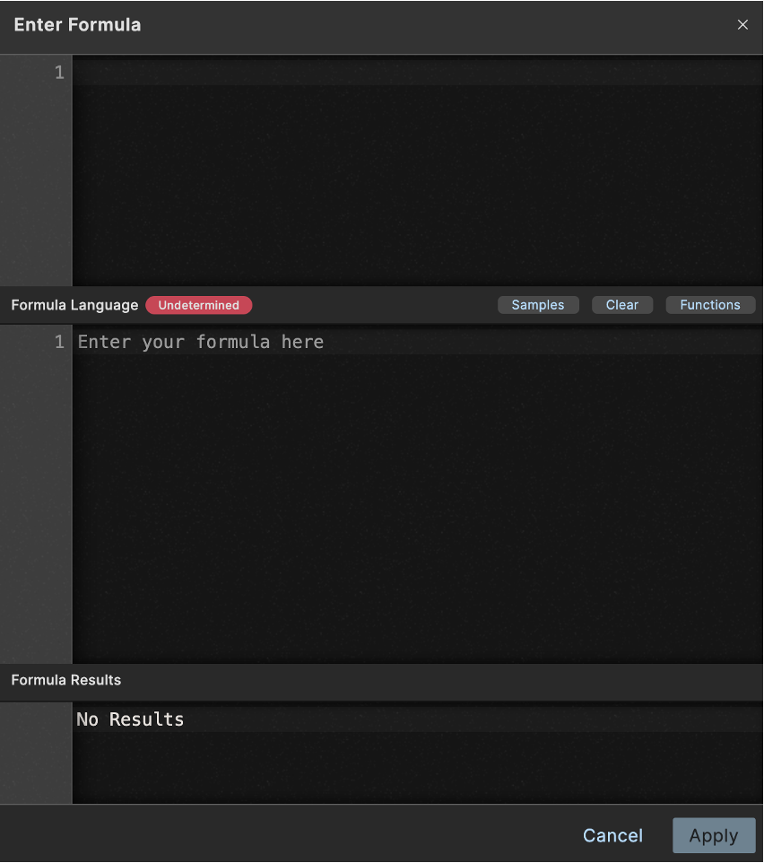{: style="height:60%;width:60%"}

    !!! note

        When the formula is set for the **Visible** property, it may not be possible to determine the formula value until application runtime. This means that the toggle is set to the off position even after setting the formula. 

=== "For **Text**"

    1. Click the formula button. The **Enter Formula** dialog opens.

        {: style="height:40%;width:40%"}

    2. Enter the formula in the **Formula Language** section and then click **Apply**.

        {: style="height:60%;width:60%"}
    
    The **Text** property is now defined using formula language as indicated by **\[FORMULA\]** in the text field.

    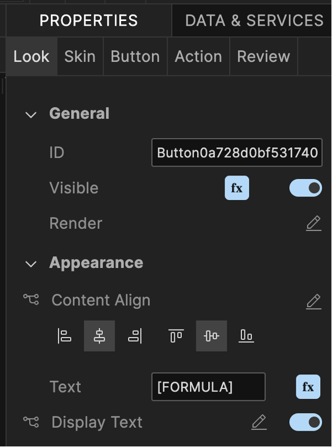{: style="height:40%;width:40%"}

=== "For **Tool Tip**"

    1. Click the **Edit** icon. The **Tool Tip** dialog opens.

        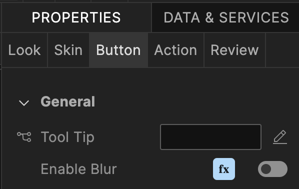{: style="height:40%;width:40%"}

    2. Click the formula button corresponding to the desired platform. The **Enter Formula** dialog opens.

        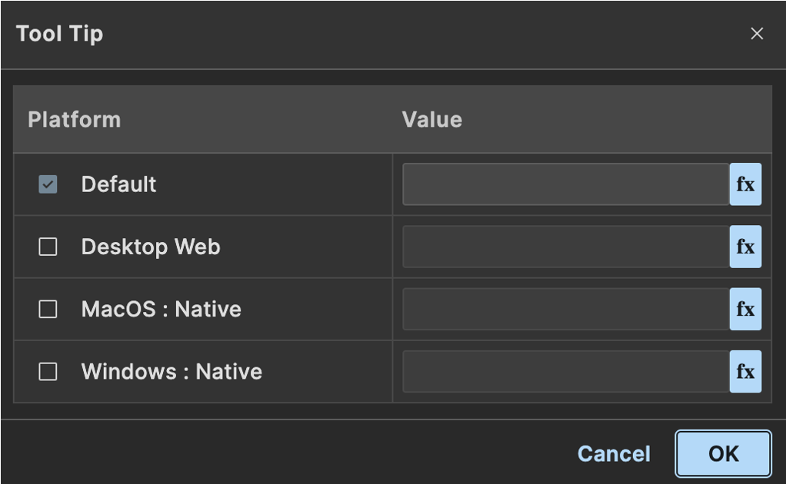{: style="height:60%;width:60%"}

    3. Enter the formula in the **Formula Language** section and then click **Apply**.

        {: style="height:60%;width:60%"}

        The tool tip for the selected platform is now defined using formula language as indicated by **\[FORMULA\]** in the text field 

        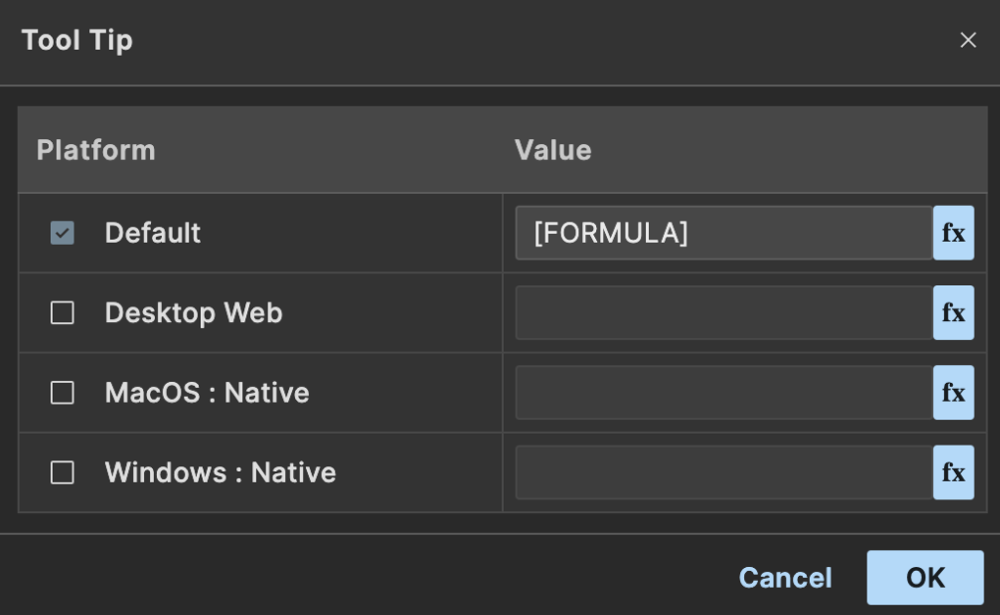{: style="height:60%;width:60%"}

    4. Click **OK** to close the **Tool Tip** dialog.

    The Tool Tip property is now defined using formula language as indicated by **\[FORMULA\]** in the text field.

    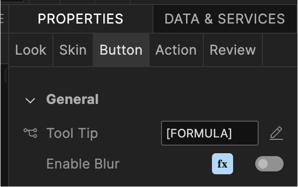{: style="height:40%;width:40%"}

=== "For **Enable Blur**"

    1. Click the formula button. The **Enter Formula** dialog opens.

        {: style="height:40%;width:40%"}

    2. Enter the formula in the **Formula Language** section and then click **Apply**.

        {: style="height:60%;width:60%"} 

    When the formula is set for the **Enable Blur** property, it may not be possible to determine the formula value until application runtime. This means that the toggle is set to the off position even after setting the formula.

=== "For **Mask Text**"

    1. Click the formula button. The **Enter Formula** dialog opens.

        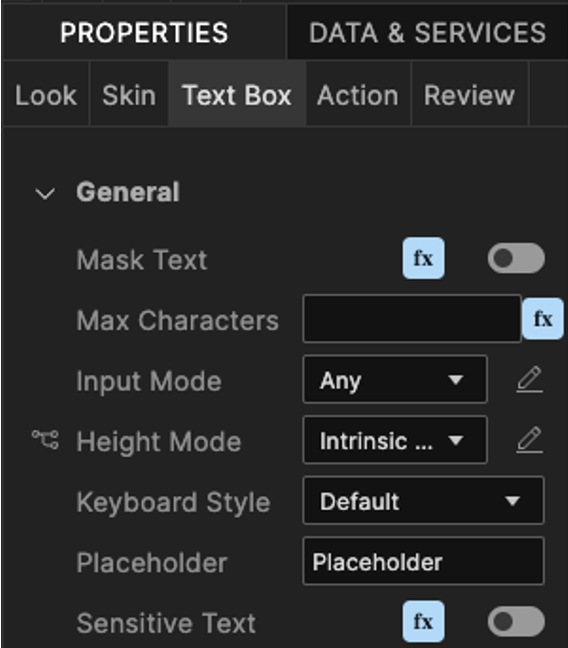{: style="height:40%;width:40%"}

    2. Enter the formula in the **Formula Language** section and then click **Apply**.

        {: style="height:60%;width:60%"}

=== "For **Max Characters**"

    1. Click the formula button. The **Enter Formula** dialog opens.

        {: style="height:40%;width:40%"}

    2. Enter the formula in the **Formula Language** section and then click **Apply**.

        {: style="height:60%;width:60%"}
    
    The **Max Characters** property is now defined using formula language as indicated by **\[FORMULA\]** in the text field.

    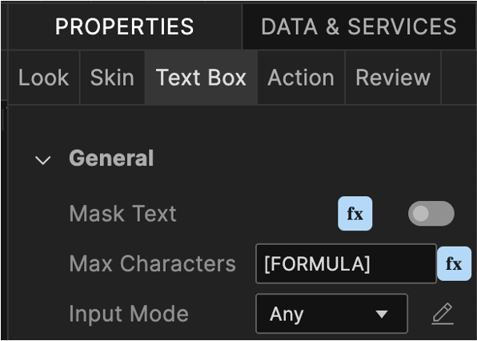{: style="height:40%;width:40%"}

=== "For **Sensitive Text**"

    1. Click the formula button. The **Enter Formula** dialog opens.

        {: style="height:40%;width:40%"}

    2. Enter the formula in the **Formula Language** section and then click **Apply**.

        {: style="height:60%;width:60%"}

## Additional information

### `WidgetFormula.js`

When a form containing any widget property with a set formula is saved, the converted JavaScript code for that formula is stored in a read-only file named `WidgetFormula.js` under **Modules**.

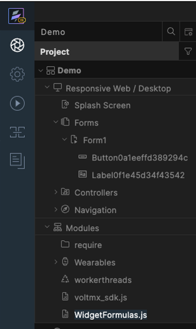{: style="height:40%;width:40%"}

This enables the formula code to be used in other areas of the application, such as from a Controller or Action. Additionally, it allows the formula code to be shared across different properties, ensuring there is only one copy of the formula code and providing a single location for updates or changes to the formula.

### Functions button

The **Enter Formula** dialog features a **Functions** button. When clicked, the **Formula Functions** dialog opens, allowing you to select existing functions from the `WidgetFormulas.js` file.

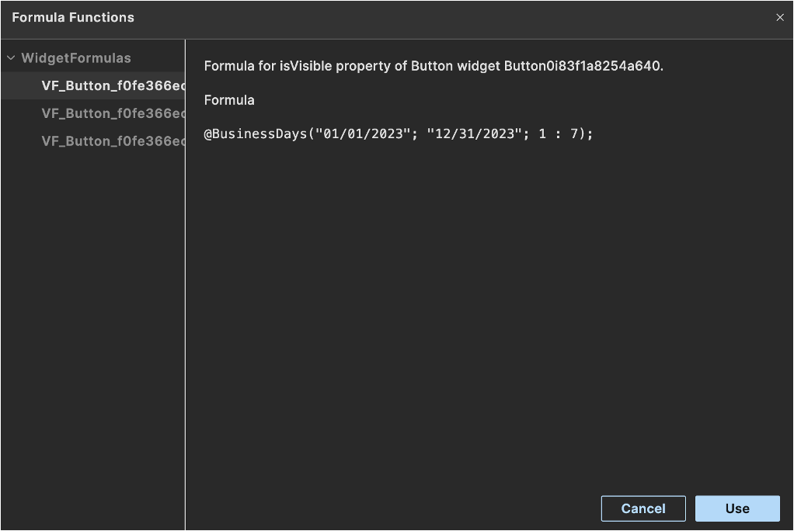{: style="height:60%;width:60%"}

When you choose a function from the **Formula Functions** dialog and click **Use**, the dialog will close, and the selected function will be inserted into the **Formula Language** section of the **Enter Formula** dialog. A message will appear in the **Formula Language** section, indicating that the formula is linked to the formula set on a different widget property.

The following image shows an example of the message indicating that the formula is linked to the formula set on a different widget property.

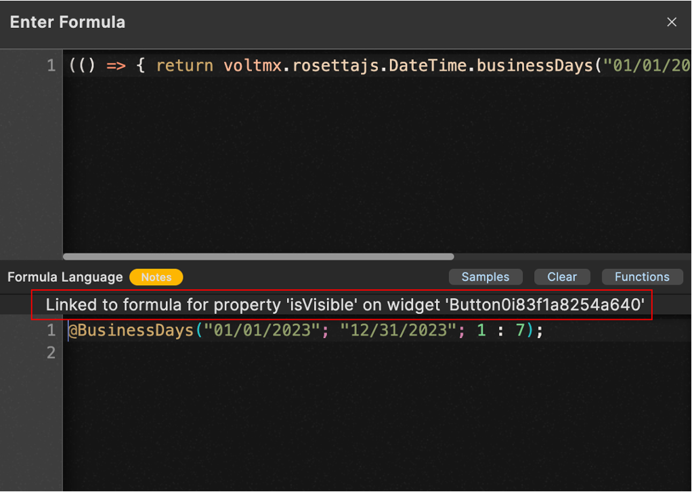{: style="height:60%;width:60%"}

!!! note

    When a user attempts to change a linked formula, a warning dialog is shown indicating that the formula is shared with another property and modifying it will create a separate formula. The following is an example of the warning dialog.

    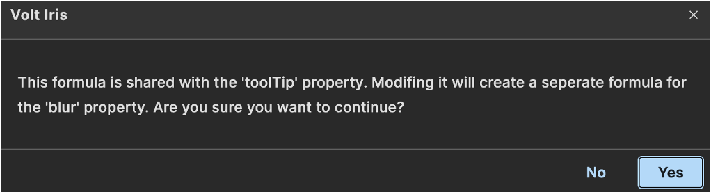{: style="height:60%;width:60%"}

    Clicking **Yes** allows the user to change the linked formula.
