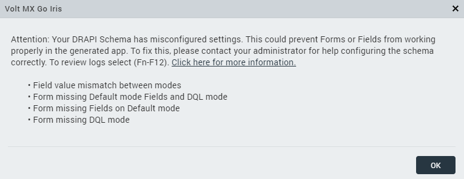

# Domino App troubleshooting

## Domino Rest API schema issues

If the Domino Rest API settings encounter an issue, a prompt will appear. While it may proceed, there is no guarantee that the resulting program will function correctly.

**Issues in Domino Rest API when importing Domino Application:**

!!!important
    These issues are applicable only to default mode and dql mode.

- **Field value mismatch between modes**: This issue occurs when the dql mode and default mode have different property values (like fields, type, field access, etc.,) in declaring each mode. They have to be in parallel or similar in property values.

- **Form missing Default mode Fields and DQL mode**: This issue occurs when you have a dql mode and default mode that aren't declared for all the fields. Note that you have to declare the same fields in dql mode and default mode.

- **Form missing Fields on Default mode**: This issue occurs when you save the form without declaring any fields or fail to declare all fields in default mode. You must declare all the fields in the default mode.
- **Missing DQL mode**: This issue occurs when only the default mode is declared. The dql mode and default mode must be parallel or similar to each other before importing the schema.

It is recommended to consult your Domino Rest API administrator to assist you with configuring the Domino Rest API based on the prerequisites mentioned [here](../tutorials/designimport.md#before-you-start).