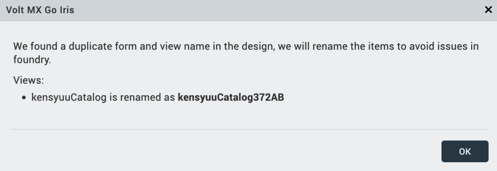

# Known limitations

## Apache CouchDB Adapter

The current implementation of the Apache CouchDB[^1] adapter doesn't support nested fields, including JSON objects and JSON arrays.

[^1]:Apache CouchDB and CouchDB are trademarks of The Apache Software Foundation.

## Data conversion

As Domino REST API and Volt Foundry administrators can redefine field data types, it can cause data conversion issues as they can redefine a field in Domino differently. For example, a Domino REST API administrator can indicate a date field in Domino as a boolean, while a Volt Foundry administrator can indicate the same date field as a string. This causes conversion issues. As not all possible conversion points have been tested, **data conversion isn't yet supported**.

## Deleting offline documents

### Hard delete

If a document is hard deleted in the Domino DB by another app, the devices using the offline sync DB won't know about this deletion, and any subsequent sync calls won't remove the document from the sync DB. This results in a stranded document on the device, but not in the back end.

To resolve stranded documents in an offline app, use the [`clearOfflineData`](https://help.hcl-software.com/voltmx/v10/Foundry/offline_objectsapi_reference_guide/Content/Object_clearOfflineData.html "Link opens a new tab"){: target="_blank" rel="noopener noreferrer"}&nbsp;{: style="height:13px;width:13px"} function provided by the Volt MX SDK in Volt Iris. The function clears out the device's sync DB at the level you choose (app level, object service level, object level) so that syncing the app with the back end fully syncs all data without sending any hard deleted documents and allows the device's sync DB to match up with what's in the back end.

### Soft delete

Offline-enabled apps use soft delete to remove deleted documents from a device's sync DB. Add the `IsDeleted` property to the Domino REST API schema to enable soft delete. The property will contain the value *deleted* when the document has been soft deleted and removed entirely from the device’s sync DB upon a sync with the DB.

Disabling document deletion on the Domino DB if using it with an offline-enabled app combined with an agent script on the Domino REST API, which periodically clears soft-deleted documents, enforces soft delete on the Domino DB. These keep the soft-deleted documents long enough for the user devices to sync before pruning the deleted documents and ensure that the Domino DB doesn't have too many soft-deleted documents.

## Design Import

- Import of forms and views with DBCS character names aren't supported<!--up until Volt MX Go v2.1.1 release-->. These forms and views will be listed under **Unsupported Forms** in the **Forms** tab and **Unsupported Views** on the **Views** tab on the **Scope and Forms** page of the **Design Import Wizard** during the import process.

- If forms with the same name are detected during the import process, one of the forms will be renamed by adding a string of random alphanumeric characters to the end of the original form name. The same procedure applies to views with identical names. One view will be renamed by adding random alphanumeric characters to the end of the view name. You are informed of the changes via a notification dialog such as shown in the following image.  

    

- Custom forms created in Domino REST API aren't supported.

## Domino Adapter

- Supports only Volt Foundry Object services.
- Domino object services in Volt Foundry are only usable by authenticated app users. You must have a valid Domino REST API token for all Domino REST API calls. Customers requiring access to Domino object services as unauthenticated users may be able to implement a Foundry pre-processor to obtain valid Domino REST API tokens and inject Authorization headers in each request.

### Special characters

- The following special characters can't be used as string values of fields in a request payload when executing POST, PUT, PATCH, or BULK UPDATE method in a Domino Adapter Object Service as they cause an error.

    - Slash (**/**)
    - Double quote (**"**)
    - Semicolon (**;**)
    - Less than (**<**)

    For example, the following request payload will cause an error since the string value of the field *Subject* includes a slash.

    ```json
    {
    "Body": "test",
    "Subject": "test/update",
    "x_004unit": "A65F75ABGDHSGFDTJ"
    }
    ```

- The special character apostrophe (**'**) can't be used as part of a string, which is used as part of the search parameter for the `$filter`, even when encoded using `x_00` concatenated with its corresponding hex code. The query will proceed, but there will be no results.

    For example, the query `$filter=Type eq 'Dessert's'` will return no results. The same goes for the query `$filter=Type eq 'Dessertx_0027s'`, where the apostrophe was encoded.

## Domino database view with duplicate column names

**Design Import**

Design Import doesn't support Domino database views with columns having the same name if those columns have different fields. During the import process, you can see these views listed under **Unsupported Views** on the **View** tab on the **Scope and Forms** page of the **Design Import Wizard**.

**Domino Adapter**

The Domino Adapter handles the Domino database view with columns having the same name in the following ways:

- The Domino Adapter allows Foundry mapping and disregards one of the columns if the data of both columns with the same name are derived from the same field.
- The Domino Adapter throws an error during data model generation if the data of one column is derived from a field while the data of the other column is derived through a formula. You need to update the view columns to have different names.

## Installing Volt MX Go plugins to Volt Iris

!!! note

    The information in this topic applies starting with the Volt MX Go v2.1 up to v2.1.2 release.

Installing the MX Go plugins to Volt Iris requires the Volt Iris workspace to contain a `pluginsInfo.json` file in the `.plugins` directory. An installation error occurs if the `pluginsInfo.json` file isn't in the `.plugins` directory. To create the `pluginsInfo.json` file in the `.plugins directory`, [create a Desktop Web App project](https://help.hcl-software.com/voltmx/v10/Iris/iris_user_guide/Content/CreateKRAProject.html#create-a-volt-mx-iris-reference-architecture-project "Link opens a new tab"){: target="_blank" rel="noopener noreferrer"}&nbsp;{: style="height:13px;width:13px"} with Volt Iris in your workspace, and then [run Live Preview](https://help.hcl-software.com/voltmx/v10/Iris/iris_user_guide/Content/LivePreview.html#preview-your-web-app-with-iris "Link opens a new tab"){: target="_blank" rel="noopener noreferrer"}&nbsp;{: style="height:13px;width:13px"}. Running the Live Preview creates the `pluginsInfo.json` file.

## Naming

- Volt Foundry only allows "letters" (A-Z and a-z) as the first characters in names. For example, `@unid` and `$files`, included in Domino field names, aren't supported. As a workaround, Domino Adapter encodes the problematic characters, for example `@unid` becomes `x_0040unid`.
- Volt Foundry restricts the length of names, such as field names, to be shorter than the name length supported in Domino.

## Using Open API Adapter

Volt MX Go doesn't support the use of the Open API Adapter in the Volt Foundry Integration Services to connect to Domino via Domino REST API.

## Using helm charts on supported Kubernetes platform

When using helm charts on a supported Kubernetes platform, you must run the `kubectl config set-context --current --namespace=mxgo` command in your Ubuntu terminal session to set the current namespace context after restarting Windows or Rancher Desktop. If you don't run the command after restarting Windows or Rancher Desktop, your kubectl commands might fail.

## Verb mapping

Verb mapping isn't supported for binary verbs in the Volt Foundry Console.

## VoltFormula

- Prompt `[LocalBrowse]` and `[ChooseDatabase]` for Volt Iris application don't have a filter setting for file type since only [registered file types](https://www.iana.org/assignments/media-types/media-types.xhtml "Link opens a new tab"){: target="_blank" rel="noopener noreferrer"}&nbsp;{: style="height:13px;width:13px"} are allowed in *voltmx.io.FileSystem*. For more information about *voltmx.io.FileSystem*, see the [Volt MX documentation](https://help.hcl-software.com/voltmx/v10/Iris/iris_api_dev_guide/content/voltmx.io.filesystem_functions.html "Link opens a new tab"){: target="_blank" rel="noopener noreferrer"}&nbsp;{: style="height:13px;width:13px"}.

- Date APIs for Notes implementations return JavaScript Date Objects, which differ from Notes Date Objects.
<!--
- VoltFormula functions reliably with only one Object Service in an application because the name of the Object Service is stored in a JavaScript global variable. To avoid potential issues caused by thread switching, limit your application to a single Object Service. If you need an additional Object Service, ensure it's in a separate part of the application.
-->