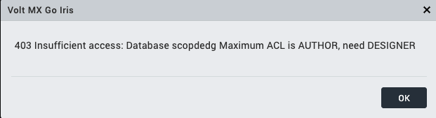
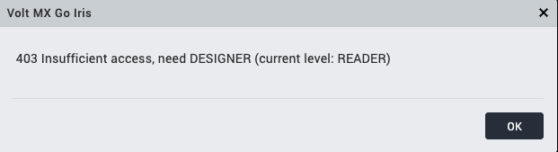

# Troubleshooting

List of issues and corresponding resolutions.

## Design Import

- **403 Insufficient access error in Volt MX Go Iris while using Design Import**

    - 403 Insufficient access error due to incorrect Maximum Access Level[^1] of scope:
        
        

        You should contact your Domino REST API administrator to update your scope's Maximum Access Level to *Designer*.

    - 403 Insufficient access error due to incorrect database access level:

        
    
        You should contact your Domino administrator to update your assigned access level to the Domino database to *Designer*.

    [^1]: The Maximum Access Level refers to access through the Domino REST API and doesn't override the database's ACL. The access level granted to the user in the Domino database ACL won't be exceeded. For example, if a user has Reader access in the Domino database ACL and the maximum access level for the scope in the Domino REST API is Editor, the user still won't be able to create or edit documents. 

- **Domino REST API schema misconfigured settings**

    You might encounter the following issues when importing Domino applications using Design Import. While you may proceed with the import, there is no guarantee that the resulting application will function correctly.

    

    - **Field value mismatch between modes** 

        The issue occurs when the **dql** mode and **default** mode have different property values, such as fields, type, and field access. Make sure they have similar property values.

    - **Form missing Default mode Fields and DQL mode**

        The issue occurs when you haven't declared the same property values in the **dql** mode and **default** mode. Make sure to declare the same property values in **dql** mode and **default** mode.

    - **Form missing Fields on Default mode**

        The issue occurs when you save the form without declaring any property values or fail to declare property values in the **default** mode that are in the **dql** mode. Make sure to declare all the fields in the **default** mode.

    - **Form missing DQL mode**

        The issue occurs when only the **default** mode is declared. Make sure to add the **dql** mode before importing the schema.

Contact your Domino Rest API administrator for assistance in complying with the Domino Rest API related [prerequisites for importing Domino Application](../tutorials/designimport.md#before-you-begin).

## First Touch

- [First Touch or Custom Application Fails to Install on Volt MX Go Foundry](https://support.hcltechsw.com/csm?id=kb_article&sysparm_article=KB0106427 "Link opens a new tab"){: target="_blank" rel="noopener noreferrer"}&nbsp;{: style="height:13px;width:13px"}

## General issues

- **The kubectl commands fail after restarting Windows or Rancher Desktop**

    When your kubectl commands fail after restarting Windows or Rancher Desktop, you must run the `kubectl config set-context --current --namespace=mxgo` command in your Ubuntu terminal session to set the current namespace context.
