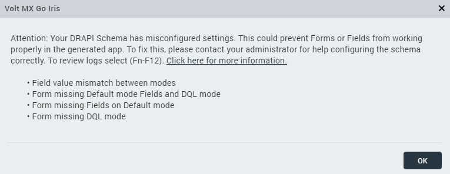

# Troubleshooting

List of issues and corresponding resolutions. 

## General issues

- [**First Touch or Custom Application Fails to Install on Foundry**](https://support.hcltechsw.com/csm?id=kb_article&sysparm_article=KB0106427){: target="_blank" rel="noopener noreferrer"}

    !!!note
        This issue and its corresponding resolution aren't applicable when setting up First Touch in Volt MX Go installed in a development or test-only environment.   

- **The kubectl commands fail after restarting Windows or Rancher Desktop**

    When your kubectl commands fail after restarting Windows or Rancher Desktop, you must run the `kubectl config set-context --current --namespace=mxgo` command in your Ubuntu terminal session to set the current namespace context.

## Domino Rest API schema issues

List of issues and corresponding resolutions related to Domino REST API when importing Domino applications using Design Import.

!!!warning "Important"
    If the Domino Rest API settings encounter an issue, a prompt will appear. While it may proceed, there is no guarantee that the resulting program will function correctly.

    

!!!note
    These issues apply only to **default** mode and **dql** mode.

- **Field value mismatch between modes** 

    This issue occurs when the **dql** mode and **default** mode have different property values, such as fields, type, field access, in declaring each mode. They have to be in parallel or similar in property values.

- **Form missing Default mode Fields and DQL mode**

    This issue occurs when you have not declared the same property values in both **dql** mode and **default** mode. You have to declare the same property values in **dql** mode and **default** mode.

- **Form missing Fields on Default mode**

    This issue occurs when you save the form without declaring any property values or fail to declare all property values in **default** mode. You must declare all the fields in the **default** mode.

- **Missing DQL mode**

     This issue occurs when only the default mode is declared. The **dql** mode and **default** mode must be parallel or similar to each other before importing the schema.

It is recommended to consult your Domino Rest API administrator to assist you with configuring the Domino Rest API based on the prerequisites required for [importing Domino Application](../tutorials/designimport.md#before-you-start).

