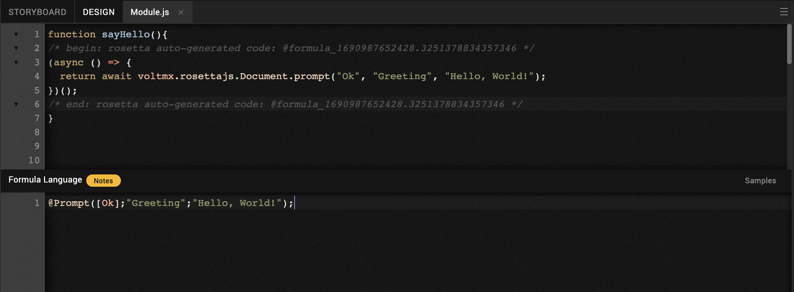
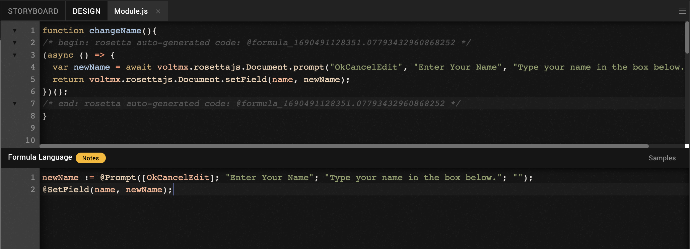
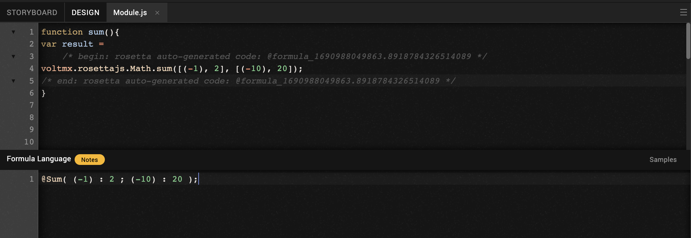
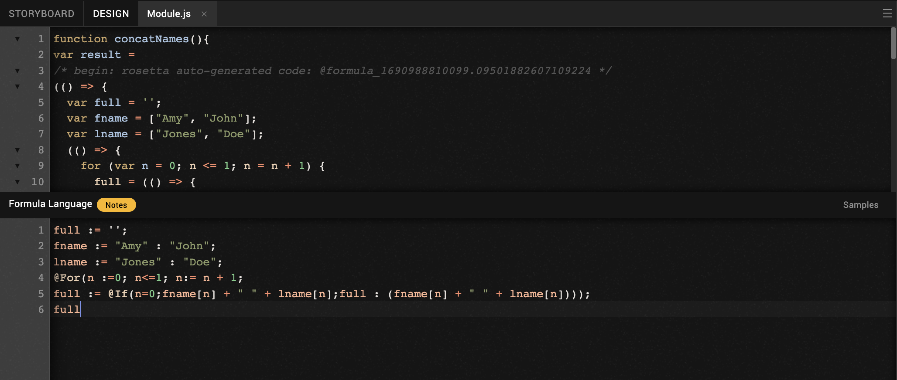
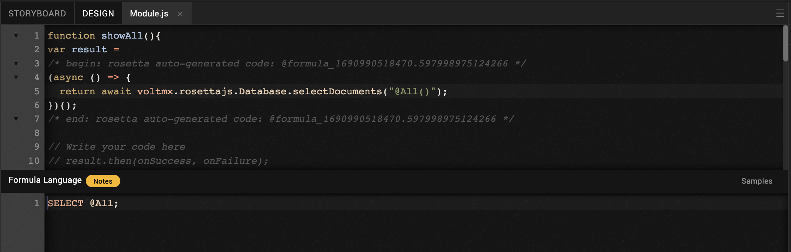

# Recommended Volt Formula Coding Practices in MX Go Iris

This document contains a series of coding exercises designed to help you understand how to use Volt Formula in Iris. Each exercise comes with a description of the problem, followed by a code template where you can write your solution.

### Hello, World!
#### Description:
Write a function called `sayHello` to show a prompt box add formula.

#### Formula Code Template:
```js
@Prompt([Ok];"Greeting";"Hello, World!");
```



### Change a Name
#### Description:
Write a function called `changeName` that takes a string from a prompt box and update a field and add formula.

#### Formula Code Template:
```js
newName := @Prompt([OkCancelEdit]; "Enter Your Name"; "Type your name in the box below."; "");
@SetField(name, newName);
```



### Sum Simple
#### Description:
Write a function called `sum` that summarizes array of numbers. Define a variable called `result` to get a returned value and add formula.

#### Formula Code Template:
```js
@Sum( (-1) : 2 ; (-10) : 20 )
```



### Concatenate Names
#### Description:
Write a function called `concatNames` that concatenates first name and last name in arrays. Define a variable called `result` to get a returned value and add formula.

#### Formula Code Template:
```js
full := '';
fname := "Amy" : "John";
lname := "Jones" : "Doe";
@For(n :=0; n<=1; n:= n + 1;
full := @If(n=0;fname[n] + " " + lname[n];full : (fname[n] + " " + lname[n])));
full
```



### Show All Documents
#### Description:
Write a function called `showAll` that retrieves and displays all documents in Domino. Define a variable called `result` to get a returned value and add formula.

#### Formula Code Template:
```js
SELECT @All
```


