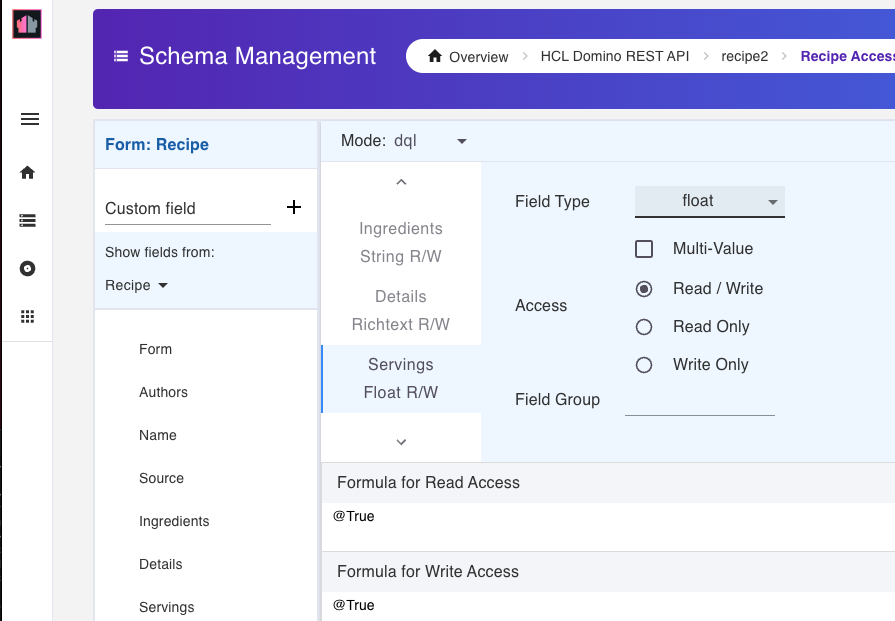
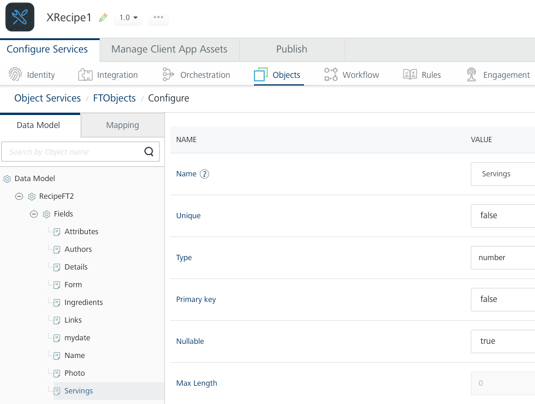
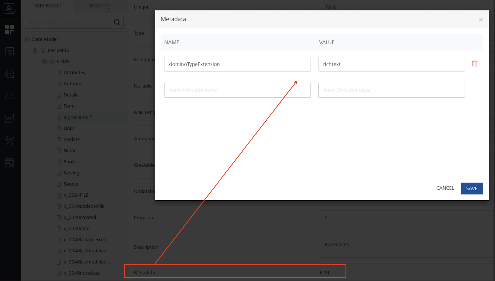
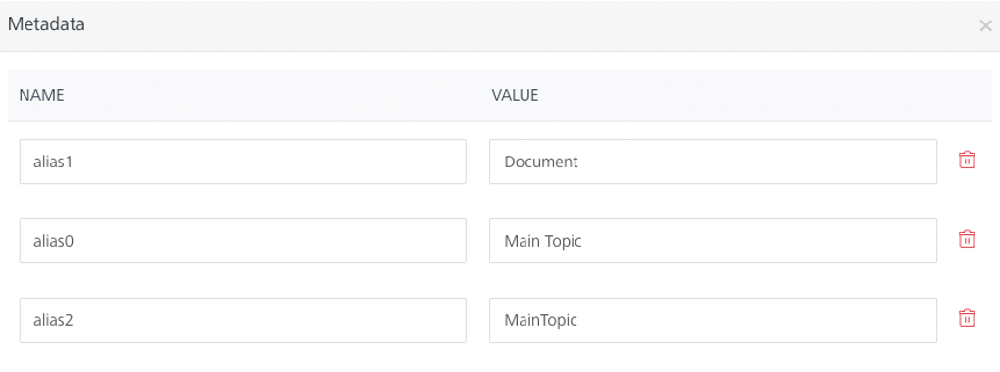

# Data models

## Overview

Data models can be generated in an object service by Volt MX Go Foundry administrators. For Domino object services, a data model can be generated for any `form` or `view` associated with a `scope` defined by a Domino REST API administrator. 

!!!note 
    `Forms` and `views` are created in a Domino REST API `schema` and named by a Domino REST API `scope`.
     

In addition to some Meta fields, generated data models include fields defined in the Domino REST API `schema` for the associated Domino `Form` or `View`. 

Volt MX Go Foundry data models are in sync with the Domino REST API `schema` at the time of data model generation. The data models may be out of sync with the `schema`, which may lead to undesired or unexpected results, because of the following:

- data models are edited in Volt MX Go Foundry
- schema is modified in Domino REST API
- changes in the NSF design

For more information on schemas, scopes, forms, and views, see [Using Admin UI](https://opensource.hcltechsw.com/Domino-rest-api/tutorial/adminui.html){: target="_blank" rel="noopener noreferrer"} in the Domino REST API documentation.  

## Data model artifact names

Volt MX Go Foundry data model names, such as field names, are similar but not identical to the names found in Domino REST API. They're generated based on related artifacts in Domino REST API. For example, data model fields are based on fields found in Domino REST API for a given scope/schema. 

The generated Volt MX Go Foundry data model artifacts, such as form names, view names, and field names, are derived from and similar to the corresponding Domino REST API artifact. However, "special characters" in any of those names are encoded. For example, the `@unid` (meta) field becomes `x_0040unid`.

## Effective data types

Field data types in the generated Volt MX Go Foundry data model are effectively the same as the data type defined in the Domino REST API schema. Some field (column) data types are common between Domino and Volt MX Go Foundry, for example string, numbers, and dates. Others, such as Domino `multivalue` (technically, these are `arrays`) and `rich text` aren't found in Volt MX Go Foundry.

For common data types, the field type in the generated Volt MX Go Foundry object models will match the data type in the Domino REST API schema. In the example image, the number of *Servings* is a `float` in the Domino REST API `schema`. 



In the Volt MX Go Foundry object model, the field type of *Servings* is `number`:



For Domino object types not found in Volt MX Go Foundry, the Volt MX Go Foundry object field type is set to `string` and Domino type information is retained as properties in the field metadata attribute. 

Two properties are used for Domino data type information:

- `dominoSpecialType` property indicates if the data is `Rich Text`, `Array` (multi-value), or `Date Only`. 
- `dominoArrayComponentType` property indicates the array type for multi-value fields, for example, a multi-value array of strings as shown in the following example:



The table shows a simplified list of data-type mappings between Domino REST API and Volt MX Go Foundry:

!!!note
    Examples in the table are from the Volt MX Go Foundry Object Service perspective.

|Domino REST API format|Volt MX Go Foundry type|Additional details|
|---|---|---|
|DATA, DATE-TIME|date|Example: `2023-05-09T19:39:47Z`|
|BYTE, DOUBLE, FLOAT, INT32, INT64|number|Example: `7`|
|BOOLEAN|boolean|Example: `true`|
|BINARY|string||
|AUTHORS, NAMES, PASSWORD, READERS|string||
|RICH TEXT|string *|Field values are in Base64-encoded HTML format.|
|ARRAY|string *|Field values are "stringified JSON Array"<br/> Example: `"[\"flour\",\"eggs\"]"`<br/><br/>Other data types may also be marked as multi-value, in which case the JSON array contains values of the corresponding type. Examples:<br/>String array: `"[\"flour\",\"eggs\"]"`<br/>Number array: `"[1,2]"`<br/>Author array: `"[\"CN=mxgo admin/O=ocp\",\"[Admin]\"]"]"`|
|all others|string|

<!--|RICH TEXT|string *|Field values are in [Inception Mode](https://opensource.hcltechsw.com/Domino-rest-api/references/usingdominorestapi/richtext.html?h=incept#flat-json-submissions-aka-inception-mode) format (Base64 encoded MIME-wrapped HTML) but likely changing to Base64 encoded HTML subsequently.|-->

!!!tip
    *[See data model metadata attribute](#data-model-metadata-attribute).

## Meta fields

In addition to the document fields specified in the database design such as `form` or `view`, Domino `meta-fields` are in the list of Volt MX Go Foundry data model fields generated for Domino. As a result, when you `GET` Domino documents from the object service, values for these `meta-fields` are also returned for each document.

For form-based data models, the document's `@unid` is an obvious example. Below are other `meta-fields` you may see for each document:

```{ .yaml .no-copy }
x_0040addedtofile
x_0040aliases	
x_0040created
x_0040editable		
x_0040lastaccessed	
x_0040lastmodified	
x_0040lastmodifiedinfile	
x_0040noteclass	
x_0040noteid	
x_0040parentunid	
x_0040revision		
x_0040size		
x_0040unid	
x_0040unread
```

For view-based data models, the following `meta-fields` are returned:

```{ .yaml .no-copy }
x_0040etag	
x_0040form	
x_0040index	
x_0040noteid	
x_0040unid
```

!!!note
    - **All `meta-fields` aren't sortable**. 
    - UNID is unique for any set of documents returned on `GET` for a form-based data model. However, UNID isn't necessarily unique for view rows since more than one row in a view may be associated with the same database document.
    - Meta-fields are included in generated data models by default. The Volt MX Go Foundry developer can modify the generated data model as needed, such as removing `meta-field` if desired.
    - `x_0040aliases` doesn't correspond to any attribute in Domino. Documents won't contain any value for this attribute. However, it's for attaching metadata for with form name aliases. For more information, see [Data model metadata attribute](#data-model-metadata-attribute).

## Data model metadata attribute

The `metadata` attribute of a Volt MX Go Foundry data model field retains extended Domino design information, which may be of interest to client applications using Volt MX Go Iris.

- Column characteristics: For View columns (only non-meta columns), the data model field Metadata attribute includes additional column properties:
    - position: refers to column number
    - sorted: refers to whether the column is sortable
    - direction: refers to sort direction, either ascending or descending
    - resort-asc: indicates that clicking the column header sorts the view in ascending order
    - resort-desc: indicates that clicking the column header sorts the view in descending order.
        
        !!!note
            If both resort-asc and resort-desc are true, clicking the column header changes the sorting between ascending and descending orders.

    - title: displays the title of the column
    - multiValueSeparator: NONE indicates the column isn't an array of values (multi-valued). COMMA, SPACE, SEMICOLON, and NEWLINE indicate that the column has an array of values, and the type of separator character is indicated.
    
- Form aliases: For the form fields, the form's alias names are itemized on the `x_0040aliases` meta field. One metadata property is added for each alias. For example, the `Main Document` form in the Domino Teamroom database has three aliases, so the **Metadata** properties look like the following:


<!--- Form aliases: Itemized for the `x_0040form` meta field. One metadata property is added for each form, and one property is added for each alias.-->

- Extended data types: Rich text and multi-value (array) form fields are seen as string fields in the data model. For these fields, `dominoSpecialType` and `dominoArrayComponentType` properties are added to metadata.

    |For...|dominoSpecialType|dominoArrayComponentType|
    |----|----|----|
    |RICH TEXT|richtext|not used|
    |MULTI-VALUE|array|the array type, such as string, number|
    |DATE ONLY|date|not used|