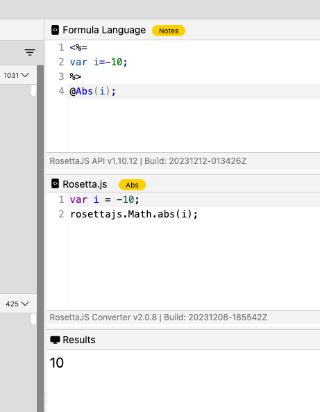

# Declaring Variables in formulas

## Using variables in formulas
There are two mechanism by which the Rosetta Converter accepts and converts variables into JavasScript:

- LET function
- JSP style syntax (code passthrough)

## Using LET function with OpenFormula

- [**Let function**](https://support.microsoft.com/en-us/office/let-function-34842dd8-b92b-4d3f-b325-b8b8f9908999)

```
=LET(x, 5, SUM(x, 1))
```


- **JSP Style Syntax**

The converter will make use of **JSP expression** syntax in **OpenFormula** formulas to provide capabilities to formula conversion (eg. resulting JavaScript) not currently possible with strictly open formula syntax. For more info, check this link [**JSP expression syntax**](https://docs.oracle.com/javaee/5/tutorial/doc/bnaov.html).

Example:

- **OpenFormula:**

    

**Albeit Notes** formula language already provides means to declare variables, the converter can also make use of the **JSP expression** syntax in a ***Notes*** formula.

Examples:

- **Notes formula** (with native notes variable declaration expression):
    
    


- **Notes formula** (with JSP based variable declaration expression):

    

    

