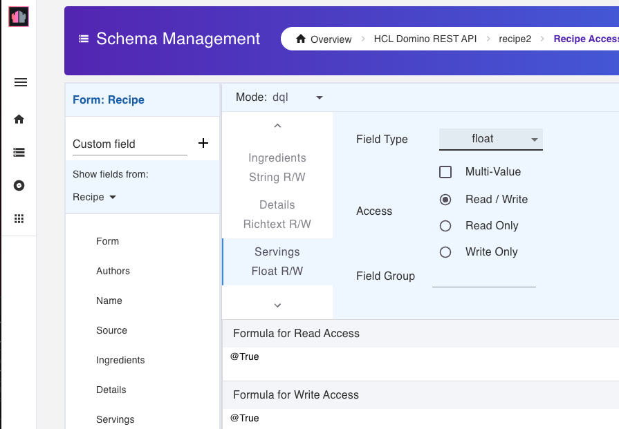

# Domino Adapter

The Domino Adapter makes Domino a core part of the Foundry Object services so that Volt MX apps can interact with Domino databases in the same way they can for relational databases.

## Authorization

The Domino Adapter interacts with Domino for both configuration and run-time activities by leveraging the Domino REST API, which requires an authorization token. The Domino Adapter relies directly on the Identity service of Foundry and indirectly on the OAuth REST API of Domino REST API to obtain valid authorization tokens for configuration and runtime. 

## Object Services

Domino Adapter supports Object services that enables model-driven app design and development by following a micro-services architectural approach to create reusable components and link them to fit into your solution. By using Object services, you can define your preferred data model, which defines how your app wants to interact with its data. 

When creating an Object service in Foundry for Domino, the Foundry administrator associates the Object service to a single Domino REST API server URL. The Foundry administrator can associate more than one Object service with the same Domino REST API server URL if desired. Domino object models are generated in the Object Service from the scopes defined in Domino REST API.

The `object` of the Object service essentially has two components:

- Data Model - refers to the definition of the fields that comprise the object definition
- Methods - verbs for interacting with the data, for example GET, POST

For more information, see [Object Services](https://opensource.hcltechsw.com/volt-mx-docs/95/docs/documentation/Foundry/voltmx_foundry_user_guide/Content/Objectservices.html).

## Data models

Data models can be generated in an object service by Foundry administrators. For Domino object services, a data model can be generated for any `form` or `view` associated with a `scope` defined by a Domino REST API administrator. 

!!!note 
    `Forms` and `views` are created in a Domino REST API `schema` and named by a Domino REST API `scope`.
     

In addition to some Meta fields, generated data models include: 

- `Form` data models include all fields defined by the associated Domino REST API `schema` and can be a subset of the fields defined by the `form` in the NSF design. 
- `View` data models include all view columns defined in the NSF design.

Foundry data models are in sync with the Domino REST API `schema` at the time of data model generation. The data models may be out of sync with the `schema`, which may lead to undesired or unexpected results, because of the following:

- data models are edited in Foundry
- schema is modified in Domino REST API
- changes in the NSF design

For more information on schemas, scopes, forms, and views, see [Using Admin UI](https://opensource.hcltechsw.com/Domino-rest-api/tutorial/adminui.html) in the Domino REST API documentation.  

### Data model artifact names

Foundry data model names, such as field names, are similar but not identical to the names found in Domino REST API. They're generated based on related artifacts in Domino REST API. For example, data model fields are based on fields found in Domino REST API for a given scope/schema. 

The generated Foundry data model artifacts, such as form names, view names, and field names, are derived from and similar to the corresponding Domino REST API artifact. However, "special characters" in any of those names are encoded. For example, the `@unid` (meta) field becomes `x_0040unid`.

### Effective data types

Field data types in the generated Foundry data model are effectively the same as the data type defined in the Domino REST API schema. Some field (column) data types are common between Domino and Foundry, for example string, numbers, and dates. Others, such as Domino `multivalue` (technically, these are `arrays`) and `rich text` aren't found in Foundry.

For common data types, the field type in the generated Foundry object models will match the data type in the Domino REST API schema. In the example image, the number of *Servings* is a `float` in the Domino REST API `schema`. 



In the Foundry object model, the field type of *Servings* is `number`:


For Domino object types not found in Foundry, the Foundry object field type is set to `string` and Domino type information is retained as properties in the field metadata attribute. 

Two properties are used for Domino data type information:

- `dominoSpecialType` property indicates if the data is `Rich Text` or `Array` (multi-value). 
- `dominoArrayComponentType` property indicates the array type for multi-value fields, for example, a multi-value array of strings as shown in the following example:


The table shows a simplified list of data-type mappings between Domino REST API and Foundry:

!!!note
    Examples in the table are from the Foundry Object Service perspective.

|Domino REST API format|Foundry type|Additional details|
|---|---|---|
|DATA, DATE-TIME|date|Example: `2023-05-09T19:39:47Z`|
|BYTE, DOUBLE, FLOAT, INT32, INT64|number|Example: `7`|
|BOOLEAN|boolean|Example: `true`|
|BINARY|string||
|AUTHORS, NAMES, PASSWORD, READERS|string||
|RICH TEXT|string *|Field values are in Base64-encoded HTML format.|
|ARRAY|string *|Field values are "stringified JSON Array"<br/> Example: `"[\"flour\",\"eggs\"]"`<br/><br/>Other data types may also be marked as multi-value, in which case the JSON array contains values of the corresponding type. Examples:<br/>String array: `"[\"flour\",\"eggs\"]"`<br/>Number array: `"[1,2]"`<br/>Author array: `"[\"CN=mxgo admin/O=ocp\",\"[Admin]\"]"]"`|
|all others|string|

<!--|RICH TEXT|string *|Field values are in [Inception Mode](https://opensource.hcltechsw.com/Domino-rest-api/references/usingdominorestapi/richtext.html?h=incept#flat-json-submissions-aka-inception-mode) format (Base64 encoded MIME-wrapped HTML) but likely changing to Base64 encoded HTML subsequently.|-->

!!!tip
    *[See data model metadata attribute](#data-model-metadata-attribute).

### Meta fields

In addition to the document fields specified in the database design such as `form` or `view`, Domino `meta-fields` are in the list of Foundry data model fields generated for Domino. As a result, when you `GET` Domino documents from the object service, values for these `meta-fields` are also returned for each document.

For form-based data models, the document's `@unid` is an obvious example. Below are other `meta-fields` you may see for each document:

```{ .yaml .no-copy }
x_0040addedtofile
x_0040aliases	
x_0040created	
x_0040etag	
x_0040lastaccessed	
x_0040lastmodified	
x_0040lastmodifiedinfile	
x_0040noteclass	
x_0040noteid	
x_0040parentunid	
x_0040revision	
x_0040seq	
x_0040seqtime	
x_0040size	
x_0040threadid	
x_0040unid	
x_0040unread
```

For view-based data models, the following `meta-fields` are returned:

```{ .yaml .no-copy }
x_0040etag	
x_0040form	
x_0040index	
x_0040noteid	
x_0040unid
```

!!!note
    - UNID is unique for any set of documents returned on `GET` for a form-based data model. However, UNID isn't necessarily unique for view rows since more than one row in a view may be associated with the same database document.
    - Meta-fields are included in generated data models by default. The Foundry developer can modify the generated data model as needed, such as removing `meta-field` if desired.
    - `x_0040aliases` doesn't correspond to any attribute in Domino. Documents won't contain any value for this attribute. However, it's for attaching metadata for with form name aliases. For more information, see [Data model metadata attribute](#data-model-metadata-attribute).

### Data model metadata attribute

The `metadata` attribute of a Foundry data model field retains extended Domino design information, which may be of interest to client applications using Iris.

- Column characteristics: For View columns (only non-meta columns), the data model field Metadata attribute includes additional column properties:
    - position: refers to column number
    - sorted: refers to whether the column is sortable
    - direction: refers to sort direction, either ascending or descending
    
- Form aliases: For the form fields, the form's alias names are itemized on the `x_0040aliases` meta field. One metadata property is added for each alias. For example, the `Main Document` form in the Domino Teamroom database has three aliases, so the **Metadata** properties look like the following:


<!--- Form aliases: Itemized for the `x_0040form` meta field. One metadata property is added for each form, and one property is added for each alias.-->

- Extended data types: Rich text and multi-value (array) form fields are seen as string fields in the data model. For these fields, `dominoSpecialType` and `dominoArrayComponentType` properties are added to metadata.

    |For...|dominoSpecialType=|dominoArrayComponentType=|
    |----|----|----|
    |RICH TEXT|richtext|not used|
    |MULTI-VALUE|array|the array type, such as string, number|

## Methods (Verbs)

Methods for interacting with the generated data models are also generated when generating the data models. 

For view-based data model, only the GET method is generated.

For form-based data models, a number of methods including standard CRUD operations and binary CRUD are supported: 

- POST :`Create` new Domino document containing the specified fields.
- GET :`Read` an existing Domino document, returning all non-null fields for that document.
- PUT :`Update` an existing document, replacing all specified fields. If a field is omitted from the payload, it's removed from the document in Domino.
- Delete :`Delete` the specified document.
- createBinary 
- getBinary 
- updateBinary 
- deleteBinary 
- Patch :`Update` an existing document, replacing only the specified fields. If a field is omitted from the payload, the field value in the Domino document isn't modified.
<!--- Batch - `Update` of 1 or more documents matching a specified criteria, for example, all documents of type `employee`.-->

### Supported OData filter parameters, form-based GET

The Domino Adapter supports these OData filter parameters for the GET method on form-based data models:

- `$select`: List of fields to include in the returned documents.
- `$filter`: Specifies conditions that must be met by a document for it to be returned to the set of matching documents.
- `$filter (unknown Form)`: Specifies the UNID of the document to return without knowing the document's form name.
- `$top`: Specifies the number of documents to return, starting from the beginning or from the row specified by `$skip`.
- `$skip`: Specifies the number of documents to skip (zero-based row index of the first returned document).

!!!note
    - `$top` and `$skip` are used together for pagination, for example to define how many entries to skip or how many entries to return from the skip point onward.
    - `$skip` can only be used if `$top` is also specified.

With `$filter`, the following canonical functions are supported:

- `substringof`
- `endswith`
- `startswith`

#### Examples

|Example query|Expected result|
|----|----|
|`$filter=Type eq 'Dessert'`|Returns all documents whose `Type` field is equal to `Dessert`.|
|`$top=2`|Returns the first two documents.|
|`$skip=3`|Returns documents starting from the fourth document onwards.|
|`$select=Name&$filter=substringof(Name,'Hot') eq true`|Returns documents with `Hot` included in the `Name` field, only returning the `Name` field.|
|`$select=Name,Ingredients`|Returned documents include only the `Name` and `Ingredients` fields.|
|`$filter=x_0040unid eq xxxx and Form eq unknown`|returns only the form name and form alias names for the document specified by UNID xxxx|


### Supported OData filter parameters, view-based GET 

The Domino Adapter supports these OData filter parameters for the GET method on view-based data models:

<!-- `$top`: limits the number of returned data rows
- `$skip`: defines the number of rows to skip or in what row index should the data query start
- `$orderby`: sorts records in either ascending or descending order based on the values of the defined column
- column data equal filter using `$filter`: filters records and shows only the record with the defined column and column value
- column data `startswith` filter using `$filter`: filters records and shows the record or records with the defined column name and column value starting with a defined string-->

- `$skip`: Specific the number of documents to skip (zero-based row index of the first returned document).
- `$top`: Specifies the number of documents to return, starting from the beginning or from the row specified by `$skip`.
- `$orderby`: Sort the result-set in ascending or descending order based on a specified column. The column must be specified as `sortable` in the database design. 
- `$filter`: Specifies conditions that must be met by a document for it to be returned in the set of matching documents. Only `sortable` columns can be filtered.

!!!note
    `$top` and `$skip` are used together for pagination, for example to define how many entries to skip or how many entries to return from the skip point onward.

With `$filter`, the canonical function `startswith` is supported.

<!--- `documentsonly` - this function isn't part of the OData standards, but for Domino use only-->

#### Examples

|Example query|Expected result|
|----|----|
|`$top=10`|Returns 10 rows of data unless the total number of data rows in the view database is less than 10.|
|`$skip=0`|Returns rows starting from the first document in the view (skip zero rows), equivalent to omitting `$skip`.|
|`$skip=5`|Returns data starting from the sixth document in the view.|
|`$filter=Year eq 2021`|Returns all documents in the view whose `Year` field is equal to `2021`.|
|`$filter=startswith(Model,'HR') eq true`|The result-set only has data that starts with "HR" in column `Model`.|
|`$orderby=Year` or `$orderby=Year asc`|Returned rows are ordered by ascending values in the `Year` column.`asc` is the default if direction is omitted.|
|`$orderby=Year desc`|Returned rows are ordered by descending values in the `Year` column.|
<!--|`$filter=documentsonly eq true`|The result-set contains documents instead of view entries.|-->
## Limitations

- Supports only Foundry Object services.
- Authenticated app users metadata and verb security only. You must have a valid Domino REST API token for all Domino REST API calls. Customers that have such a requirement may be able to implement a Foundry pre-processor to obtain valid Domino REST API tokens and to inject Authorization headers in each request.

### MX core limitations (Iris, client SDK, Foundry)

- Naming limitations:

    - Foundry only allows "letters" (A-Z and a-z) as the first characters in names. For example, `@unid` and `$files`, included in Domino field names, aren't supported. As a workaround, Domino Adapter encodes the problematic characters, for example `@unid` becomes `x_0040unid`.
    - Foundry restricts the length of names, such as field names, to be shorter than the name length supported in Domino.
   
