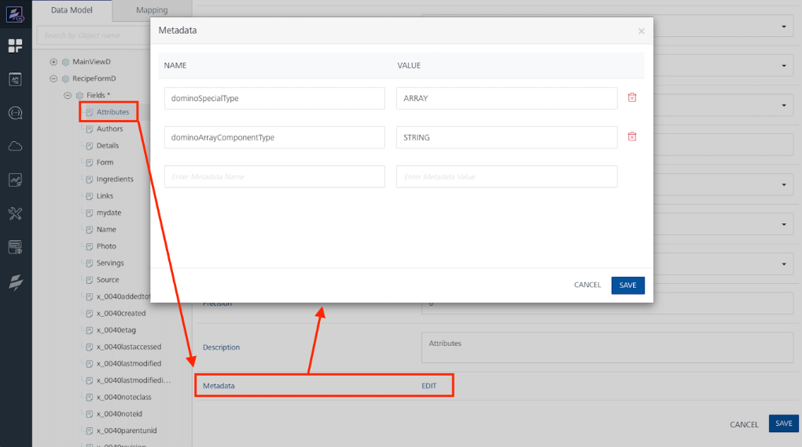

# HCL Domino Adapter

The HCL Domino Adapter makes Domino a core part of the Foundry Object services so that Volt MX apps can interact with Domino databases in the same way they can for relational databases.

## Object Services

HCL Domino Adapter supports Object services that enables model-driven app design and development by following a micro-services architectural approach to create reusable components and link them to fit into your solution. By using Object services, you can define your preferred data model, which defines how your app wants to interact with its data. 

When creating an Object service in Foundry for Domino, the Foundry administrator associates the Object service to a single Domino REST API server URL. The Foundry administrator can associate more than one Object service with the same Domino REST API server URL if desired.

For more information, see [Object Services](https://opensource.hcltechsw.com/volt-mx-docs/95/docs/documentation/Foundry/voltmx_foundry_user_guide/Content/Objectservices.html).

## Authorization

The HCL Domino Adapter interacts with Domino for both configuration and run-time activities by leveraging the Domino REST API, which requires an authorization token. The HCL Domino Adapter relies directly on the Identity service of Foundry and indirectly on the Domino REST API OAuth REST API to obtain valid authorization tokens. The same Identity service is used for authorizing access to Domino REST API for both configuration flow, such as configuring Object services in Foundry, and runtime flow, such as using the Object service from Iris applications.

## Data models

Data models are generated in an Object service by Foundry administrators to serve as a bridge between your back-end data and the client app. Each data model is associated with a single `form` or `view` in Domino REST API. A Domino REST API administrator defines the `forms` and `wiews` in a `schema`. To expose the `schema` to generate a data model, the Domino REST API administrator creates a `scope`. 

For more information on schemas, scopes, forms, and views, see [Using Admin UI](https://opensource.hcltechsw.com/Domino-rest-api/tutorial/adminui.html) in the Domino REST API documentation.  

### Data model characteristics

The generated data models have these characteristics:

- More than one data model can be generated from the same Domino REST API `Scope`, either in the same or in a different object service.
- Data models can be generated from the `forms` and `views` configured in a Domino REST API `schema` associated with the selected `scope`.
- Generated data models include all fields defined by the associated Domino REST API `schema` and all additional metadata fields:

      - have the same names as in the Domino REST API `schema` except for meta fields whose `@` character is encoded. For example, `@unid` becomes `x_0040unid`.
      - have the same [effective data type](dominoadapter.md#effective-data-types) as the data type defined in the Domino REST API `schema`

- Data models are in sync with the Domino REST API `schema` at the time of data model generation. 

!!!note
    If the data models are edited in Foundry or the `schema` is modified in Domino REST API, the model and `schema` may be out of sync leading to undesired results. 

### Effective data types

Some field (column) data types are common between Domino and Foundry, for example string, numbers, and dates. Others, such as Domino `multivalue` (technically, these are `arrays`) and `rich text` aren't supported in Foundry.

For common data types, the field type in the generated Foundry object models will match the data type in the Domino REST API schema. In the example image, the number of *Servings* is a `float` in the Domino REST API `schema`. 

In the Foundry object model, the field type of *Servings* is `number`:

For Domino object types not supported in Foundry, the Foundry object field type is `string`. The extended type information is stored in the the field metadata as `richtext` as shown in the following example image.

#### Additional Metadata (per "row")

In addition to the document fields specified in the database design, metadata "fields" related Domino document data is also included. 

For form-based data models, the document's `@unid` is an obvious example, along with date information (created, updated, accessed) and parent UNID.

For view-based data models, `UNID` and `form name` are included.

## Methods (Verbs)

Methods for interacting with the generated data models are also generated when generating the data models. 

For view-based data model, only the GET method is generated.

For form-based data models, the following methods are generated: 

- POST :`Create` new Domino document containing the specified fields.
- GET :`Read` an existing Domino document, returning all non-null fields for that document.
- PUT :`Update` an existing document, replacing all specified fields. If a field is omitted from the payload, it's removed from the document in Domino.
- Delete :`Delete` the specified document.
- Patch :`Update` an existing document, replacing only the specified fields. If a field is omitted from the payload, the field value in the Domino document isn't modified.
- Batch - `Update` of 1 or more documents matching a specified criteria, for example, all documents of type `employee`.

### Supported OData filter parameters, form-based GET

The HCL Domino adapter supports these OData filter parameters for the GET method on form-based data models:

- `$select` - list of fields to include in the returned documents
- `$filter` - search criteria specifying which documents to return 
- `$top` - number of documents to return
- `$skip` - number of documents to skip

With `$filter`, the following canonical functions are supported:

- `substringof`
- `endswith`
- `startswith`

#### Examples

`$filter=Type eq 'Dessert'`

Returns all documents whose `Type` field is equal to `Dessert`.

`$top=2`

Returns the first two documents.

`$skip=3` 

Returns documents from the fourth onwards.

`$select=Name&$filter=substringof(Name,'Hot') eq true`

Returns documents with `Hot` included in the `Name` field.

!!!note 
    - `$skip` can only be used if `$top` is also specified
    - canonical function syntax seems inconsistent with published standards (name and value seem reversed)
    

<!-- ### Supported OData filter parameters, view-based GET (stretch goal)
The Foundry Domino adapter supports these OData filter parameters for the GET method on view-based data models:
***Coming soon***, for example: $top, $skip, and sorting related parameters -->

## Limitations

- Only Foundry Object services is supported.
- Authenticated app users metadata and verb security only. You must have a valid Domino REST API token for all Domino REST API calls. Customers that have such a requirement may be able to implement a Foundry pre-processor to obtain valid Domino REST API tokens and to inject Authorization headers in each request.
- Offline Object downloadReconciliationRequired isn't implemented 

### MX core limitations (Iris, client SDK, Foundry)

- Naming limitations
   - Foundry only allows "letters" (A-Z and a-z) as the first characters in names. For example, `@unid` and `$files`, which are included in Domino field names, aren't supported. As a workaround, HCL Domino adapter encodes the problematic characters, for example `@unid` becomes `x_0040unid`.
   - Foundry restricts the length of names, for example field names, to ???X??? that's shorter than the name length supported in Domino.
   - Iris doesn't respect non-queryable in `$filter` and read-only on update/add forms.