# First Touch app

## Overview

The First Touch Recipe Catalog app is built with Volt MX Go to demonstrate how a Volt MX application can connect back to a Domino application through the Domino Adapter and Domino REST APIs. The app stores and displays recipe cards of various dishes. Its front-end user interface is created using Volt Iris, while the Domino database `FirstTouchRecipes.nsf` stores the recipe data used by the app. The app is an excellent working example of how data in your Domino database files might be accessed, displayed, and used in different ways and on various devices using Volt MX Go.

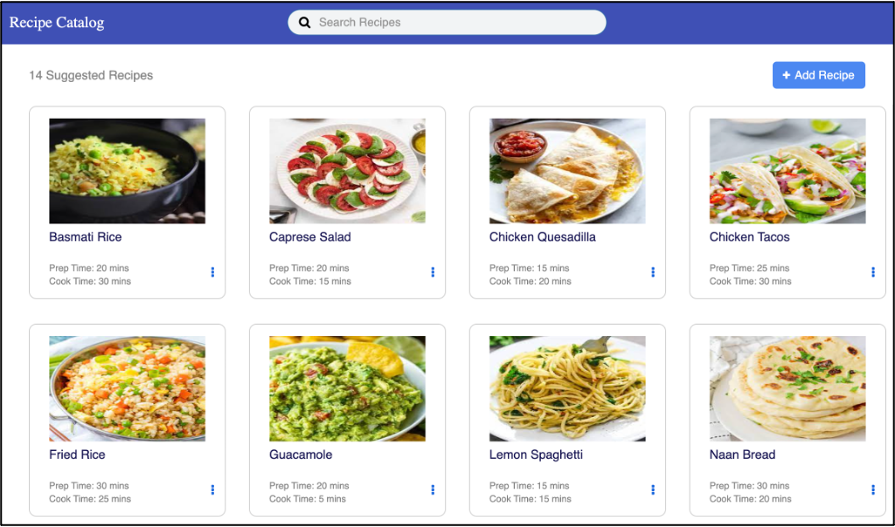

## Database file

The Domino database `FirstTouchRecipes.nsf` stores the recipe data used by the the First Touch Recipe Catalog app. The database file consists of rows, each representing a recipe:

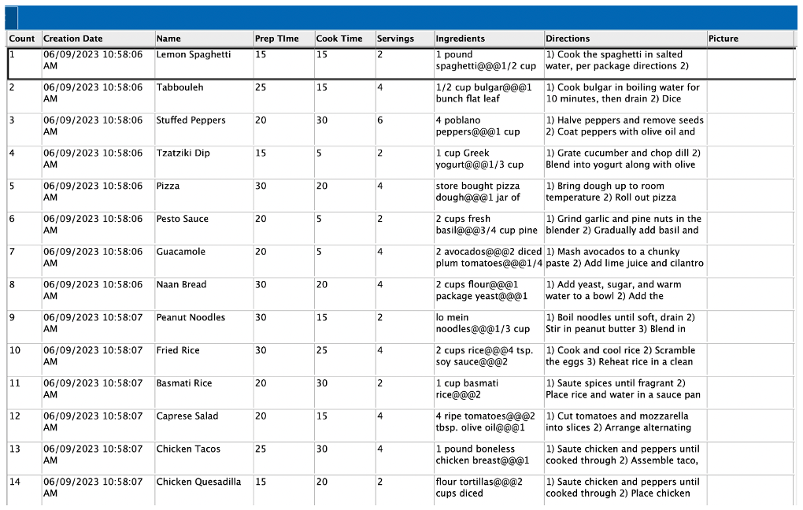

Each cell in a row represents a field containing recipe information:

|Field name|Field description|
|----|----|
|Name|Name of the recipe|
|Prep Time|Time needed for preparing the ingredients|
|Cook Time|Time needed to cook the dish|
|Servings|Number of servings|
|Ingredients|List of ingredients|
|Directions|Cooking instructions|
|Picture|Photo of the dish|

All the data is available in a single Domino View named `$All` by default.

## Accessing the data

Accessing the recipe data is straightforward using the Domino REST API, which provides direct access to Domino data from Volt MX Go. The First Touch Recipe Catalog app uses new Volt MX Go object-oriented APIs by modeling each recipe as a Recipe Object:

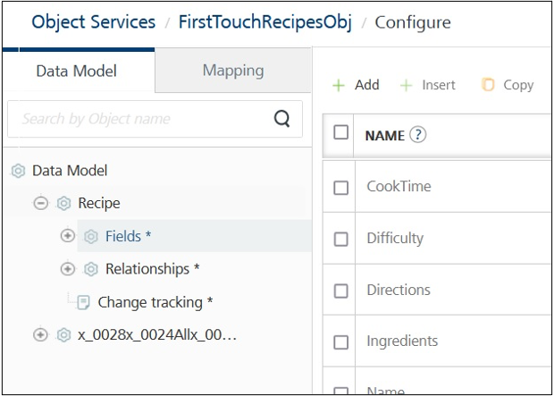{: style="height:70%;width:70%"}

The following image shows how the various Recipe operations map to particular APIs:

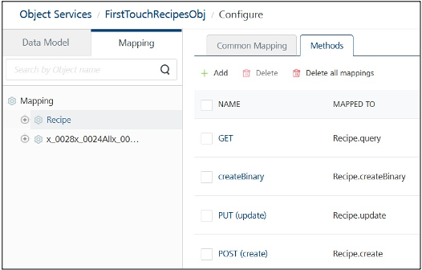

The table explains what each of the operations do:

|Operation|Description|
|----|----|
|GET|gets/reads a recipe|
|PUT|edits a recipe|
|POST|creates a recipe|
|DELETE|deletes a recipe|

## Using the app

You can click a recipe card to open an expanded view that shows recipe details such as ingredients and cooking instructions.

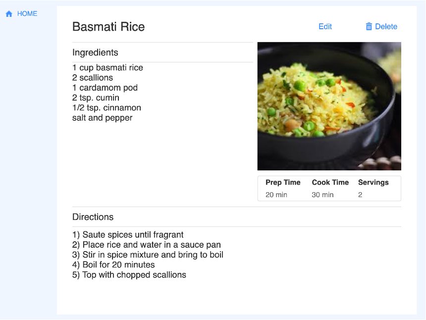{: style="height:80%;width:80%"}

You can enter text or keywords in a **Search Recipes** box, which highlights the recipe cards with information matching the text or keywords.

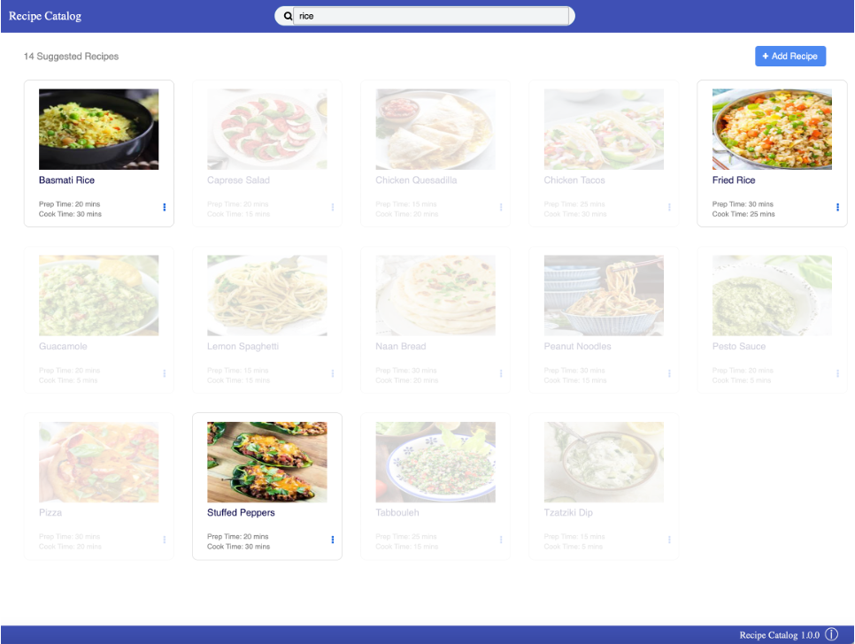

You can add a new recipe by clicking **+ Add Recipe**. It opens the **Add Recipe** window, which allows you to add the recipe name, prep time, cooking time, number of servings, needed ingredients, and cooking direction. You can also upload a picture of the cooked dish using the recipe.

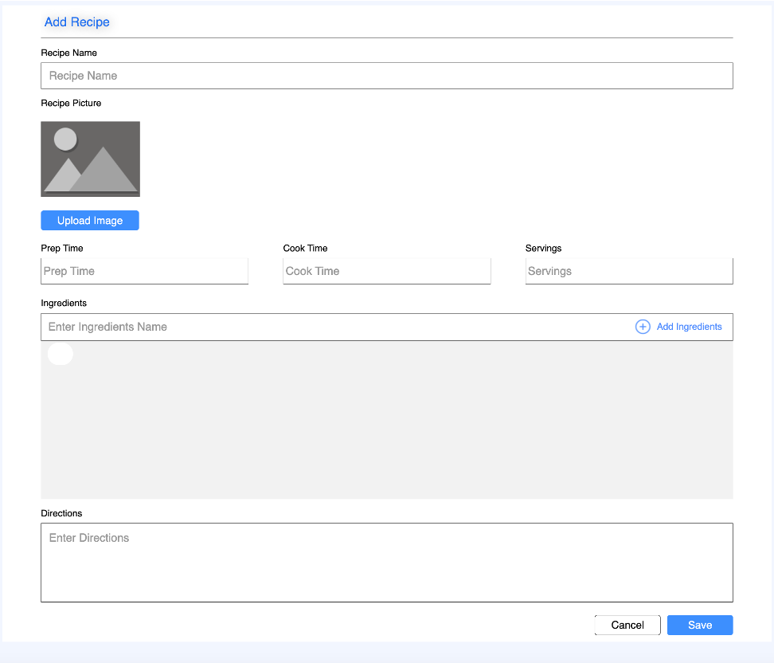

The app also allows you to edit each recipe by clicking the menu icon in the recipe card and selecting **Edit** to open the **Update Recipe** window. You can also click **Edit** when in the expanded view.

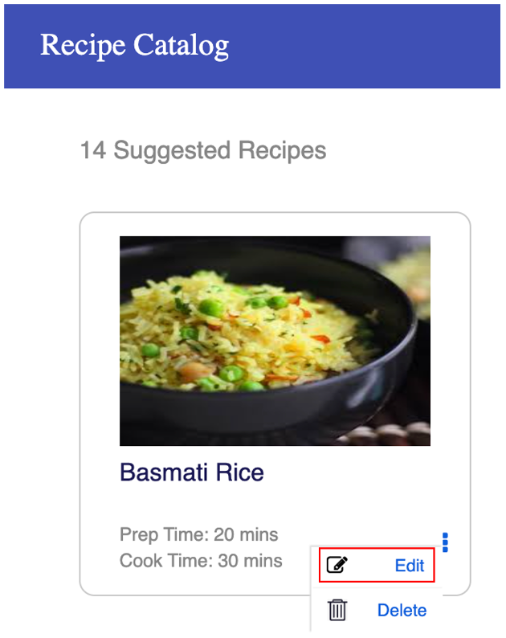{: style="height:40%;width:40%"}

In the **Update Recipe** window, you can change the values of the different fields.

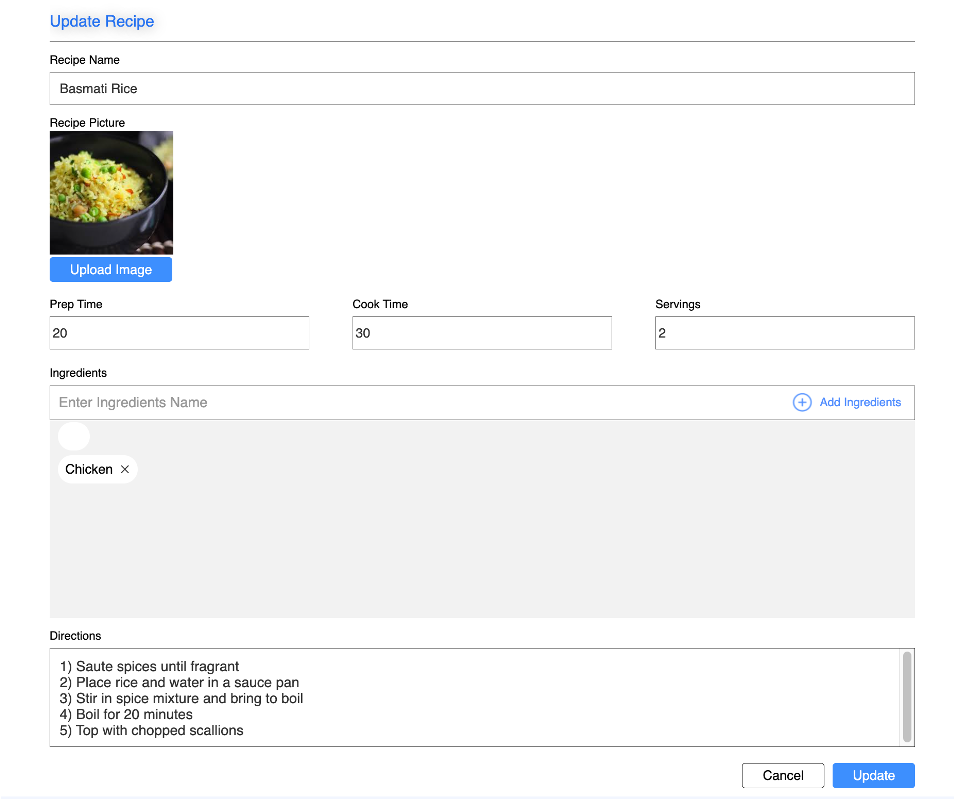

If you want to remove a recipe, click the menu icon in the recipe card and select **Delete**. You can also click **Delete** when in the expanded view.

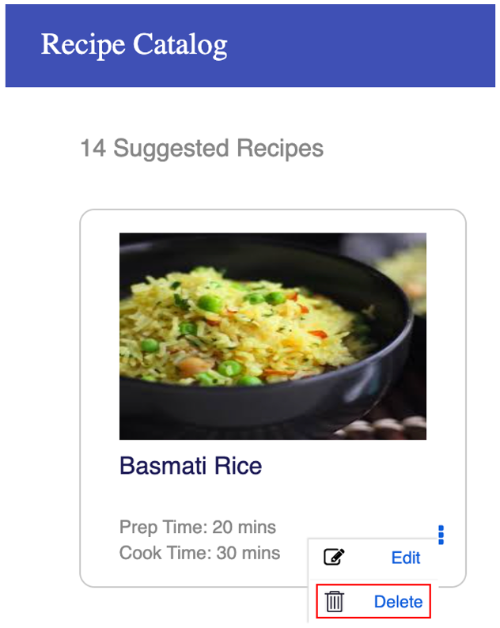{: style="height:40%;width:40%"}

## Mobile phone version

Volt MX Go makes it easy to develop apps for many platforms. The First Touch Recipe Catalog app also works on mobile phones, such as iPhones and Android phones, using the same Domino REST APIs. In the mobile phone version of the app, you can also use all its features, such as viewing a recipe, editing a recipe, and adding a recipe.

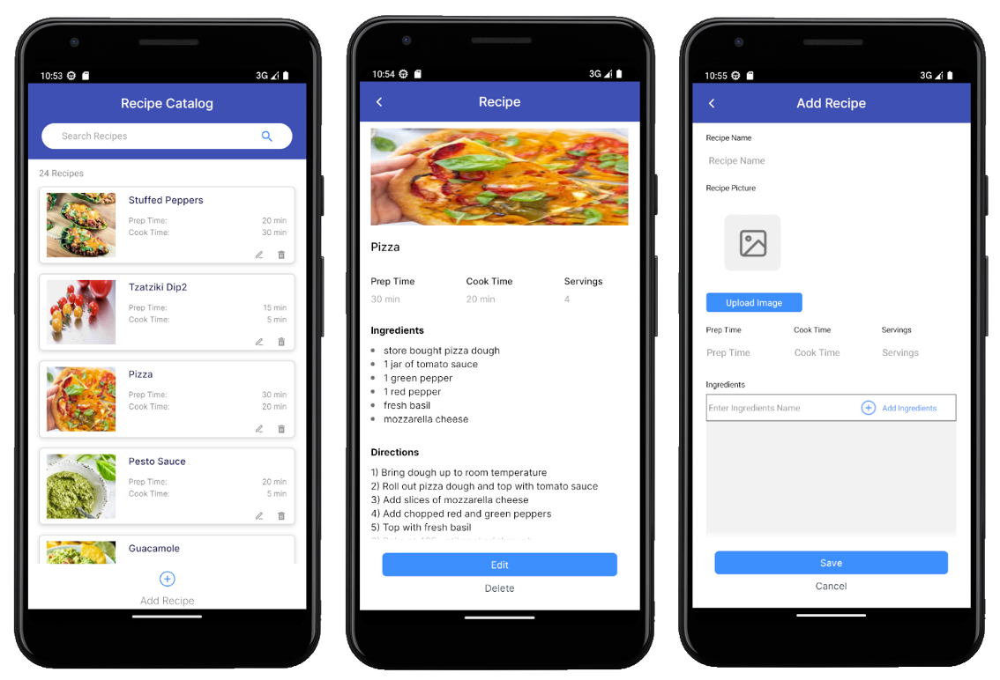
