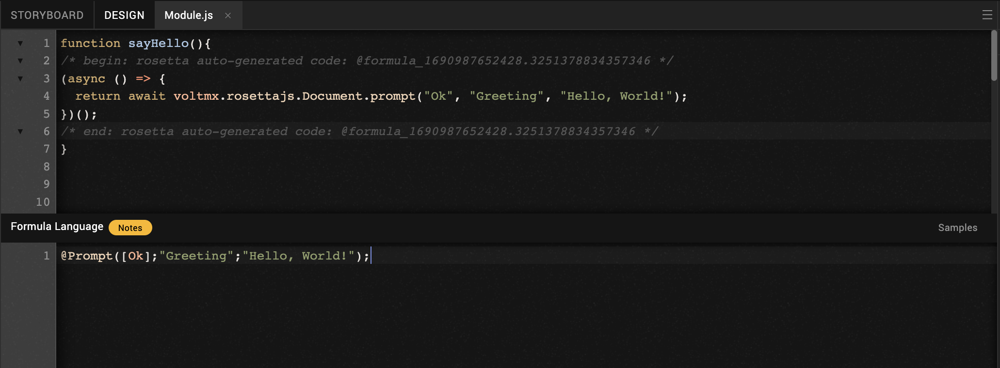
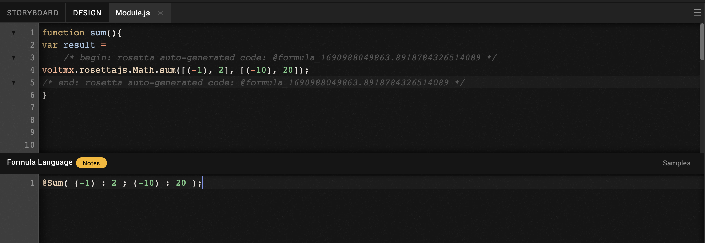
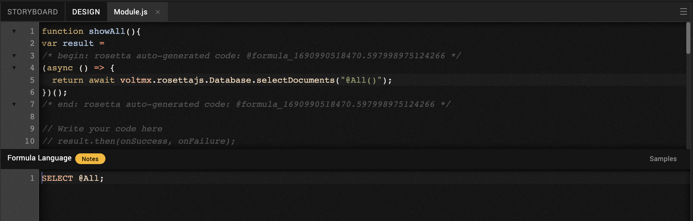

# VoltFormula coding exercise examples in Volt MX Go Iris

This section has a series of coding exercise examples to help you understand how to use VoltFormula in Volt MX Go Iris. Each exercise example has a problem description, followed by a code template where you can write your solution.

## Exercise 1: Hello, World!

**Description**

Write a function named `sayHello` to show a prompt box and add the formula.

**Formula code template**

```js
@Prompt([Ok];"Greeting";"Hello, World!");
```




## Exercise 2: Change a name

**Description**

Write a function called `changeName` that takes a string from a prompt box, update a field, and add formula.

**Formula code template**

```js
newName := @Prompt([OkCancelEdit]; "Enter Your Name"; "Type your name in the box below."; "");
@SetField(name, newName);
```


## Exercise 3: Sum simple

**Description**

Write a function called `sum` that summarizes an array of numbers. Define a variable called `result` to get a returned value and add the formula.

**Formula code template**

```js
@Sum( (-1) : 2 ; (-10) : 20 )
```




## Exercise 4: Concatenate names

**Description**

Write a function called `concatNames` that concatenates first names and last names in arrays. Define a variable called `result` to get a returned value and add the formula.

**Formula code template**

```js
full := '';
fname := "Amy" : "John";
lname := "Jones" : "Doe";
@For(n :=0; n<=1; n:= n + 1;
full := @If(n=0;fname[n] + " " + lname[n];full : (fname[n] + " " + lname[n])));
full
```


## Exercise 5: Show all documents

**Description**

Write a function called `showAll` that retrieves and displays all documents in Domino. Define a variable called `result` to get a returned value and add the formula.

**Formula code template**

```js
SELECT @All
```



