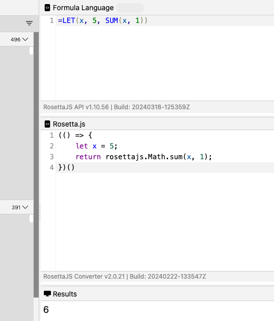
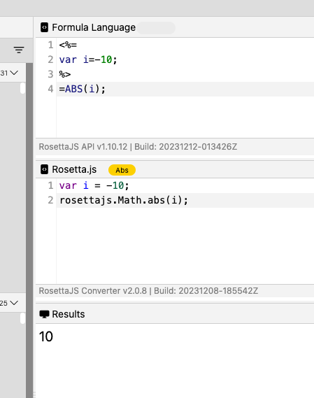
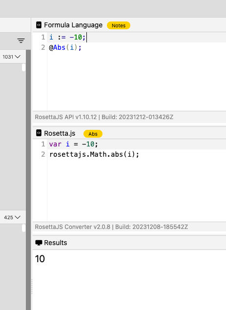
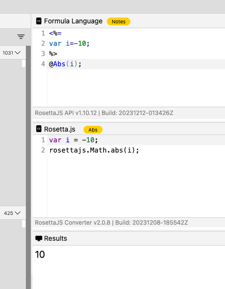

# Using variables in formulas

## Overview

There are two mechanisms by which the Rosetta Converter accepts and converts variables into JavasScript:

- [LET function](https://support.microsoft.com/en-us/office/let-function-34842dd8-b92b-4d3f-b325-b8b8f9908999 "Link opens a new tab"){: target="_blank" rel="noopener noreferrer"}&nbsp;{: style="height:13px;width:13px"} in Excel[^1]

- JSP style syntax (code passthrough)

[^1]: Excel is a registered trademark or trademark of Microsoft Corporation in the United States and/or other countries.

## Using LET function with OpenFormula

**LET function**

```
=LET(x, 5, SUM(x, 1))
```
{: style="height:70%;width:70%"}

## Using JSP style syntax

The converter uses **JSP expression** syntax in **OpenFormula** formulas to provide capabilities for formula conversion not currently possible with strict OpenFormula syntax. For more information, see [JSP expression syntax](https://docs.oracle.com/javaee/5/tutorial/doc/bnaov.html "Link opens a new tab"){: target="_blank" rel="noopener noreferrer"}&nbsp;{: style="height:13px;width:13px"}.

Example:

- **OpenFormula:**

    {: style="height:70%;width:70%"}

Although Notes formula language already provides means to declare variables, the converter can also use the **JSP expression** syntax in a ***Notes*** formula.

Examples:

- **Notes formula** with native notes variable declaration expression:

    {: style="height:70%;width:70%"}

- **Notes formula** with JSP-based variable declaration expression:

    {: style="height:70%;width:70%"}

!!!note
    To use JSP expression in formulas, select **Passthrough unrecognized formula language into JavasSript conversion results** checkbox. For more information, see [Configure VoltFormula](../../howto/voltformula/configrosetta.md).
