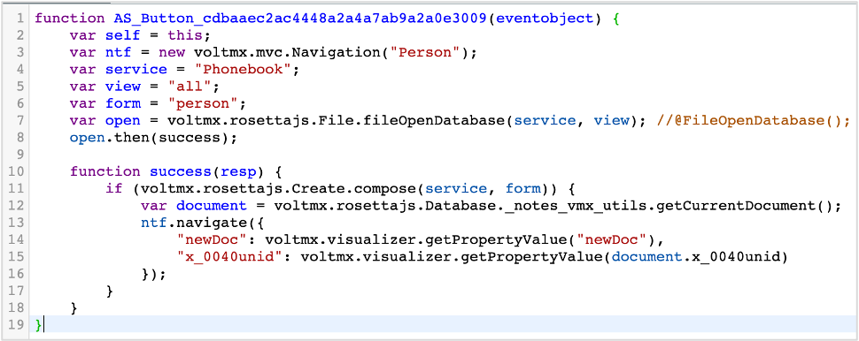
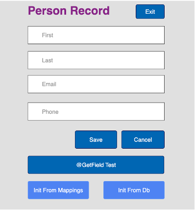
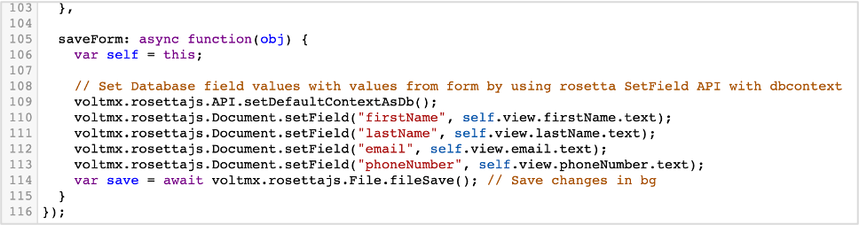

# Compose()

## Overview

`compose(serverDatabase, formName)` is used to compose a new form document in memory. `fileSave()` is then used to persist the document to the Notes DB.

Before `compose()` can be called, the Notes DB needs to be opened using `fileOpenDatabase(serverDatabase, viewName)`. The `serverDatabase` corresponds to the name of the database where you want to create the document. For Volt MX Go, this is the name of the Object Service. For the Domino REST API, this is the name of the scope.

## Using `compose()`

An example of using `compose()` is in a phonebook application, which presents a list of phonebook entries. A new entry can be added by clicking **New Person**.

The **New Person** button has an `onClick` event that triggers the following code:

`fileOpenDatabase()` is first called to open the database using the object service that uses the Domino Adapter to access the Notes DB. If `fileOpenDatabase()` succeeds, then `success` is called. `compose()` is then called to create the in-memory document. If its successful, the current document, which is the newly composed document, is retrieved. A local object is then used when navigating back to the `PersonController`. The object contains a `newDoc` property and the `unid` property.

The `PersonController` then displays a user interface where a user can fill in field values, and then click **Save**.

The **Save** button has an `onClick` event that triggers the following code:

`SaveForm` is called in the `PersonController` to save the document to the server using `fileSave()`. The field values are taken from the user interface fields in the form and stored into the fields in the Notes document before saving.
