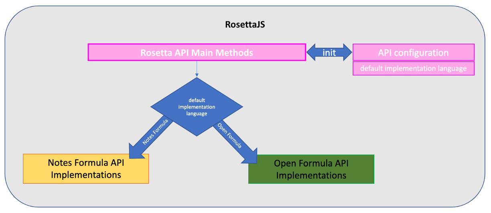

# VoltFormula

What ideas do you think of whenever you hear the word *formula*? It refers to a string of words, a collection of mathematical processes, or an expression with the purpose of producing results as an output. The description of this "formula" and our VoltFormula are the same. VoltFormula is responsible for converting the formula used on other Formula Language platforms into the JavaScript programming language. This is essential for existing users of Notes and Excel[^1] who want to convert their existing formulas into the JavaScript language.

[^1]: Excel is a registered trademark or trademark of Microsoft Corporation in the United States and/or other countries.

## Two formula languages exposed as one implementation by VoltFormula

 - [OpenFormula](https://docs.oasis-open.org/office/OpenDocument/v1.3/OpenDocument-v1.3-part4-formula.html){: target="_blank" rel="noopener noreferrer"}
 - [Notes Formula Language](https://help.hcltechsw.com/dom_designer/10.0.1/basic/H_NOTES_FORMULA_LANGUAGE.html){: target="_blank" rel="noopener noreferrer"}

These two are wrapped into one parent formula language that encapsulates both implementations. We call this **VoltFormula**, aka RosettaJS. By nature of being a JavaScript exposed API library, the formula language can be extended via helper registration methods.

## Objective

The aim of VoltFormula is to expose the capability to run certain functions of OpenFormula (Excel) and Formula Language (Notes @Function) in the context of Volt MX Go. This converts certain functions of OpenFormula and Formula Language into JavaScript. This JavaScript is used to build web-based applications. This is to help or to guide all the existing users of Formula Language and OpenFormula to transition into a web-based app. The VoltFormula reveals the JavaScript without any problem in converting the existing formulas in OpenSource and Formula Language.

## Architecture diagrams

### Rosetta flow overview

### OpenFormula or Notes API implementation paths

### Serving Rosetta under Volt MX Go via SDK plug-in

