# Domino Adapter tutorial

The tutorial guides you in creating an app in Foundry and connecting the app to your Domino database as an endpoint via the Domino REST API, and testing the methods.

## Before you begin

- You have completed the [Volt MX Go installation](installation.md).
- You have created your [Foundry admin account](../howto/foundryadminaccount.md). 
- You have added and configured a schema and a scope in the Domino REST API. 

    !!!tip
        For more information, see [Using Admin UI](https://opensource.hcltechsw.com/Domino-rest-api/tutorial/adminui.html){: target="_blank" rel="noopener noreferrer"} in the Domino REST API documentation. 

- Your schema should have a configured form with a `dql` mode similar to the `default` mode. 

## Log in to Volt MX Foundry

1. Open the Foundry hostname concatenated with `/mfconsole/` in your browser.

    !!!tip
        Use the **Console URL** in the **Install Complete** window or from the *Installation Complete* details that appear in the command line to log in to Volt MX Go Foundry.
  
2. Enter your username and password on the **Sign in to your account** page.
3. Click **Sign In**.  

   The **Volt MX Foundry Console** opens with the **Apps** page shown by default. 

## Create an app in Volt MX Foundry

1. On the **Apps** page, click **Add New**. 
2.	A new app is added, and you are directed to the **Configure Services** &rarr; **Identity** page of the new app. 
3.	Click the **Edit App Name** icon to give a unique name to your app.

!!!tip
    For more information, see [How to Add Applications](https://opensource.hcltechsw.com/volt-mx-docs/95/docs/documentation/Foundry/voltmx_foundry_user_guide/Content/Adding_Applications.html){: target="_blank" rel="noopener noreferrer"} in the HCL Volt MX documentation. 

## Configure an Identity service

1. On the **Identity** page, click **Configure New**.
2. Enter a name for the identity service in the **Name** text box.
3. From the **Type of Identity** drop-down list, select `OAuth2.0`.
4. Under **Provider Details**:
    
    1. Select `Authorization Code` in the **Grant Type** dropdown list.
    2. Enter the Domino REST API server URL concatenated with `/oauth/authorization` in the **Authorize Endpoint** field.

        Example: `[Domino REST API server URL]/oauth/authorization`

    3. Enter the Domino REST API server URL concatenated with `/oauth/token` in the **Token Endpoint** field.

        Example:  `[Domino REST API server URL]/oauth/token`

    4. In the **Callback URL** text box, click **Copy**.   You need the callback URL when configuring your app in Domino REST API.
    5. [Create and configure an application](#create-and-configure-an-application-in-domino-rest-api) in Domino REST API. 

        !!!warning "Important"
            You need to pause the execution of the **Configure an Identity Service** procedure without saving your initial changes and complete the creation and configuration of an app in Domino REST API before proceeding. 

    6. Enter the name of the scope that you have configured in your app in Domino REST API in the **Scope** text box. 

        !!!warning "Important"
            Make sure that the name of the scope you enter in the **Scope** text box matches the name of the scope that you have configured in your app in Domino REST API. 

    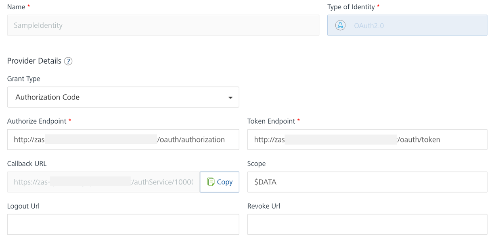

5.	Under **Client Details**:

    1. Select **Basic authentication** as the **Client Assertion Type**. 
    2. Enter the App ID of your app in Domino REST API in the **Client ID** text box.
    3. Enter the App Secret of your app in Domino REST API in the **Client Secret** text box.

    !!!tip
        The App ID and App Secret are generated when you add an app in Domino REST API. For more information, see [Application Management](https://opensource.hcltechsw.com/Domino-rest-api/references/usingwebui/appui.html){: target="_blank" rel="noopener noreferrer"} in the Domino REST API documentation.  

6.	Under **Advanced**:
    
    1. Select **Form Param** as the **Client Authentication Scheme**. 
    2. Use the default for the rest of the settings.

7.	Click **Save**.

!!!tip
    - Click **Test Login** to verify if the configured Identity service works. 
    - If the configuration works, you might need to enter your Domino REST API administrator username and password in the  Domino REST API login dialog and click **Allow** in the Domino REST API **Access consent required** dialog. You might also only see the **Permission Requested** dialog without needing to enter anything.  
    - If the configuration doesn't work, an error message is shown. 

## Add an environment 

1.	On the left pane on the **Volt MX Foundry Console**, click **Environments**.
2.	On the **Environments** page, click **Add New**. The **Add a New Environment** dialog opens. 
3.	In the **Environment Name** text box, enter an environment name.

    !!!note
        Your environment name can only contain letters, numbers, and hyphens (-). A hyphen can't appear at the beginning or at the end of a name. A number can't appear at the beginning of a name. A name should be a minimum of three characters and a maximum of 20 characters long.

4.	On the **Server** tab, enter the URL of your Volt MX Foundry in the **URL** text box.
    The URL format is: `<http or https>://<server_host>:<server_port>`
    
    For example: `http://mbaastest30.hcl.net:53504`

5.  Click **Test Connection** to verify that the entered URL is correct. If the test is successful, a check mark appears beside the **Server** tab.
6.  Click **Save**.

    

## Configure an Object service

1. In the left pane on the **Volt MX Foundry Console**, click **Apps**.
2. On the **Apps** page, select the app you created. 
3. Go to **Configure Services** &rarr; **Objects**, and then click **Configure New**.
4. Enter the object service name in the **Name** text field. For example, `EmployeeModelSchema`.
5. Select **HCL Domino** under **Business Adapters** for the **Endpoint Type**.
4. Set the **Metadata Security Level** to **Authenticated App Users** to restrict the download of object service metadata to users that have successfully authenticated using the Identity Service.

    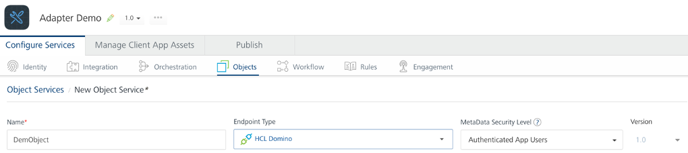

5.	Under **Connection Parameters**:

    1. Enter the Domino REST API server URL in the **Domino REST API Base URL** text field.
    2. Enter a value in the **Connection Timeout** text field. By default, the value is set to 30 ms.
        
        !!!note
            The **Connection Timeout** is the period for waiting for a new connection to happen before aborting the connection attempt, and is in milliseconds.

    3. Enter *true* or *false* in the **Return documents from Bulk Update** text field. By default, the value is set to *true*. 

        !!!note
            Entering true in the **Return documents from Bulk Update** text field ensures the return of documents updated using the BULK UPDATE method. For more information, see [Methods](../topicguides/method.md).   

    <!--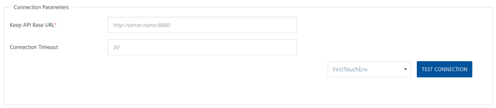-->

    !!!tip
        To test the connection parameters, select the environment you added from the **Select an Environment** drop-down list and then click **Test Connection**. You will see a *Connection Successful* message if the configured connection parameters are correct.

6.	Under **Authentication**: 

    1. Select the **Use Existing Identity Provider** radio button.
    2. Select the identity service you configured in the drop-down list.
    
    !!!tip
        Click **Test Login** to test the authentication. If the configuration works, you might need to enter your Domino REST API administrator username and password in the  Domino REST API login dialog and then click **Allow** in the Domino REST API **Access consent required** dialog. You might also only see the **Permission Requested** dialog without needing to enter anything. A *Test Login Successful* message is then displayed.

    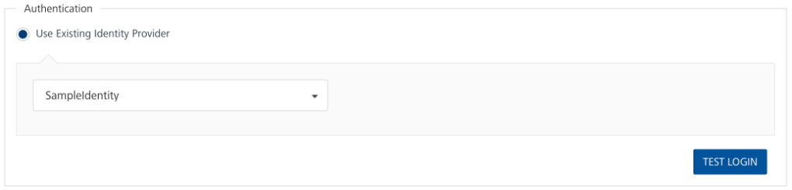

7.	Click **Save and Configure**.

## Configure a data model

1. On the **Data Model** tab, click **Generate**.
2. In the Domino REST API **Access consent required** dialog, click **Allow**. The **Import Objects from Backend** dialog appears. 
3. Expand the scope, **Forms**, and **View Entities**.
4. Select the checkboxes corresponding to the forms and view entities you want to import.

    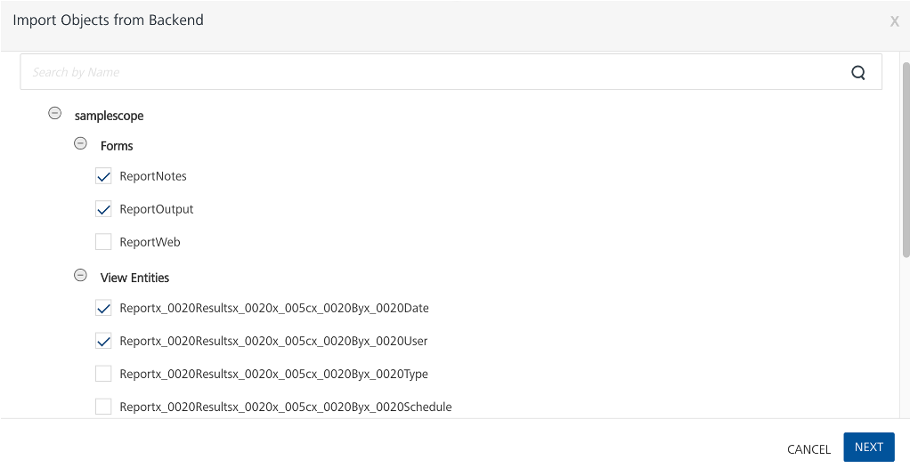

5. Click **Next**. The **Backend Object Name** and **Data Model Object Name** of the selected forms and view entities are shown. 

    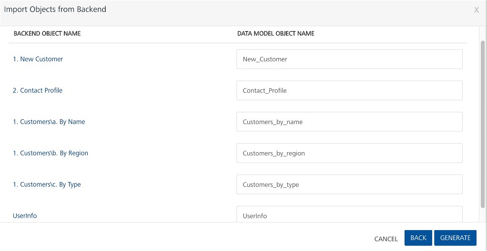

    !!!tip
        - You can change the data model object names of the selected forms and view entities.
        - For more information on naming limitations, see [naming limitations](../references/knownlimitation.md#naming).

5. Click **Generate**. The forms and view entities are now added to the **Data Model**. 

## Test the GET method by viewing a record

1. Click the **Mapping** tab, and then click the expand icon corresponding to a data model name to display a list of available methods.
2. From the list, click **GET**. 
4. Expand the **base mapper1**, and then select the **Test** tab.
5. Click **Send**.
    
    All records are displayed on the **Response** console. 
    
6. Click **Save** after viewing. 

**To view a filtered record**

1. Expand the **base mapper1**, and then select the **Test** tab.
2. Enter a query parameter in the **Enter the Query Params** text box.

    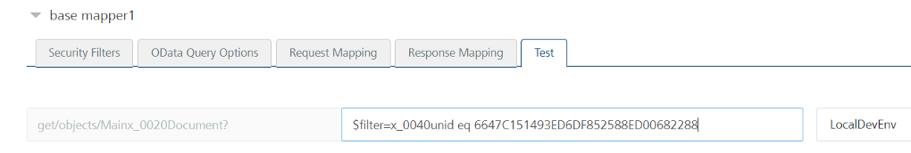

3. Click **Send**.
    
    The record is displayed on the **Response** console. 

4. Click **Save** after viewing.

For more information on supported parameters, see [Supported OData query parameters for form-based GET method](../topicguides/method.md#supported-odata-query-parameters-for-form-based-get-method) and [Supported OData query parameters for view-based GET method](../topicguides/method.md#supported-odata-query-parameters-for-view-based-get-method).

## Test the POST method by creating a record

1. Click the **Mapping** tab, and then click the expand icon corresponding to a data model name to display a list of available methods.
2. From the list, click **POST**.
3. Expand the **base mapper1**, and then select the **Test** tab.	
4. In the **Request Payload**, the fields of the data model should be displaying.
5. Beside the fields, input the values, then click **Send**. 
    
    The ID of the record is displayed on the **Response** console after the successful insertion of the record. 

    !!!tip
        Save the ID for updating or deleting the record using PUT or DELETE method, respectively.

6. Click **Save** after viewing.

## Test the PUT method by updating a record

1. Click the **Mapping** tab, and then click the expand icon corresponding to a data model name to display a list of available methods.
2. From the list, click **PUT**.
3. Expand the **base mapper1**, and then select the **Test** tab.	
4. In the **Request Payload**, the fields of the data model should be displaying.
5. Beside the fields, input the updated values, then click **Send**.

    !!!note
        All fields, updated or not, must be specified to maintain the fields in the note after the update. 

    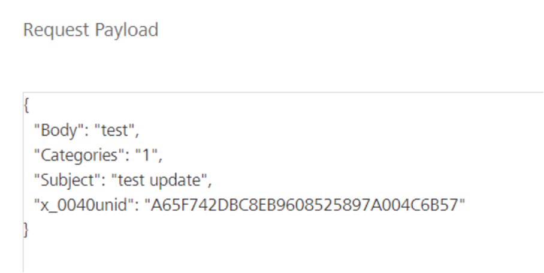{: style="height:60%;width:60%"}

    The **Response** console shows the fields with updated values and the number of updated records. 

    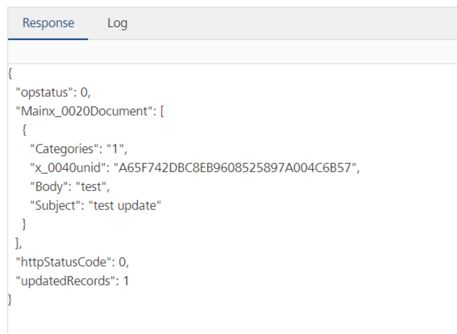{: style="height:60%;width:60%"}

6. Click **Save** after viewing.

## Test the DELETE method by deleting a record

1. Click the **Mapping** tab, and then click the expand icon corresponding to a data model name to display a list of available methods.
2. From the list, click **DELETE**.
3. Expand the **base mapper1**, and then select the **Test** tab.	
4. In the **Request Payload**, the field of the data model should be displaying.
5. Beside the field, input the ID of the record to be deleted, then click **Send**.

    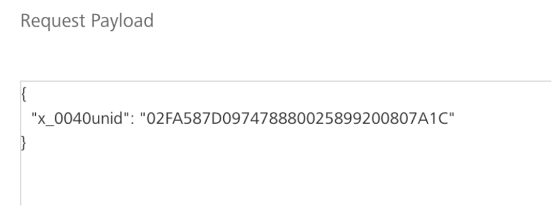{: style="height:60%;width:60%"}

    The **Response** console shows the number of deleted records. 

    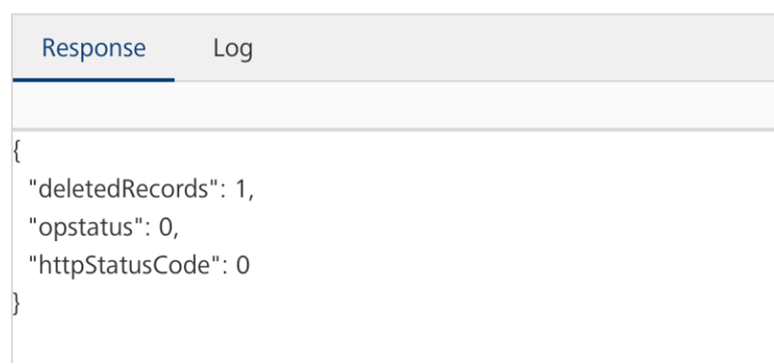{: style="height:60%;width:60%"}

6. Click **Save** after viewing.

## Test the PATCH method by updating a record

1. Click the **Mapping** tab, and then click the expand icon corresponding to a data model name to display a list of available methods.
2. From the list, click **PATCH**.
3. Expand the **base mapper1**, and then select the **Test** tab.	
4. In the **Request Payload**, the fields of the data model should be displaying.
5. Beside the fields, input the updated values, then click **Send**.

    <!--!!!note
        All fields, updated or not, must be specified to maintain the fields in the note after the update.--> 

    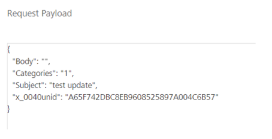{: style="height:60%;width:60%"}

    The **Response** console shows the fields with updated values and the number of updated records. 

    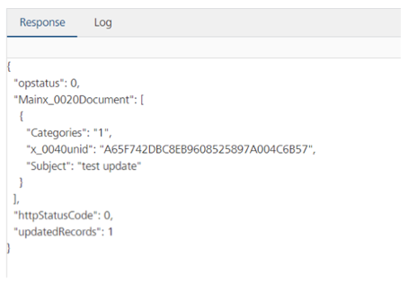{: style="height:60%;width:60%"}

6. Click **Save** after viewing.

## Test the BULK UPDATE method for updating a collection of records

1. Click the **Mapping** tab, and then click the expand icon corresponding to a data model name to display a list of available methods.
2. From the list, click **BULK UPDATE**.
3. Expand the **base mapper1**, and then select the **Test** tab.
4. Enter a `$filter` ODATA query parameter in the **Enter the Query Params** text box.

    !!!warning "Important"
        You must use the $filter ODATA query parameter to tell Domino REST API which documents to update. Otherwise, an error occurs.

    In the following example image, `$filter=Subject eq ‘old subject’` is used as the ODATA query parameter.

    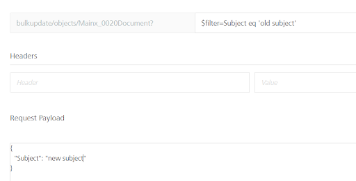{: style="height:70%;width:70%"}
    
5. In the **Request Payload**, specify the field to update and the updated value, and then click **Send**.

    The **Response** console shows all the documents with the specified field having the updated value. As shown in the example image, `Subject` is the updated field with an updated value of `new subject`.

    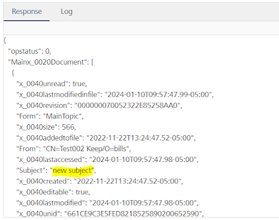{: style="height:60%;width:60%"}

6. Click **Save** after viewing.

## Additional procedure

### Create and configure an application in Domino REST API

1. Log in to Domino REST API.

    !!!tip
        For more details, see [Access Domino REST API](../howto/accessdrapi.md).

2. Select **Application Management - OAuth** from the home page.
3. On the **Application Management** page, click **Add Application**.
4. Under **Add New Application**, fill in the form:
    1. Enter an **Application Name**.
    2. Provide a **Description**.
    3. Paste the callback URL that you have copied when configuring the Identity Service in Foundry in the **Callback URLs** text box.
    4. Provide the application startup page URL under **Startup Page**. 
    4. Select and add a scope in the **Scope** field.
5. Click **Add**. 
6. Hover over the application tile and click **Generate Application Secret**. Take note of the App secret and the App ID.

!!!note
    Make sure to take note of the App ID and App secret as you need these details in configuring the Identity Service in Foundry. 

