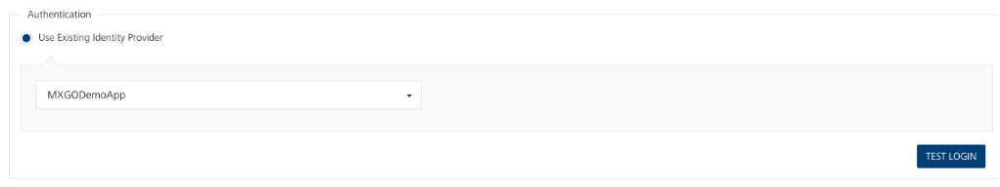
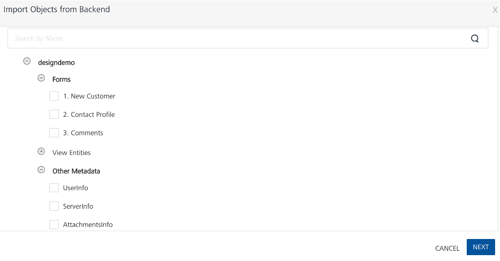
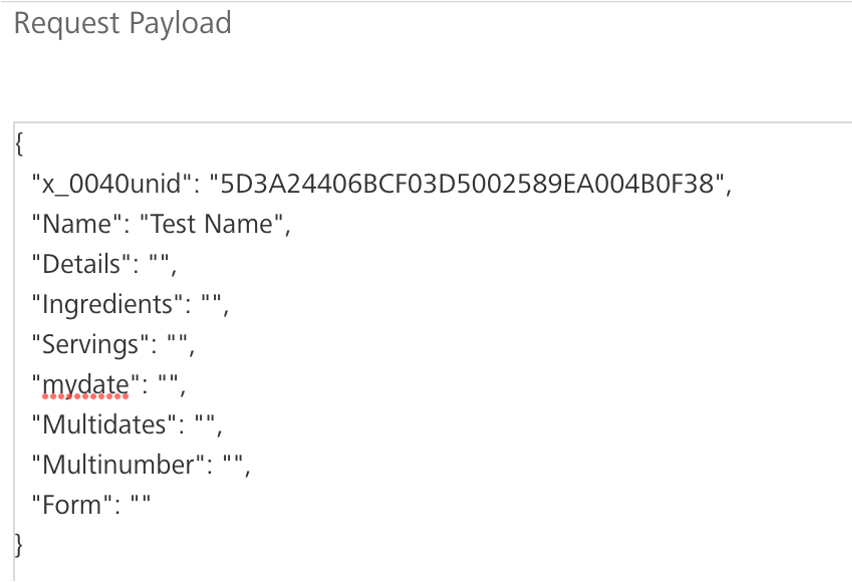

# Domino Adapter tutorial

## About this task

The tutorial guides you through the Domino Adapter process in Volt MX Go. You will create an app in Volt Foundry and connect the app to your Domino database as an endpoint via the Domino REST API. You will then configure a data model and test the methods, including standard CRUD operations, for interacting with the data model.

For more information, see [Data models](../topicguides/adapter/datamodel.md) and [Methods](../topicguides/adapter/method.md).  

At the end of this tutorial, you can manually create an app in Volt Foundry and create an Identity Service and Object Service to connect your app to your Domino database via Domino REST API. You will also be able to test the methods for interacting with the data model.

## Before you begin

Before starting this tutorial, you must meet prerequisites based on the situational scenario that applies to you:

- The **All access scenario** is for a user with all the necessary access rights to install and configure Volt MX Go and with the correct access to all required Domino databases and the Domino REST API.
- The **Limited access scenario** is for a user who is most likely a Volt Foundry Administrator that doesn't have all the necessary access to all the required Domino databases and the Domino REST API. In this case, you must coordinate with a Domino/Domino REST API administrator to obtain the required access and fulfill other requirements.

Kindly follow and complete the prerequisites that apply to your situation.

=== "All access scenario"

    **Volt MX Go prerequisites**

    - You have completed the [Volt MX Go installation](installupgrade/index.md).

    - You have a [Volt Foundry admin account](../howto/install/foundryadminaccount.md).

    **Domino/Domino REST API prerequisites**

    !!! tip

        Contact your Domino administrator/Domino REST API administrator for any needed assistance.

    - You have set up Domino REST API in the Domino server containing the Domino database you are importing.
    - You have at least *Designer* access to the Domino database where you are creating or updating a schema.
    - You have at least an *Editor* access to the *Domino Keep Configuration database* `keepconfig.nsf` to create a scope and OAuth application for the Domino application.
    - You have the correct access level to the Domino database to test the CRUD operations.

        For more information on access levels, see [Access Levels in the ACL](https://help.hcltechsw.com/domino/14.0.0/admin/conf_accesslevelsintheacl_c.html "Link opens a new tab"){: target="_blank" rel="noopener noreferrer"}&nbsp;{: style="height:13px;width:13px"} in the HCL Domino documentation 

    - You have accessed Domino REST API
    - You have configured a schema, activated the forms of the schema, and added a `dql` mode having similar fields to the `default` mode to each activated form. For more information, see [Schema Management](https://opensource.hcltechsw.com/Domino-rest-api/references/usingwebui/schemaui.html "Link opens a new tab"){: target="_blank" rel="noopener noreferrer"}&nbsp;{: style="height:13px;width:13px"}.

    - You have configured a scope for your schema. For more information, see [Scope Management](https://opensource.hcltechsw.com/Domino-rest-api/references/usingwebui/scopeui.html "Link opens a new tab"){: target="_blank" rel="noopener noreferrer"}&nbsp;{: style="height:13px;width:13px"}.

    - You have [created an OAuth application](https://opensource.hcltechsw.com/Domino-rest-api/references/usingwebui/appui.html#add-an-application "Link opens a new tab"){: target="_blank" rel="noopener noreferrer"}&nbsp;{: style="height:13px;width:13px"}:
        - having your configured scope added to the *Scope* field.
        - having a placeholder callback URL that you will replace with the callback URL from the Identity Service you will create.

    - You have taken note of the Domino REST API URL, and the App ID and [App Secret](https://opensource.hcltechsw.com/Domino-rest-api/references/usingwebui/appui.html#generate-an-app-secret "Link opens a new tab"){: target="_blank" rel="noopener noreferrer"}&nbsp;{: style="height:13px;width:13px"} of the OAuth application

=== "**Limited access scenario**"

    **Volt MX Go prerequisites**
    
    - You have completed the [Volt MX Go installation](installupgrade/index.md).

    - You have a [Volt Foundry admin account](../howto/install/foundryadminaccount.md).

    **Domino/Domino REST API prerequisites**

    - You have contacted the Domino/Domino REST API administrator to:

        - ensure you have at least Designer access to the Domino database you will be accessing
        - ensure you have the correct access level to the Domino database to test the CRUD operations.
        - configure a schema for the Domino database that you will be using with:
            - All necessary forms:
                - having active status 
                - having a `default` mode and a `dql` mode, and both modes having matching fields 
            - All necessary views having active status
            - All necessary agents having active status
        - configure a scope or scopes for your schema
        - create an OAuth application:

            - having your configured scope or scopes and `$SETUP` added to the **Scope** field.
            - having a placeholder callback URL that will be replaced with the callback URL from the Identity Service you will configure later in this tutorial

        - provide you with Domino REST API URL, and the Client ID and Client Secret of the OAuth application.

## Log in to Volt Foundry

1. Open the Volt Foundry hostname concatenated with `/mfconsole/` in your browser.

    !!! tip

        Use the **Console URL** in the **Install Complete** window or from the *Installation Complete* details that appear in the command line to log in to Volt Foundry.

2. Enter your username and password on the **Sign in to your account** page.
3. Click **Sign In**.  

   The **Volt MX Foundry Console** opens with the **Apps** page shown by default. 

## Create an app in Volt Foundry

1. On the **Apps** page, click **Add New**.
2. A new app is added, and you are directed to the **Configure Services** &rarr; **Identity** page of the new app. 
3. Click the **Edit App Name** icon to give a unique name to your app.

!!! tip

    For more information, see [How to Add Applications](https://help.hcl-software.com/voltmx/v10/Foundry/voltmx_foundry_user_guide/Content/Adding_Applications.html "Link opens a new tab"){: target="_blank" rel="noopener noreferrer"}&nbsp;{: style="height:13px;width:13px"} in the HCL Volt MX documentation. 

## Configure an Identity service

1. On the **Identity** page, click **Configure New**.
2. Enter a name for the identity service in the **Name** text box.
3. From the **Type of Identity** drop-down list, select `OAuth2.0`.
4. Under **Provider Details**:

    1. Select `Authorization Code` in the **Grant Type** dropdown list.
    2. Enter the Domino REST API server URL concatenated with `/oauth/authorization` in the **Authorize Endpoint** field.

        Example: `[Domino REST API server URL]/oauth/authorization`

    3. Enter the Domino REST API server URL concatenated with `/oauth/token` in the **Token Endpoint** field.

        Example: `[Domino REST API server URL]/oauth/token`

    4. In the **Callback URL** text box, click **Copy**.

        You need to save the copied callback URL and use it to [update the placeholder callback URL in the OAuth app](#update-callback-url-of-oauth-app-in-domino-rest-api) in Domino REST API.

    5. Enter the name of the scope, configured in the OAuth application in the Domino REST API, in the **Scope** text box.

        !!! warning "Important"

            Make sure that the name of the scope you enter in the **Scope** text box matches the name of the scope that's configured in the OAuth app in Domino REST API. 

    

5. Under **Client Details**:

    1. Select **Basic authentication** as the **Client Assertion Type**.
    2. Enter the App ID of the OAuth app in Domino REST API in the **Client ID** text box.
    3. Enter the App Secret of the OAuth app in Domino REST API in the **Client Secret** text box.

    !!! tip

        The App ID and App Secret are generated when an OAuth app is added on Domino REST API. For more information, see [Application Management](https://opensource.hcltechsw.com/Domino-rest-api/references/usingwebui/appui.html "Link opens a new tab"){: target="_blank" rel="noopener noreferrer"}&nbsp;{: style="height:13px;width:13px"} in the Domino REST API documentation.  

6. Under **Advanced**:

    1. Select **Form Param** as the **Client Authentication Scheme**.
    2. Use the default for the rest of the settings.

7. Click **Save**.

### Update callback URL of OAuth app in Domino REST API

=== "All access scenario"

    1. Log in to Domino REST API.
    1. Select **Application Management – OAUTH** from the home page or **Applications** from the side navigation pane to access the **Application Management** page.
    1. Click the **Edit Application** icon corresponding to your OAuth app.
    1. Update the **Callback URLs** field with the callback URL you copied from your Identity Service.
    1. Click **Update**.
    1. Close Domino REST API.

=== "Limited access scenario"

    1. Send the copied callback URL to the Domino REST API administrator and request to update the callback URL of the OAuth app.
    2. Get confirmation that the callback URL of the OAuth app is already updated before proceeding with verifying your Identity Service.  

### Verify if configured Identity service works

!!! note

    Ensure the callback URL in the OAuth app you are using has been updated before performing this procedure.

1. Log in to Volt Foundry.
1. On the **Apps** page, click your Volt Foundry app.
1. On the **Identity** tab under **Configure Services**, click your Identity Service.
1. Click **Test Login** to verify if the configured Identity service works. 
    - If the configuration works, you might need to enter your Domino credentials in the **HCL Domino Login** dialog and click **Login**. In the **Permission Requested** dialog, click **Allow**. You might also only see the **Permission Requested** dialog without needing to enter anything.  
    - If the configuration doesn't work, an error message is shown.

## Add an environment

1. On the left pane on the **Volt MX Foundry Console**, click **Environments**.
2. On the **Environments** page, click **Add New**. The **Add a New Environment** dialog opens.
3. In the **Environment Name** text box, enter an environment name.

    !!!note
        Your environment name can only contain letters, numbers, and hyphens (-). A hyphen can't appear at the beginning or at the end of a name. A number can't appear at the beginning of a name. A name should be a minimum of three characters and a maximum of 20 characters long.

4. On the **Server** tab, enter the URL of your Volt Foundry in the **URL** text box.
    The URL format is: `<http or https>://<server_host>:<server_port>`

    For example: `http://mbaastest30.hcl.net:53504`

5. Click **Test Connection** to verify that the entered URL is correct. If the test is successful, a check mark appears beside the **Server** tab.
6. Click **Save**.

    

## Configure an object service for Domino

1. In the left pane on the **Volt MX Foundry Console**, click **Apps**.
2. On the **Apps** page, select the app you created.
3. Go to **Configure Services** &rarr; **Objects**, and then click **Configure New**.
4. Enter the object service name in the **Name** text field. For example, `EmployeeModelSchema`.
5. Select **HCL Domino** under **Business Adapters** for the **Endpoint Type**.
6. Set the **Metadata Security Level** to **Authenticated App Users** to restrict the download of object service metadata to users that have successfully authenticated using the Identity Service.

    

7. Under **Connection Parameters**:

    1. Enter the Domino REST API server URL in the **Domino REST API Base URL** text field.
    2. Enter a value in the **Connection Timeout** text field. By default, the value is set to 30 ms.

        !!! note

            The **Connection Timeout** is the period for waiting for a new connection to happen before aborting the connection attempt, and is in milliseconds.

    3. Enter *true* or *false* in the **Return documents from Bulk Update** text field. By default, the value is set to *true*.

        !!! note

            Entering true in the **Return documents from Bulk Update** text field ensures the return of documents updated using the BULK UPDATE method. For more information, see [Methods](../topicguides/adapter/method.md).

    !!! tip

        To test the connection parameters, select the environment you added from the **Select an Environment** drop-down list and then click **Test Connection**. You will see a *Connection Successful* message if the configured connection parameters are correct.

8. Under **Authentication**:

    1. Select the **Use Existing Identity Provider** radio button.
    2. Select the identity service you configured in the drop-down list.

    !!! tip

        Click **Test Login** to test the authentication. If the configuration works, you might need to enter your Domino REST API administrator username and password in the  Domino REST API login dialog and then click **Allow** in the Domino REST API **Access consent required** dialog. You might also only see the **Permission Requested** dialog without needing to enter anything. A *Test Login Successful* message is then displayed.

    

9. Click **Save and Configure**.

## Generate a data model

1. On the **Data Model** tab, click **Generate**.
2. In the Domino REST API **Access consent required** dialog, click **Allow**. The **Import Objects from Backend** dialog appears.
3. Expand the scope, **Forms**, **View Entities**, and **Other Metadata**.

    

    !!! tip

        Use the **Other Metadata** in cases where you want to request Domino information not included in Domino data documents but still necessary for creating a Domino application in Volt MX Go. For more information, see [Other Metadata](../topicguides/adapter/datamodel.md#other-metadata).

4. Select the checkboxes corresponding to the forms and view entities you want to import.

5. Click **Next**. The **BACKEND OBJECT NAME** and **DATA MODEL OBJECT NAME** of the selected forms and view entities are shown.

    !!! tip

        - You can change the data model object names of the selected forms and view entities.
        - For more information on naming limitations, see [Known limitations](../references/knownlimitation.md#naming).

    The example image shows the data model object names after being renamed. It also shows the `UserInfo`, which is an Other Metadata.

    

6. Click **Generate**. The forms and view entities are now added to the **Data Model**.

## Test methods for interacting with the data model

The following produres enable you to test the different methods for interacting with the configured data model.

!!! note

    There are some special characters that you cannot use as string values when performing the methods for interacting with the data models. For more information, see [Special characters](../references/knownlimitation.md#special-characters). 

### Test the GET method by viewing a record

1. Click the **Mapping** tab, and then click the expand icon corresponding to a data model name to display a list of available methods.
2. From the list, click **GET**.
3. Expand the **base mapper1**, and then select the **Test** tab.
4. Click **Send**.

    All records are displayed on the **Response** console.

5. Click **Save** after viewing.

**To view a filtered record**

1. Expand the **base mapper1**, and then select the **Test** tab.
2. Enter a query parameter in the **Enter the Query Params** text box.

    

3. Click **Send**.

    The record is displayed on the **Response** console.

4. Click **Save** after viewing.

For more information on supported parameters, see [Supported OData query parameters for form-based GET method](../topicguides/adapter/method.md#supported-odata-query-parameters-for-form-based-get-method) and [Supported OData query parameters for view-based GET method](../topicguides/adapter/method.md#supported-odata-query-parameters-for-view-based-get-method).

### Test the POST method by creating a record

1. Click the **Mapping** tab, and then click the expand icon corresponding to a data model name to display a list of available methods.
2. From the list, click **POST**.
3. Expand the **base mapper1**, and then select the **Test** tab.
4. In the **Request Payload**, the fields of the data model should be displaying.
5. Beside the fields, input the values, then click **Send**.

    The ID of the record is displayed on the **Response** console after the successful insertion of the record.

    !!! tip

        Save the ID for updating or deleting the record using PUT or DELETE method, respectively.

6. Click **Save** after viewing.

### Test the PUT method by updating a record

1. Click the **Mapping** tab, and then click the expand icon corresponding to a data model name to display a list of available methods.
2. From the list, click **PUT**.
3. Expand the **base mapper1**, and then select the **Test** tab.
4. In the **Request Payload**, the fields of the data model should be displaying.
5. Beside the fields, input the updated values, then click **Send**.

    !!! note

        All fields, updated or not, must be specified to maintain the fields in the note after the update. 

    {: style="height:60%;width:60%"}

    The **Response** console shows the fields with updated values and the number of updated records.

    {: style="height:60%;width:60%"}

6. Click **Save** after viewing.

### Test the DELETE method by deleting a record

1. Click the **Mapping** tab, and then click the expand icon corresponding to a data model name to display a list of available methods.
2. From the list, click **DELETE**.
3. Expand the **base mapper1**, and then select the **Test** tab.
4. In the **Request Payload**, the field of the data model should be displaying.
5. Beside the field, input the ID of the record to be deleted, then click **Send**.

    {: style="height:60%;width:60%"}

    The **Response** console shows the number of deleted records.

    {: style="height:60%;width:60%"}

6. Click **Save** after viewing.

### Test the PATCH method by updating a record

1. Click the **Mapping** tab, and then click the expand icon corresponding to a data model name to display a list of available methods.
2. From the list, click **PATCH**.
3. Expand the **base mapper1**, and then select the **Test** tab.
4. In the **Request Payload**, the fields of the data model should be displaying.
5. Beside the fields, input the updated values, then click **Send**.

    {: style="height:60%;width:60%"}

    The **Response** console shows the fields with updated values and the number of updated records.

    {: style="height:60%;width:60%"}

6. Click **Save** after viewing.

### Test the BULK UPDATE method for updating a collection of records

1. Click the **Mapping** tab, and then click the expand icon corresponding to a data model name to display a list of available methods.
2. From the list, click **BULK UPDATE**.
3. Expand the **base mapper1**, and then select the **Test** tab.
4. Enter a `$filter` ODATA query parameter in the **Enter the Query Params** text box.

    !!!warning "Important"
        You must use the $filter ODATA query parameter to tell Domino REST API which documents to update. Otherwise, an error occurs.

    In the following example image, `$filter=Subject eq ‘old subject’` is used as the ODATA query parameter.

    {: style="height:70%;width:70%"}

5. In the **Request Payload**, specify the field to update and the updated value, and then click **Send**.

    The **Response** console shows all the documents with the specified field having the updated value. As shown in the example image, `Subject` is the updated field with an updated value of `new subject`.

    {: style="height:60%;width:60%"}

6. Click **Save** after viewing.
